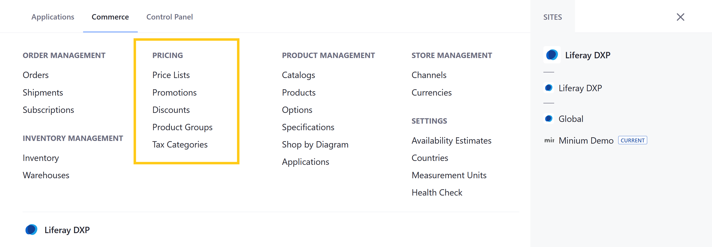
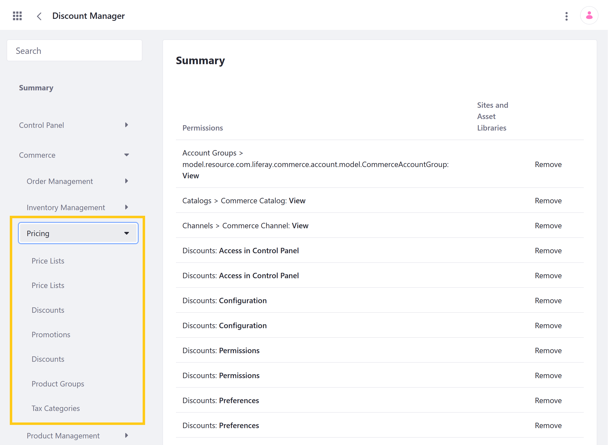

# Pricing Permissions

With Liferay Commerce, you can use permissions to control access to Pricing applications and resources in the Commerce tab of the Global Menu ().

You can manage Pricing permissions for user roles under *Commerce* &rarr; *Pricing* in the Define Permissions tab. Assign permissions individually, or check *Action* to assign all permissions for an application or resource.

## Application Permissions

Application permissions grant abilities for an application itself, but do not include [related resource permissions](#resource-permissions).

Pricing includes the following applications:

**Price Lists**: This application is used to create and manage Price List entities that store Product price entries.

**Discounts**: This application is used to create and manage Discount entities that modify prices.

**Promotions**: This application is used to create and manage Promotions, which are entities that store Product price entries that can be applied to a Product in place of its other Price List entries.

**Product Groups**: This application is used to create and manage Product Group entities.

**Tax Categories**: This application is used to create and manage categories for applying tax rates to Channel Products and shipping costs. See [Creating Tax Categories](../store-administration/configuring-taxes/creating-tax-categories.md) for more information.

All Pricing applications have the following permissions:

| Permission | Description |
| --- | --- |
| Access in Control Panel | Ability to access the application in the Global Menu |
| Configuration | Ability to view and set the application's configuration options |
| Permissions | Ability to view and modify the application's permissions |
| Preferences | Ability to view and set application preferences |
| View | Ability to view the application |

## Resource Permissions

Resource permissions grant specific abilities related to application resources. Some of these permissions grant the ability to perform operations on database entities (i.e., model resources). Others grant the ability to perform resource-related operations in an application context (e.g., the ability to create a new resource entity).

Pricing applications reference the following resources:

**Commerce Price List** (listed under Price Lists and Product Groups): These permissions grant the ability to perform operations on Price List entities. Price List entities are used to store price entries for Product SKUs. This includes Base Price Lists and custom Price Lists, as well as Base Promotion Lists and custom Promotion Lists. Each list is linked to a single Catalog and has the following configuration options: currency, priority, schedule, eligibility, and price modifiers.

| Permission | Description |
| --- | --- |
| Delete | Ability to delete Price List entities |
| Permissions | Ability to view and modify permissions for Price List entities |
| Update | Ability to modify Price List entities |
| View | Ability to view Price List entities |

**Commerce Price Lists** (listed under Price Lists; previously listed under Control Panel > General Permissions): These permissions grant the ability to perform resource-related operations in the Price Lists application.

| Permission | Description |
| --- | --- |
| Add Commerce Price List | Ability to create Price List entities in the Price Lists application |
| Permissions | Ability to view and modify resource permissions in the Price Lists application |

**Commerce Discount** (listed under Discounts and Product Groups): These permissions grant the ability to perform operations on Discount entities. Discount entities are used to modify prices and can be configured to target the price of Products, Shipments, Subtotals, Totals, or Product Groups. When applied, a Discount modifies the best applicable price for a customer, whether unit or promo.

| Permission | Description |
| --- | --- |
| Delete | Ability to delete Discount entities |
| Permissions | Ability to view and modify permissions for Discount entities |
| Update | Ability to modify Discount entities |
| View | Ability to view Discount entities |

**Commerce Discounts** (listed under Discounts; previously listed under Control Panel > General Permissions): These permissions grant the ability to perform resource-related operations in the Discounts application.

| Permission | Description |
| --- | --- |
| Add Discount | Ability to create Discount entities in the Discounts application. |
| Permissions | Ability to view and modify resource permissions in the Discounts application |
| View Discounts | Ability to view existing Discount entities in the Discounts application |

**Commerce Product Group** (listed under Product Groups): These permissions grant the ability to perform operations on Product Group entities. Product Group entities are used for grouping related Products so Price Lists and Discounts can be easily applied to them.

| Permission | Description |
| --- | --- |
| Delete | Ability to delete Product Group entities |
| Permissions | Ability to view and modify permissions for Product Group entities |
| Update | Ability to modify Product Group entities |
| View | Ability to view Product Group entities |

**Commerce Pricing** (listed under Product Groups and [Products](./product-management-permissions.md); previously listed under Control Panel > General Permissions): These permissions grant the ability to perform resource-related operations in the Product Groups application.

| Permission | Description |
| --- | --- |
| Add Commerce Pricing Class | Ability to create Pricing Class entities in the Product Groups application |
| Permissions | Ability to view and modify resource permissions in the Product Groups application |

**Commerce Taxes** (listed under Tax Categories; previously listed under Control Panel > General Permissions): These permissions grant the ability to perform resource-related operations in the Tax Categories application.

| Permission | Description |
| --- | --- |
| Manage Tax Categories | Ability to manage Tax Category entities in the Tax Categories application |
| Permissions | Ability to view and modify resource permissions in the Tax Categories application |

## Additional Information

* [Introduction to Pricing](../../managing-a-catalog/managing-prices/introduction-to-pricing.md)
* [Introduction to Discounts](../../promoting-products/introduction-to-discounts.md)
