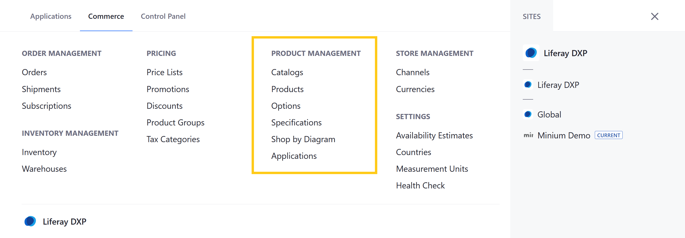
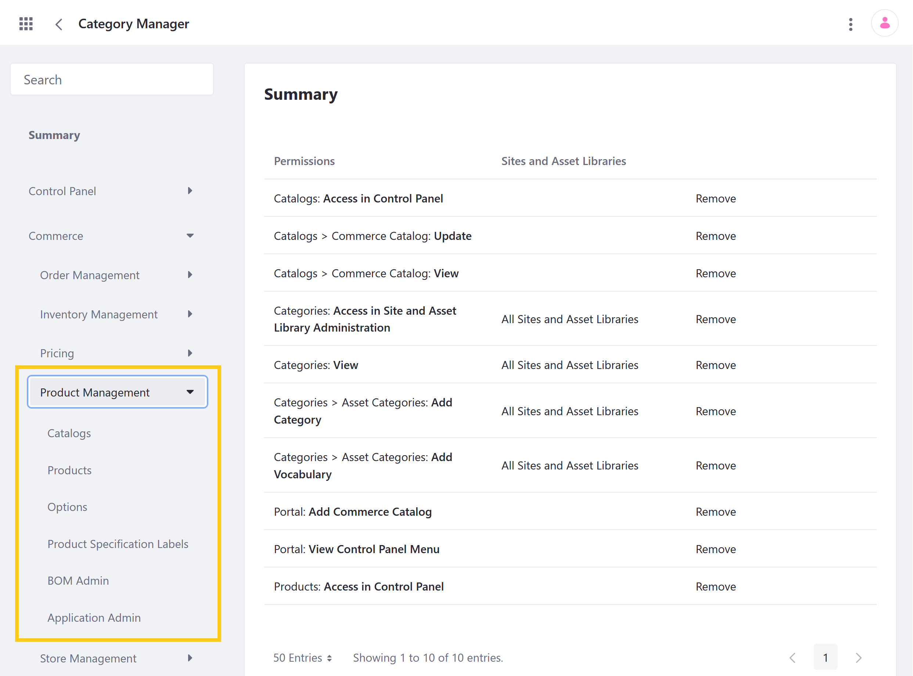

# Product Management Permissions

With Liferay Commerce, you can use permissions to control access to Product Management applications and resources in the Commerce tab of the Global Menu ().



You can manage Product Management permissions for user roles under *Commerce* &rarr; *Product Management* in the Define Permissions tab. Assign permissions individually, or check *Action* to assign all permissions for an application or resource.



## Application Permissions

Application permissions grant abilities for an application itself, but do not include [related resource permissions](#resource-permissions).

Product Management includes the following applications:

**Catalogs**: This application is used to create and manage Catalog entities.

**Products**: This application is used to create and manage Product entities within a Catalog.
  
**Options**: This application is used to create and manage templates for Product Options.

**Specifications**: This application is used to create labels, groups, and templates for categorizing Product Specifications.

**Shop by Diagram Admin** (previously known as BOM Admin): This application is used to create and annotate Bill of Materials diagrams.

**Application Admin**: This application is used to create and manage Brands and their Model entries.

All Product Management applications have the following permissions:

| Permission | Description |
| --- | --- |
| Access in Control Panel | Ability to access the application in the Global Menu |
| Configuration | Ability to view and set the application's configuration options |
| Permissions | Ability to view and modify the application's permissions |
| Preferences | Ability to view and set application preferences |
| View | Ability to view the application |

## Resource Permissions

Resource permissions grant specific abilities related to application resources. Some of these permissions grant the ability to perform operations on database entities (i.e., model resources). Others grant the ability to perform resource-related operations in an application context (e.g., the ability to create a new resource entity).

Product Management applications reference the following resources:

**Commerce Catalog** (listed under Catalogs): These permissions grant the ability to perform operations on Catalog entities, which are used for storing and managing related Products. Each Catalog has a default language, currency, image, Base Price List, and Base Promotion List.

**Commerce Catalogs** (listed under Catalogs; previously listed under Control Panel > General Permissions): These permissions grant the ability to perform resource-related operations in the Catalogs application.

**Commerce Products** (listed under Products, Options, and Product Specification Labels): These permissions grant the ability to perform operations on Product entities. Each Product entity is stored in a Catalog and has one or more associated SKUs. They can also have linked media (images and attachments), Specifications, Categories, Options, Inventory, price entries, and more.

**Commerce Product Option** (listed under Catalogs): These permissions grant the ability to perform operations on Product Option entities, which are used to add custom fields to Products. Each Option has a field type that determines its behavior. Depending on its type, an Option can be used to receive customer input, generate SKUs for product variants, and more.

**Commerce Product Option Category** (listed under Catalogs): These permissions grant the ability to perform operations on Product Option Category entities, which are Specification Groups used to categorize Specifications.

**Commerce Product Specification** (listed under Catalogs): These permissions grant the ability to perform operations on Product Specification entities, which are used to store information about a Product's attributes. Each is an instance of a Specification template.

**Commerce Pricing** (listed under [Product Groups](./pricing-permissions.md) and Products; previously listed under Control Panel > General Permissions): These permissions grant the ability to perform resource-related operations in the Product Groups application. Product Group entities are used for grouping related Products so Price Lists and Discounts can be easily applied to them.

**Commerce Warehouse** (listed under Products, [Shipments](./order-management-permissions.md) and [Warehouses](./inventory-management-permissions.md)): These permissions grant the ability to perform operations on Warehouse entities. Each Warehouse stores Product inventory, is connected to Channels, and represents a physical location, with an address and geolocation.

**Commerce BOM** (listed under Shop by Diagram Admin; previously listed under Control Panel > General Permissions): These permissions grant the ability to perform resource-related operations in the Shop by Diagram application. BOM resource entities are diagrams that map object components to Product SKUs.  

**Commerce BOM Folder** (listed under Shop by Diagram Admin): These permissions grant the ability to perform operations on BOM Folder entities, which are used for storing BOM Definitions. Each folder has its own associated image and can be linked to Models defined in the Application Admin.

**Commerce BOM Definition** (listed under Shop by Diagram Admin): These permissions grant the ability to perform operations on BOM Definition entities, which are annotated diagrams that link to Product SKUs. Each diagram represents how the Product SKUs relate to one another within a larger system.

**Commerce Applications** (listed under Application Admin; previously listed under Control Panel > General Permissions): These permissions grant the ability to perform resource-related operations in the Application Admin. These resources include Brand and Model entities.

**Commerce Application Brand** (listed under Application Admin): These permissions grant the ability to perform operations on Application Brand entities, which are used to store and organize Application Models.

**Commerce Application Model** (listed under Application Admin): These permissions grant the ability to perform operations on Application Model entities, which are Brand entries that can be linked with BOM folders to organize BOM diagrams by version. Each model has a name and year.

### Standard Resource Permissions

Most of the above resources have the following standard permissions:

| Permission | Description |
|---|---|
| Delete | Ability to delete a resource entity |
| Permissions | Ability to view and modify permissions for a resource entity |
| Update | Ability to modify a resource entity |
| View | Ability to view a resource entity |

### Unique Resource Permissions

However, Commerce Products, Commerce Catalogs, Commerce Pricing, and Commerce BOM have unique permissions.

#### Commerce Products

| Permission | Description |
|---|---|
| Add Commerce Product Specification Option | Ability to add Specifications to a Product |
| Add Option | Ability to add Options to Products |
| Add Option Category | Ability to add Specification Groups to a Product for categorizing Specifications |
| Manage Attachments| Ability to manage Product attachments in the Media tab |
| Manage Images | Ability to manage Product images in the Media tab |
| Manage Measurement Units | Ability to manage measurement units used for individual Product entities |
| Permissions | Ability to view and modify permissions for individual Product entities |
| View Price | Ability to view Product price entries |
| View Rules | Ability to view Product rules |

```{note}
In Liferay DXP 7.3 and earlier, the *Add Commerce Product Specification Option* and *Add Option Category* permissions were listed under Control Panel > General Permissions.
```

#### Commerce Catalogs

| Permission | Description |
|---|---|
| Add Commerce Catalog | Ability to create Catalog entities in the Catalogs application |
| Permissions | Ability to view and modify permissions for Catalog entities in the Catalogs application |
| View Commerce Catalogs | Ability to view and modify resource permissions in the Catalogs applications |

#### Commerce Pricing

| Permission | Description |
| --- | --- |
| Add Commerce Pricing Class | Ability to create Pricing Class entities in the Product Groups application |
| Permissions | Ability to view and modify resource permissions in the Product Groups application |

#### Commerce BOM

| Permission | Description |
| --- | --- |
| Add Commerce BOM Definition | Ability to create BOM Definition entities in the Shop by Diagram application |
| Add Commerce BOM Folder | Ability to create BOM Folder entities in the Shop by Diagram application |
| Permissions | Ability to view and modify resource permissions in the Shop by Diagram application |

#### Commerce Applications

| Permission | Description |
| --- | --- |
| Add Commerce Brand | Ability to create Brand entities in the Application Admin |
| Add Commerce Model | Ability to add Model entries to a Brand in the Application Admin |
| Permissions | Ability to view and modify resource permissions in the Application Admin |

## Additional Information

* [Products Overview](../../managing-a-catalog/creating-and-managing-products/products/products-overview.md)
* [Creating a New Catalog](../../managing-a-catalog/catalogs/creating-a-new-catalog.md)
* [Using Product Options](../../managing-a-catalog/creating-and-managing-products/products/using-product-options.md)
