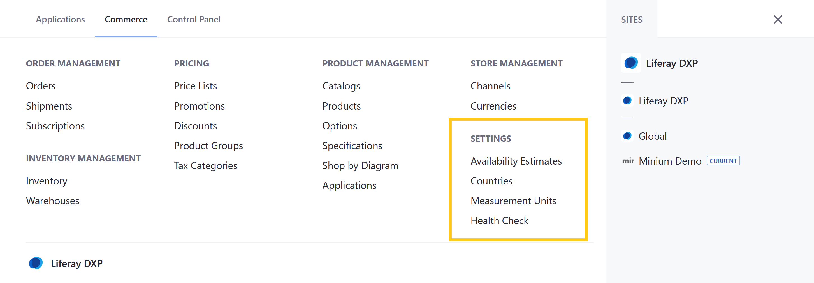

# Settings Permissions

With Liferay Commerce, you can use permissions to control access to Settings applications in the Commerce tab of the Global Menu ().

You can manage Settings permissions for user roles under *Commerce* &rarr; *Settings* in the Define Permissions tab. Assign permissions individually, or check *Action* to assign all permissions for an application or resource.

## Application Permissions

Application permissions grant abilities for an application itself, but do not include [related resource permissions](#resource-permissions).

Settings includes the following applications:

**Availability Estimates**: This application is used to create and manage availability estimates for when Products are available.

**Countries**: This application is used to create and manage country entries, which are then used in other applications (e.g., Channels).

**Measurement Units**: This application is used to create and manage standard measurement units that are used for Product Specifications.

**Health Check**: This application is used to check the health status of Commerce applications, as well as fix any existing issues.

All Settings applications have the following permissions:

| Permission | Description |
| --- | --- |
| Access in Control Panel | Ability to access the application in the Global Menu |
| Configuration | Ability to view and set the application's configuration options |
| Permissions | Ability to view and modify the application's permissions |
| Preferences | Ability to view and set application preferences |
| View | Ability to view the application |

## Resource Permissions

Resource permissions grant specific abilities related to application resources. Some of these permissions grant the ability to perform operations on database entities (i.e., model resources). Others grant the ability to perform resource-related operations in an application context (e.g., the ability to create a new resource entity).

Settings applications reference the following resources:

**Commerce Availability** (listed under Availability Estimates; previously listed under Control Panel > General Permissions): These permissions grant the ability to perform resource relate operations in the Availability Estimates application.

| Permission | Description |
|---|---|
| Manage Availability Estimates | Ability to access and modify Availability Estimate entities. |
| Permissions | Ability to view and modify resource permissions in the Availability Estimates application |

**Commerce Health** (listed under Health Check; previously under Control Panel > General Permissions): These permissions grant the ability to perform resource-related operations in the Health Check application.

| Permission | Description |
|---|---|
| Manage Health Status | Ability to access and modify Health Status entities |
| Permissions | Ability to view and modify resource permissions in the Health Check application |

## Additional Information

* [Availability Estimates](../../managing-a-catalog/managing-inventory/availability-estimates.md)
* [Measurement Units](../../store-administration/configuring-shipping-methods/measurement-units.md)
