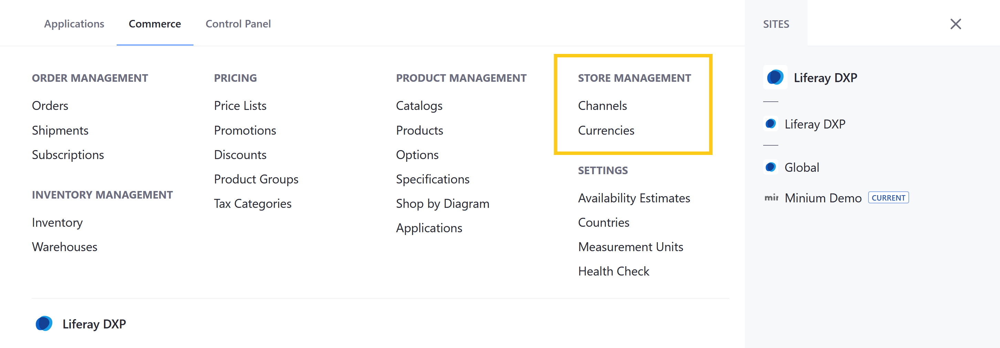
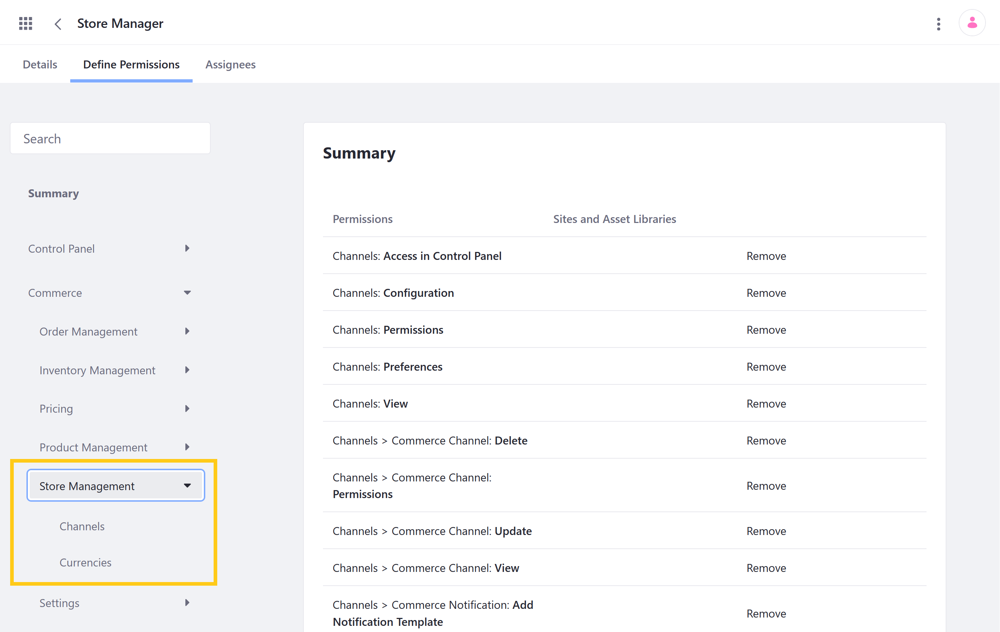

# Store Management Permissions

With Liferay Commerce, you can use permissions to control access to Store Management applications and resources in the Commerce tab of the Global Menu ().

You can manage Store Management permissions for user roles under *Commerce* &rarr; *Store Management* in the Define Permissions tab.  Assign permissions individually, or check *Action* to assign all permissions for an application or resource.

## Application Permissions

Application permissions grant abilities for an application itself, but do not include [related resource permissions](#resource-permissions).

Store Management includes the following applications:

**Channels**: This application is used to create and manage Channels, which are used to display Products and receive Orders.

**Currencies**: This application is used to add and manage the currencies used within a Liferay instance.

All Store Management applications have the following permissions:

| Permission | Description |
| --- | --- |
| Access in Control Panel | Ability to access the application in the Global Menu |
| Configuration | Ability to view and set the application's configuration options |
| Permissions | Ability to view and modify the application's permissions |
| Preferences | Ability to view and set application preferences |
| View | Ability to view the application |

## Resource Permissions

Resource permissions grant specific abilities related to application resources. Some of these permissions grant the ability to perform operations on database entities (i.e., model resources). Others grant the ability to perform resource-related operations in an application context (e.g., the ability to create a new resource entity).

Store Management applications are connected to the following resources:

**Commerce Channel** (listed under Channels): Channels are entities used to display Products and receive customer orders via a connected Site. Each Channel has its own workflow for orders, payment setting, shipping settings, tax calculations, and notifications.

| Permission | Description |
|---|---|
| Delete | Ability to delete Channel entities |
| Permissions | Ability to view and modify permissions for Channel entities  |
| Update | Ability to modify Channel entities |
| View | Ability to view Channel entities |

**Commerce Channels** (listed under Channels; previously listed under Control Panel > General Permissions): These permissions grant the ability to perform resource-related operations in the Channels application.

| Permission | Description |
|---|---|
| Add Commerce Channel | Ability to create Channel entities |
| Permissions | Ability to view and modify resource permissions in the Channels application |
| View Commerce Channels | Ability to view Channels |

**Commerce Notification Template** (listed under Channels): These permissions grant the ability to perform operations on Notification Template entities, which are custom templates used to create notifications for Channel events.

| Permission | Description |
|---|---|
| Delete | Ability to delete Notification Template entities |
| Permissions | Ability to view and modify permissions for Notification Template entities  |
| Update | Ability to modify Notification Template entities |
| View | Ability to view Notification Template entities |

**Commerce Notification** (listed under Channels): Notifications are instances of a Notification Template created by an event trigger. They are displayed within the Channels application.

| Permission | Description |
|---|---|
| Add Notification Template | Ability to create Notification Template entities |
| Delete Notification Queue Entry | Ability to remove Notification entries from the queue |
| Permissions | Ability to view and modify permissions for Notification entities |
| Resend Notification Queue Entry | Ability to resend Notification queue entries |
| View Notification Queue Entries | Ability to view Notifications in the queue |
| View Notification Templates | Ability to view Notification Template entities |

**Commerce Currencies** (listed under Currencies; previously listed under Control Panel > General Permissions): These permissions grant the ability to perform resource-related operations in the Currencies application.

| Permission | Description |
|---|---|
| Manage Currencies | Ability to access and modify Currency entities |
| Permissions | Ability to view and modify resource permissions in the Currencies application |

## Additional Information

* [Introduction to Channels](../../starting-a-store/channels/introduction-to-channels.md)
* [Managing Channels](../../starting-a-store/channels/managing-channels.md)
* [Channels Reference Guide](../../starting-a-store/channels/channels-reference-guide.md)
* [Currencies Reference](../../store-administration/currencies/currencies-reference.md)
