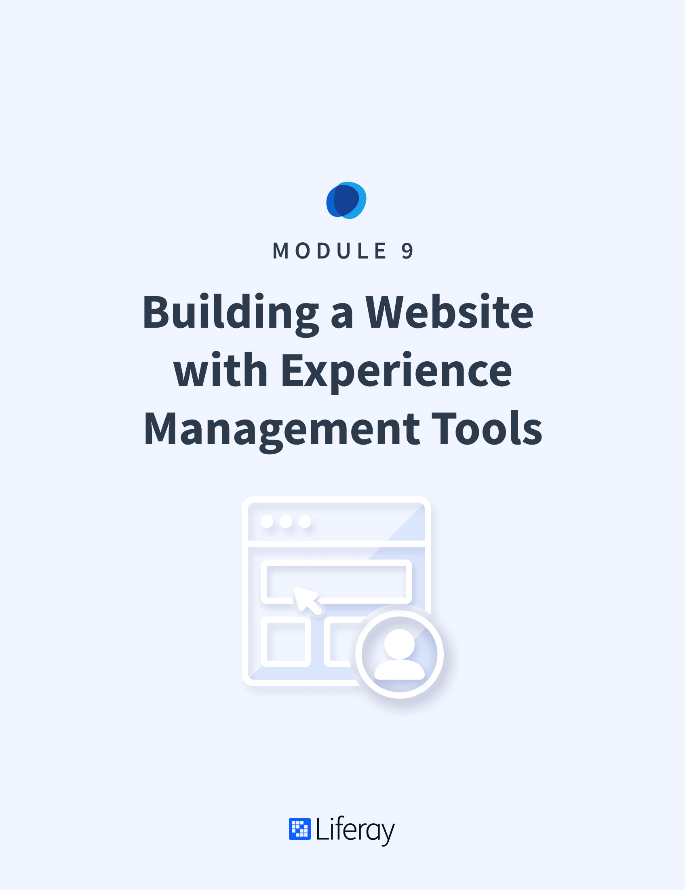

# Building a Website with Experience Management Tools

#### Learning Objectives

* Understand how to create and use Content Pages in Liferay DXP
* Explore methods of controlling Site aesthetics from within the Liferay DXP UI
* Understand how to use Publications to edit content and publish changes

#### Tasks to Accomplish
* Create the Livingstone Life Blog Site using Content Pages
* Create a Master Page Template and Style Book for the Livingstone Life Site
* Make and publish changes using Publications

#### Exercise Prerequisites

* Unzipped module exercise files in the following folder structure:
    * Windows: <code>C:\liferay</code>
    * Unix Systems: <code>[user-home]/liferay</code>
* A Liferay DXP or CE 7.3 instance up and running
    - If you have not started your instance yet, first, make sure you have installed Docker. Then, use the following commands to get and start the Liferay Docker Image: 
        * `docker pull liferay/[product]:[version]`
        * `docker run -it -m 8g -p 8080:8080 liferay/[product]:[version]`
    - See available Liferay DXP and CE versions at: <a href="https://hub.docker.com/r/liferay/dxp/tags">https://hub.docker.com/r/liferay/dxp/tags</a>

<h2> Table of Contents </h2>

TABLE OF CONTENTS
