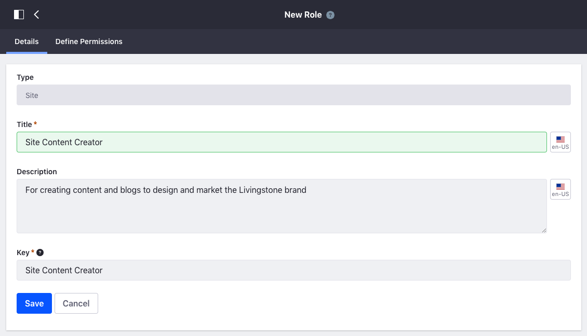
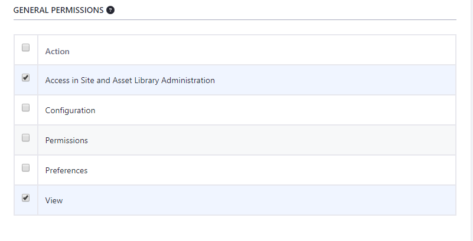
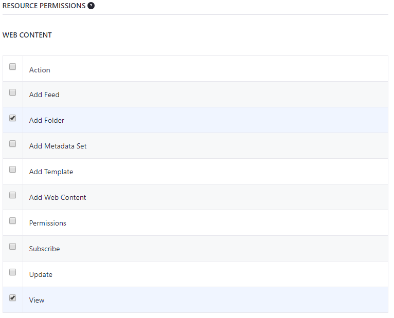
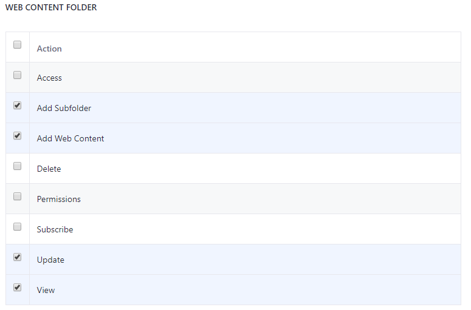
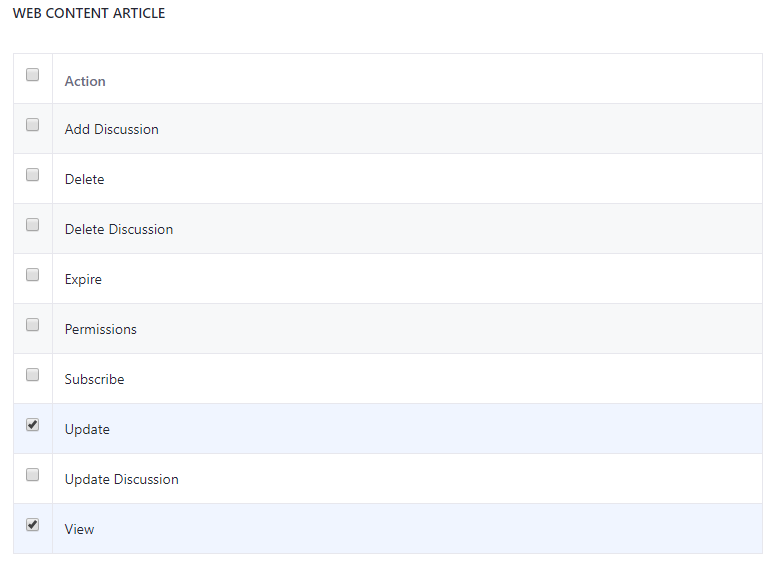
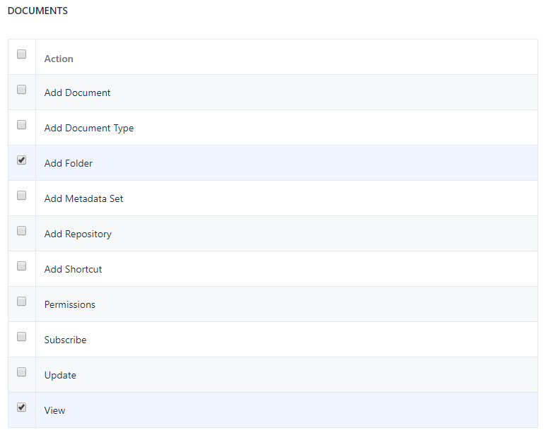
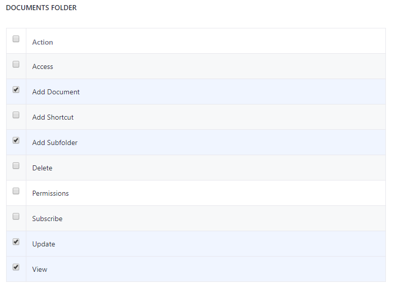

## Create a Custom Site Role 

#### Exercise Goals
* Create a Content Creator Role that allows the content team to do the following:
    * Add and Edit Web Content
    * Add and Edit Blogs
    * Add and Edit Images

#### Create a New Site Content Creator Role
1. **Open** the _Global Menu_.  
2. **Go to** _`Control Panel > Roles`_.  
3. **Click** the _Site Roles_ tab.
4. **Click** the _Add_ icon at the top right.
5. **Type** `Site Content Creator` for the _Title_.
6. **Type** `For creating content and blogs to design and market the Livingstone brand` for _Description_.
7. **Click** _Save_.

 

#### Add Site and Asset Library Administration Access and View Permissions for Web Content
1. **Click** the _Define Permissions_ tab.  
2. **Open** the _Site and Asset Library Administration_ drop-down.
3. **Open** the _Content & Data_ drop-down.
4. **Click** the _Web Content_ option.
5. **Check** _Access in Site and Asset Library Administration_ under _General Permissions_.
6. **Check** _View_ under _General Permissions_.

 

#### Add the Add Folder and View Permissions for Web Content
1. **Check** _Add Folder_ under _Web Content_.
2. **Check** _View_ under _Web Content_.

 

#### Add the Add Subfolder, Web Content, Update, and View Permissions for Web Content Folders
1. **Check** _Add Subfolder_ under _Web Content Folder_.
2. **Check** _Add Web Content_ under _Web Content Folder_.
3. **Check** _Update_ under _Web Content Folder_.
4. **Check** _View_ under _Web Content Folder_.

 

#### Add the Update and View Permissions for Web Content Articles
1. **Check** _Update_ under _Web Content Article_.
2. **Check** _View_ under _Web Content Article_.
3. **Click** _Save_ at the very bottom.

 

#### Add Site and Asset Library Administration Access and View Permissions for Blogs
1. **Open** the _Site and Asset Library Administration_ drop-down.
2. **Open** the _Content & Data_ drop-down.
3. **Click** the _Blogs_ option.
4. **Check** _Access in Site and Asset Library Administration_ under _General Permissions_.
5. **Check** _View_ under _General Permissions_.

 

#### Add the Add Entry Permission for All Blog Entries
1. **Check** _Add Entry_ under _Blog Entries_.

 

#### Add the Add, Delete, Update Discussion, Update, and View Permissions for Blogs
1. **Check** _Add Discussion_ under _Blogs Entry_.
2. **Check** _Delete Discussion_ under _Blogs Entry_.
3. **Check** _Update_ under _Blogs Entry_.
4. **Check** _Update Discussion_ under _Blogs Entry_.
5. **Check** _View_ under _Blogs Entry_.
6. **Check** _Save_.

 

#### Add Site and Asset Library Administration Access and View Permissions for Documents and Media
1. **Open** the _Site and Asset Library Administration_ drop-down.
2. **Open** the _Content & Data_ drop-down.
3. **Click** the _Documents and Media_ option.
4. **Check** _Access in Site and Asset Library Administration_ under _General Permissions_.
5. **Check** _View_ under _General Permissions_.

 

#### Add the Add Folder and View Permissions for Documents
1. **Check** _Add Folder_ under _Documents_.
2. **Check** _View_ under _Documents_.

 

#### Add the Add Subfolder, Document, Update, and View Permissions for Document Folders
1. **Check** _Add Document_ under _Documents Folder_.
2. **Check** _Add Subfolder_ under _Documents Folder_.
3. **Check** _Update_ under _Documents Folder_.
4. **Check** _View_ under _Documents Folder_.

 

#### Add the Update and View Permissions for Individual Documents
1. **Check** _Update_ under _Document_.
2. **Check** _View_ under _Document_.
3. **Click** _Save_ at the very bottom.

 

 

---

#### Bonus Exercises:
1. Create a new User and make them a member of the main Site. Grant the new User the _Site Content Creator_ role.
