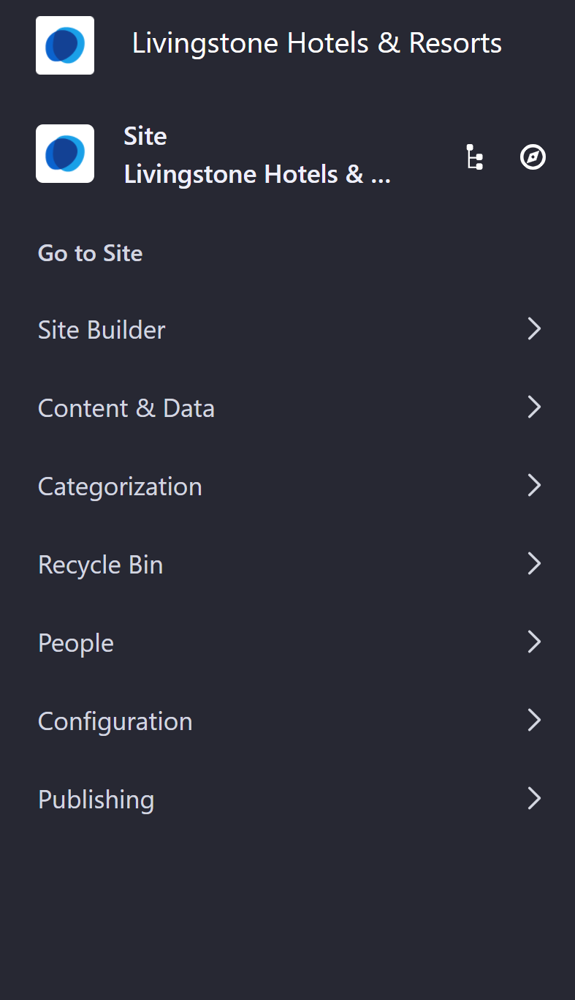
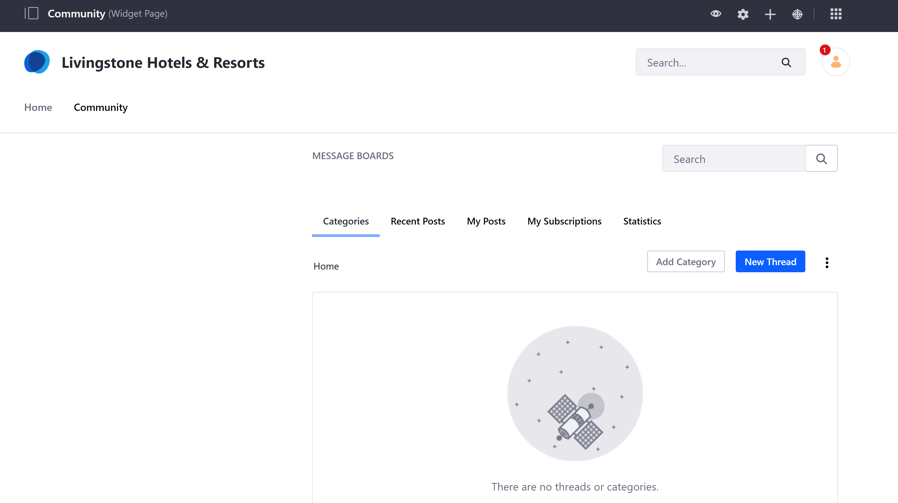
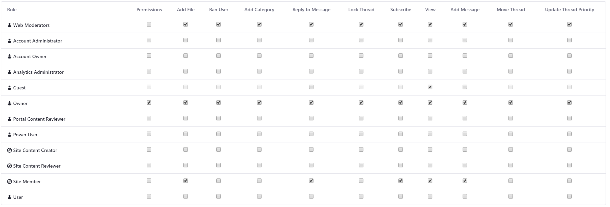

## Control Community Permissions 

#### Exercise Goals
* Create a Site Team for the Livingstone Hotels & Resorts Site
* Modify Permissions on a Resource on the Site

#### Go to the Default Site
1. **Open** the _Menu_.  
2. **Open** the _Site Administration_ panel.
3. **Click** _Go to Site_ for the default Site.
	* If you've followed along in other modules, the default Site is called _Livingstone Hotels & Resorts_.

 

#### Create a Web Moderator's Site Team in the Members Tab
1. **Go to** _`Site Administration > People > Teams`_
2. **Click** the _Add_ icon at the top right.
3. **Type** `Web Moderators` for the _Name_.
4. **Click** _Save_.

 

#### Add a User to the New Site Team
1. **Click** into the new _Web Moderators_ team.
2. **Click** the _Add_ icon at the top right.
3. **Check** your User from the list of Site Members.
	* If you have any other Users added to the Site, feel free to add any of them as well.
4. **Click** _Add_.

 

#### Create a New Community Page
1. **Open** _Site Builder_ in the _Site Administration_ panel.
2. **Click** _Pages_.
3. **Click** _Add_ at the top right.
4. **Choose** _Public Page_.
5. **Click** _Widget Page_.
6. **Type** `Community` for the _Name_.
7. **Click** _Add_.
8. **Click** _Save_.

 

#### Add a Message Board Widget to the New Page
1. **Click** _Home_ for the default Site.
2. **Go to** the _Community_ Page.
3. **Open** the _Add_ menu at the top right.
4. **Open** _Widgets > Collaboration_.
5. **Add** the _Message Boards_ widget to the right column.

 

#### Grant the Web Moderator Team Permissions to the Message Board Widget
1. **Click** on the _Options_ menu next to the _New Thread_ button.
2. **Click** _Permissions_.
3. **Check** every permission except for _Permissions_ for _Web Moderators_.
4. **Click** _Save_.
5. **Close** the pop-up.

 

 

---

#### Bonus Exercises:
1. Create new Users or add existing Users to the Web Moderators Team. Add new Widgets to the Community Page and grant permissions to the team.
