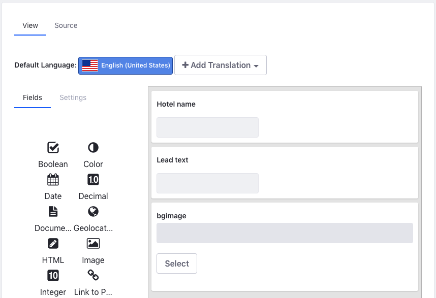

## Automating Staging Publication (Optional)

#### Exercise Goals

* Create a Seasonal Site Page Variation
* Automate Staging Publication

#### Add a New Seasonal Site Page Variation
1. **Click** the _Options_ menu in the top right of the _Staging_ menu.
	* Make sure you are on Staging in the Livingstone Hotels & Resorts Site.
* **Choose** _Site Pages Variations_.
* **Click** _Add Site Pages Variation_.
* **Type** `Holiday Season Variation` as the _Name_.
* **Choose** _Main Variation_ for the _Copy Pages from Site Pages Variation_ drop-down.
* **Click** _Add_.
* **Close** the pop-up.

 

#### Add the Hotel Banner Structure
1. **Open** the _Menu_.
* **Go to** _`Content & Data > Web Content`_ in the _Site Administration_ panel.
* **Click** on the _Structures_ tab. 
* **Click** the _Add_ button.
* **Type** `Hotel Banner` for the _Untitled Structure_.
* **Click** the _Source_ tab.
* **Copy** the content from the `hotel-banner-structure.json` file found in the exercises folder for this exercise.
* **Paste** the content in the _Source_ editor, replacing the default code.
* **Click** the _View_ tab to see the new fields.
* **Click** the _Save_ button at the top right.

 

#### Add the Hotel Banner Template
1. **Click** on the _Templates_ tab. 
* **Click** the _Add_ button.
* **Type** `Hotel Banner Template` for the _Untitled Template_.
* **Choose** the `Hotel Banner` Structure under _Basic Information_.
* **Click** _Choose File/Browse_ under the editor.
* **Choose** the `hotel-banner-template.ftl` file found in the Course Module exercises folder.
* **Click** the _Save_ button at the top right.

 

#### Create a New Seasonal Banner for the News & Specials Page
1. **Click** the _Web Content_ tab.
    * You may need to click the back button at the top.
* **Click** the _Add_ button.
* **Choose** _Hotel Banner_.
* **Type** `Livingstone Holiday Banner` as the _Title_.
* **Type** `Livingstone Hotels & Resorts` under _Hotel Name_.
* **Type** `Spend the holidays in Paradise` under _Lead Text_.
* **Click** _Select_ under the _bgimage_ field.
* **Click** the _Image_ icon.
* **Click** _Select File_.
* **Choose** the `livingstone-seasonal-banner.jpg` file found in the Course Module exercises folder.
* **Click** _Add_.
    * You may need to make sure the `Hotel Banner Template` is selected as the _Default Template_ by clicking the drop-down and selecting the correct template.
* **Click** the _Publish_ button at the bottom.

 

#### Replace the Banner with the New Seasonal Banner
1. **Click** _Go to Site_ in the _Site Administration_ panel.
	* Make sure _Holiday Season Variation_ is selected under _Site Page Variations_ if not selected already.
* **Click** on _News & Specials_ in the _Navigation_ menu.  
* **Click** on the _Add_ menu at the top right.
* **Open** _Content_.
* **Drag** the _Livingstone Holiday Banner_ to the top of the page.
* **Click** _Options_ at the top of the new Web Content Display widget. 
* **Click** _Look and Feel Configuration_. 
* **Choose** _Barebone_ in the _Application Decorators_ drop-down.
* **Click** _Save_.
* **Close** the pop-up.

 

#### Set up a Publishing Schedule for This Change
1. **Click** the _Ready for Publication_ slider at the top of the page.
* **Click** _Publish to Live_.
* **Click** _Switch to Advanced Publication_.
* **Type** `Holiday Site` as the _Name_.
* **Choose** _Schedule_ under the _Date_ section.
* **Choose** _November 1st_ for the _Start Date_.
* **Click** the _End By_ radio button.
* **Choose** the following _January 1st_ for the _End Date_.
* **Choose** _Yearly_ from the _Repeat_ drop-down.
* **Type** `1` in the _Day_ field.
* **Choose** _November_ in the _Month_ field.
* **Click** _Add Event_ at the bottom right.
* **Close** the pop-up.

 

 

---

#### Bonus Exercises
1. Make more changes to the Holiday Season Variant. Improve the Holiday Banner and put it on the _Home_ page. Add additional special offers for the Holiday Season using the Special Offers Web Content Structures.
2. Set up Staging on a new Site. Create a new Site Pages Variation, add content to pages, and merge the new Site Pages Variation with the Main Variation for your Site.

