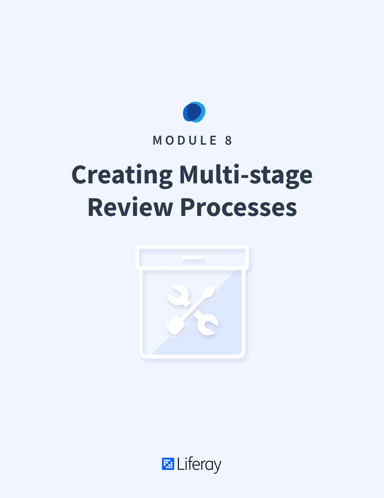

# Creating Multistage Review Processes

#### Learning Objectives

* Understand how to use workflows for Content in Liferay DXP
* Walk through the Single Approver Workflow
* Learn how to create custom workflows for unique business review processes
* Understand how Staging works and the configuration options available
* Walk through the entire business review process from Content Creation to Live Publication

#### Tasks to Accomplish
* Create a Workflow Definition
* Walk through a Workflow process with Assets
* Turn on Staging and publish new content
* Automate Staging Publication

#### Exercise Prerequisites

* Unzipped module exercise files in the following folder structure:
    * Windows: <code>C:\liferay</code>
    * Unix Systems: <code>[user-home]/liferay</code>
* A Liferay DXP 7.3.x instance up and running
    - If you have not started your instance yet, first, make sure you have installed Docker. Then, use the following commands to get and start the Liferay Docker Image: 
        * `docker pull liferay/[product]:[version]`
        * `docker run -it -m 8g -p 8080:8080 liferay/[product]:[version]`
    - See available Liferay DXP and CE versions at: <a href="https://hub.docker.com/r/liferay/dxp/tags">https://hub.docker.com/r/liferay/dxp/tags</a>
* Special Offer Web Content Structure and Template created (instructions for the creation of this content can be found in the Digital Asset Management module)
* Bavarian Special Offer Web Content created (instructions for the creation of this content can be found in the Digital Asset Management module)

As the new _Publications_ application fulfills many of the same functions that were formerly fulfilled using _Staging_, the final two exercises in this module are optional. For more on _Publications_, see the _Creating Websites with Experience Management Tools_ module. 

<h2> Table of Contents </h2>

TABLE OF CONTENTS
