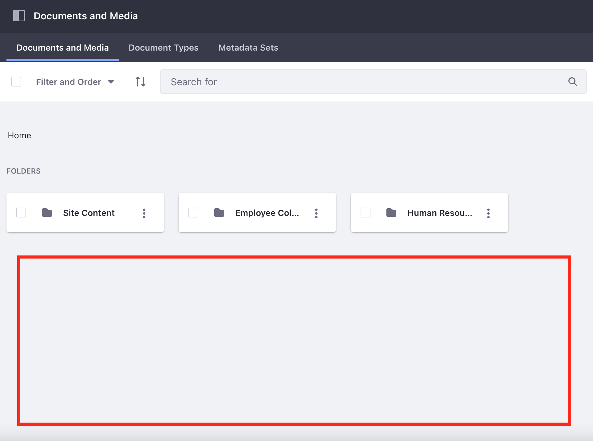

## Using Folders to Organize Assets

#### Exercise Goals

* Create folders for Documents and Media
* Create a folder for Web Content
	* Add restrictions to the folder
	* Add new Web Content to the folder and go through the Single Reviewer workflow

#### Create a Folder Structure for the Livingstone Loop Documents and Media
1. **Open** the _Menu_.
* **Click** on the _Livingstone Loop_ Site (if you're not already there from the previous exercise) in the _Sites_ panel.
* **Go to** _`Content & Data > Documents and Media`_ in the _Site Administration_ panel.  
* **Click** the _Add_ button.  
* **Choose** _Folder_.  
* **Type** `Human Resources` for the  _Name_.  
* **Click** the _Save_ button at the bottom.
* **Click** the _Add_ button.  
* **Choose** _Folder_.  
* **Type** `Employee Collaboration` for the  _Name_.
* **Click** the _Save_ button at the bottom.
* **Click** the _Add_ button.  
* **Choose** _Folder_.  
* **Type** `Site Content` for the _Name_.  
* **Click** the _Save_ button at the bottom.

 

 

#### Add Sub-Folders to Human Resources
1. **Click** the _Human Resources_ folder.
* **Click** the _Add_ button.  
* **Choose** _Folder_.  
* **Type** `Employee Records` for the  _Name_.  
* **Click** the _Save_ button at the bottom.
* **Click** the _Add_ button.  
* **Choose** _Folder_.  
* **Type** `Contracts` for the  _Name_.  
* **Click** the _Save_ button at the bottom.
* **Click** the _Add_ button.  
* **Choose** _Folder_.  
* **Type** `Onboarding` for the  _Name_.  
* **Click** the _Save_ button at the bottom.

 

 

#### Move Existing Files to the Appropriate Folders
1. **Click** the _Documents and Media_ tab at the top of the page.
* **Check** the box next to `handbook.pdf`.
* **Click** the _Options_ icon next to `handbook.pdf`.
* **Click** _Move_ in the pop-up menu.
* **Click** _Human Resources_.
* **Click** the _Select_ button next to _Onboarding_.
* **Check** the box next to `Omar Miles Employee Record`.
* **Click** the _Options_ icon.
* **Click** _Move_ in the pop-up menu.
* **Click** _Human Resources_.
* **Click** the _Select_ button next to _Employee Records_.

 

 

#### Create a Folder for Livingstone Hotels & Resorts Web Content
1. **Open** the _Menu_.
* **Click** on the _Site Selector_ in the _Site Administration_ panel.
* **Click** on the _Livingstone Hotels & Resorts_ site.
* **Go to** _`Content & Data > Web Content`_ in the _Site Administration_ panel.  
* **Click** the _Add_ button.  
* **Choose** _Folder_.  
* **Type** `Special Offers` for the _Name_.  
* **Click** the _Save_ button at the bottom.

 

#### Add a Workflow to Our Folder
1. **Click** the _Options_ icon next to the folder we just created.  
* **Choose** _Edit_.  
* **Click** the _Structure Restrictions and Workflow_ to display a list of settings.  
* **Click** the radio button next to _Default Workflow for This Folder (Special Offers)_.  
* **Choose** _Single Approver_ from the drop-down.  
* **Click** the _Save_ button.

 

#### Create a Special Offers Web Content Structure
1. **Click** the _Structures_ tab.
* **Click** the _Add_ icon.
* **Click** _Untitled Structure_.
* **Type** `Special Offers`.
* **Drag and Drop** a _Text_ field into the gray drop zone.
* **Double Click** the _Text_ Value next to _Field Label_.
* **Type** `Title`.
* **Click** _Save_.
* **Double Click** the _No_ Value next to _Required_.
* **Choose** _Yes_.
* **Click** _Save_.
* **Drag and Drop** a _Text Box_ field beneath the _Text_ field.
* **Double Click** the _Text Box_ Value next to _Field Label_.
* **Type** `Offer Text`.
* **Click** _Save_.
* **Double Click** the _No_ Value next to _Required_.
* **Choose** _Yes_.
* **Click** _Save_.
* **Drag and Drop** an _Image_ field beneath the _Text Box_ field.
* **Double Click** the _Image_ Value next to _Field Label_.
* **Type** `Offer Image`.
* **Click** _Save_.
* **Double Click** the _No_ Value next to _Required_.
* **Choose** _Yes_.
* **Click** _Save_.
* **Click** _Save_ (upper right corner of screen).

 

#### Create a Special Offers Web Content Template
1. **Click** the _Templates_ tab.
* **Click** the _Add_ icon.
* **Click** _Untitled Template_.
* **Type** `Special Offers`.
* **Click** _Select_ under _Structure_ in the _Properties_ panel.
* **Choose** _Special Offers_.
* **Click** _Save_ (upper right corner of screen).

 

#### Add a New Offer to Our Folder
1. **Click** the _Web Content_ tab.
* **Click** the _Special Offers_ folder.
* **Click** the _Add_ button.
* **Choose** _Special Offers_.
* **Type** `Bavarian Special Offer` as the _Title_ at the top of the page and in the _Title_ field.
* **Open** the `bavaria.txt` file found in your module exercises folder.
* **Copy** the contents of the document.
* **Paste** the text from `bavaria.txt` beneath the image in the _Offer Text_ field.
* **Click** on _Select_ below the _Offer Image_ field.
* **Click** _Select File_.
* **Choose** the `bavaria.jpg` file from your module exercises folder.
* **Type** `The wonders of Bavaria` as the _Image Description_.
* **Click** _Add_.
* **Click** _Default Template_ in the panel on the right.
* **Click** _Select_ under the _Default Template_ section of the _Properties_ panel.
* **Choose** _Special Offers_.
	- Your browser may open a pop-up. Click _Ok_ if it does.
* **Click** the _Submit for Publication_ button at the top right corner of the page.

 

#### Assign the Content to Yourself for Review
1. **Click** on the _User_ icon in the top right corner of the page.  
* **Choose** _Notifications_.  
* **Click** the top notification.
	- This should read `Josiah Copeland sent you a Web Content Article for review in the workflow.`
* **Click** the _Options_ icon to the right of _Assigned to_.  
* **Choose** _Assign to Me_.  
* **Type** `Reviewing the offer` under _Comment_.  
* **Click** the _Done_ button.

 

#### Approve the New Content
1. **Click** the _View_ icon on the right under the _Preview of Web Content Article_ section.  
* **Click** the _Back_ button at the top left after looking over the content.  
* **Type** `Looks good!` in the _Comments_ section.  
* **Click** _Reply_.  
* **Click** the _Options_ icon in the top right.  
* **Choose** _Approve_.  
* **Type** `Good to go`.  
* **Click** the _Done_ button.
	- You will be redirected to a page called _My Workflow Tasks_. It should now be empty.

 

 

---

#### Bonus Exercises
1. Create a folder structure for the Web Content in the _Livingstone Hotels & Resorts_ Site. Make sure to include folders for headings, footers, calls to action, and promoted content.
2. Add a folder to the _Documents and Media_ repository in the _Livingstone Life_ Site called _Blog Images_. Assign the _Single Approver_ workflow to the new folder.
