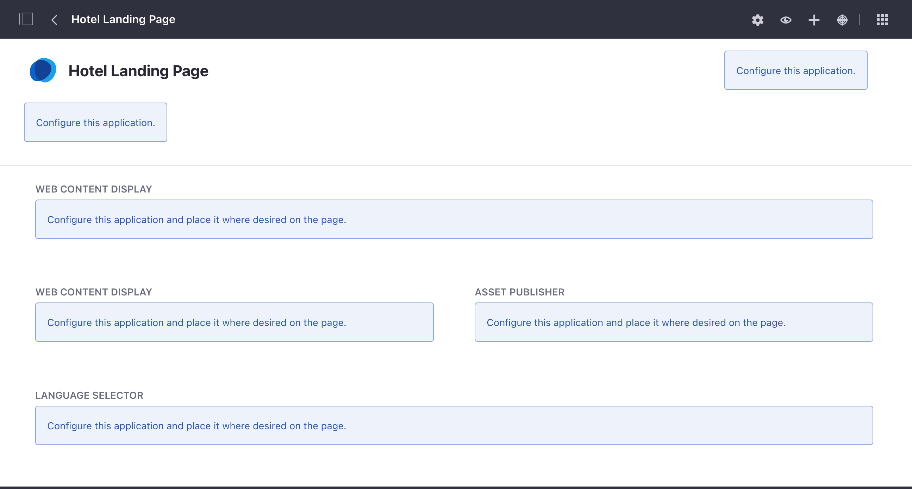
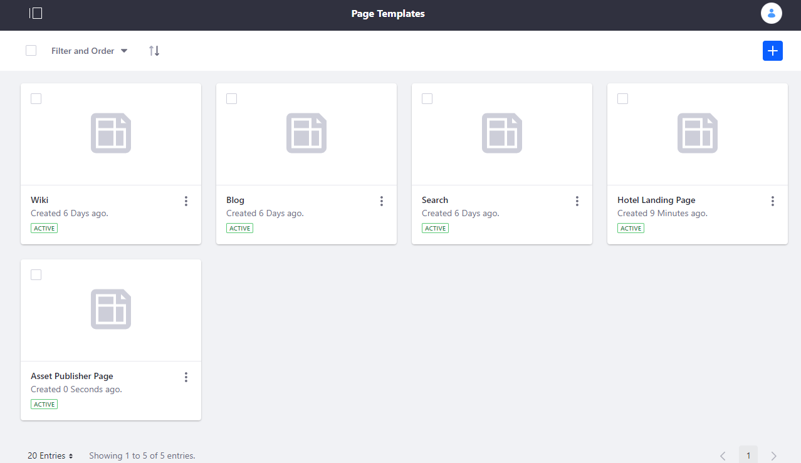
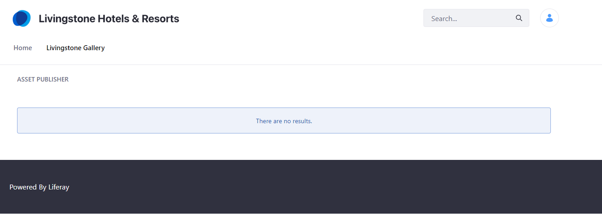

## Add Pages to the Livingstone Platform with Page Templates

#### Exercise Goals
	
- Create a Landing Page Template
- Use the Template to create a Landing Page for some of Livingstone's Hotels

#### Set Up a Global Landing Page Template
1. **Open** the _Menu_.
* **Click** the _Site Selector_ in the _Site Administration_ panel.
	- The _Site Selector_ allows you to choose which Site you want to access in your Liferay platform. Once selected, you will be able to access and edit the Site with the _Site Administration_ panel.
* **Click** the _My Sites_ tab.
* **Choose** the _Global_ site.
* **Go to** _`Design > Page Templates`_ in the _Site Administration_ panel.
	* You'll see the default global Page Templates here already: Search, Wiki, and Blog.
* **Click** the _Add_ icon in the top right corner.  
* **Type** `Hotel Landing Page` as the _Name_.  
* **Type** `A landing page for the various hotel and resort locations.` as the _Description_.  
* **Click** the _Save_ button.

 

#### Configure the Page Template
1. **Click** on the new _Hotel Landing Page_ template.  
	* This will take you to the new template page.
* **Click** the _Configure Page_ icon at the top right (the gear left of the _Add_ icon).  
* **Choose** _1-2-1 Columns (50/50)_ from the grid of options.
* **Click** _Save_.
* **Click** the _Back_ (<) icon.

#### Add Language and Content Widgets to the Template
1. **Click** the _Add_ icon in the top right corner of the page.  
* **Open** the _`Widgets > Highlighted`_ section.
* **Drop** a _Web Content Display_ at the top of the page.
* **Add** a _Web Content Display_ from the _`Widgets > Highlighted`_ section in the left column below the first one.
* **Add** an _Asset Publisher_ from the _`Widgets > Highlighted`_ section and place it in the right column beside the last Web Content Display. 
* **Drop** a _Language Selector_ from the _`Widgets > Tools`_ section and place it at the bottom of the page in the single column below the Web Content Display and Asset Publisher.
* **Click** the _Back_ (<) icon.
	- If your browser opened a new tab when you clicked on the _Hotel Landing Page_ template, close the tab to get back to the _Pages_ section of the _Global_ Site.

 

 

#### Create Another Widget Page Template
1. **Click** the _Add_ icon in the top right corner.  
* **Type** `Asset Publisher Page` as the _Name_.  
* **Type** `A widget page for displaying a specific type of content.` as the _Description_.  
* **Click** the _Save_ button.

 

#### Configure the New Page Template
1. **Click** on the new _Asset Publisher Page_ template.  
	* This will take you to the new template page.
* **Click** the _Configure Page_ icon at the top right (the gear left of the _Add_ icon). 
	* Make sure you're in the _General_ tab.
* **Choose** _1 Column_ from the grid of options.
* **Click** _Save_.
* **Click** the _Back_ (<) icon.

#### Add the Asset Publisher Widget to the Template
1. **Click** the _Add_ button in the top right corner of the page.  
* **Open** the _`Widgets > Highlighted`_ section.
* **Add** an _Asset Publisher_.
	- If your browser opened a new tab when you clicked on the _Asset Publisher Page_ template, close the tab to get back to the _Pages_ section of the _Global_ site.
* **Click** the _Back_ (<) icon.

 

#### Create a Page with the Asset Publisher Page Template
1. **Open** the _Menu_.
* **Click** on the _Site Selector_ in the _Site Administration_ panel.
* **Choose** the _Livingstone Hotels & Resorts_ Site.
* **Go to** _`Site Builder > Pages`_ in the _Site Administration_ panel.
* **Click** the _Add_ button next to _Public Pages_.
* **Choose** _Add Page_.
* **Go to** the _Global Templates_ tab.
	- You should see the three default Page Templates plus the two we added above.
* **Choose** the _Asset Publisher Page_.
* **Type** `Livingstone Gallery` for the _Name_.
* **Click** _Add_.
	- When the configuration page loads, note that the _Inherit Changes_ slider is set to _YES_. We want to keep this for now so that any changes we make to this Page Template in the future change this Page, too.
* **Click** the _Save_ button.
* **Click** _Home_ in the _Site Administration_ panel.
* **Click** _Livingstone Gallery_ in the navigation menu.

 

 
 
 

---

#### Bonus Exercises:
1. Add another Widget Page Template called Hotel Room Comparisons. Use two Asset Publishers and a Web Content Display. Choose whichever page layout looks best to you.
2. Add more Pages to the default Livingstone Hotels & Resorts Site. Use any existing Page Templates to create the new Pages. View the new Pages in the default Navigation Menu.
