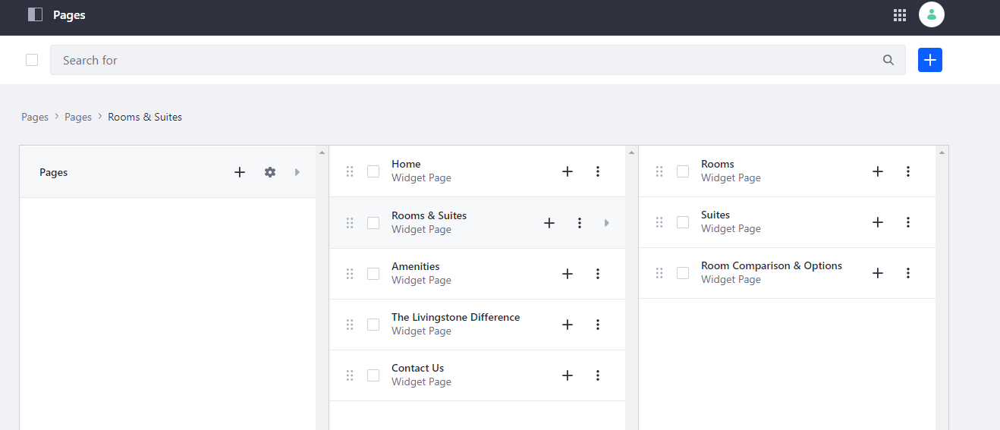
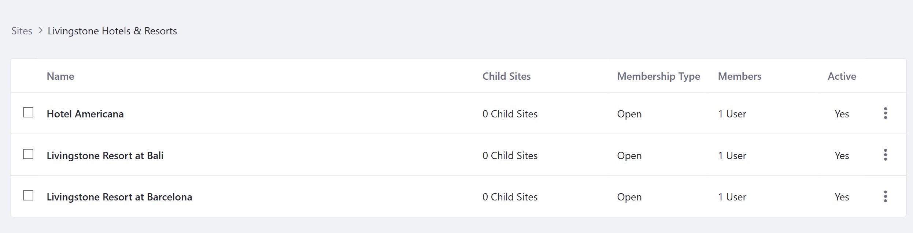

## Add Sites to the Livingstone Platform

#### Exercise Goals

- Create a Site Template for luxury hotel locations
- Use the template to create a Landing Page for some of Livingstone's luxury hotels

#### Create a Site Template for Luxury Hotel Location Landing Pages
1. **Open** the _Global Menu_.
* **Go to** _`Control Panel > Sites > Site Templates`_ in the _Menu_. 
* **Click** the _Add_ icon near the top right.
* **Type** `Luxury Hotel Location Site` as the _Name_. 
* **Click** _Save_.  
* **Click** the _Luxury Hotel Location Site_.
	- This will open up our Site Template in a new tab.
* **Go to** _`Site Builder > Pages`_ in the _Site Administration_ panel.
* **Click** the _Options_ icon next to the default _Home_ Page.
* **Choose** _Delete_.
* **Click** _OK_ in the pop-up asking if you are sure you want to delete this.
* **Click** the _New_ button in the center of the page.
* **Choose** _Private Page_.
* **Click** the _Global Templates_ tab.  
* **Choose** _Hotel Landing Page_.
* **Type** `Home` as the _Name_.
* **Click** _Add_.
	- When the configuration page loads, make sure the _Inherit Changes_ slider is set to _YES_.
* **Click** the _Save_ button at the bottom of the page.
* **Click** the _Back_ (<) icon.

 

#### Add a Room & Suites Page to the Site Template
1. **Click** the _Add_ icon near the top right.
* **Choose** _Add Site Template Page_.
* **Choose** _Widget Page_.
* **Type** `Rooms & Suites` as the _Name_.
* **Click** _Add_.
* **Click** the _Save_ button at the bottom of the page.
* **Click** the _Back_ (<) icon.

#### Add Child Pages for Suites, Rooms, and Options
1. **Click** the _Add_ icon to the right of the _Room & Suites_ Page we just created.
* **Choose** _Add Page_.
* **Choose** _Widget Page_.
* **Type** `Suites` as the _Name_.
* **Click** _Add_.
* **Click** the _Save_ button at the bottom of the page.
* **Click** the _Back_ (<) icon.
* **Click** the _Add_ icon to the right of the _Room & Suites_ Page.
* **Choose** _Add Page_.
* **Choose** _Widget Page_.
* **Type** `Rooms` as the _Name_.
* **Click** _Add_.
* **Click** the _Save_ button at the bottom of the page.
* **Click** the _Back_ (<) icon.
* **Click** the _Add_ icon to the right of the _Room & Suites_ Page.
* **Choose** _Add Page_.
* **Choose** _Widget Page_.
* **Type** `Room Comparison & Options` as the _Name_.
* **Click** _Add_.
* **Click** the _Save_ button at the bottom of the page.
* **Click** the _Back_ (<) icon.

#### Finish Creating the Page Structure for the Site Template
1. **Click** the _Add_ icon at the top right.
* **Choose** _Add Site Template Page_.
* **Choose** _Widget Page_.
* **Type** `Amenities` as the _Name_.
* **Click** _Add_.
* **Click** the _Save_ button at the bottom of the page.
* **Click** the _Back_ (<) icon.
* **Click** the _Add_ icon at the top right.
* **Choose** _Add Site Template Page_.
* **Choose** _Widget Page_.
* **Type** `The Livingstone Difference` as the _Name_.
* **Click** _Add_.
* **Click** the _Save_ button at the bottom of the page
* **Click** the _Back_ (<) icon.
* **Click** the _Add_ icon at the top right.
* **Choose** _Add Site Template Page_.
* **Choose** _Widget Page_.
* **Type** `Contact Us` as the _Name_.
* **Click** _Add_.
* **Click** the _Save_ button at the bottom of the page.
* **Click** the _Back_ (<) icon.

 

#### Create a New Site Using the New Site Template
1. **Go to** _`Control Panel > Sites > Sites`_ in the _Global Menu_.   
* **Click** the _Options_ icon next to _Livingstone Hotels & Resorts_.
* **Choose** _Add Child Site_.  
* **Choose** _Luxury Hotel Location Site_.
* **Type** `Hotel Americana` as the _Name_.
* **Click** the _Save_ button at the bottom.
* **Click** on _`Site Builder > Pages`_ in the _Site Administration_ panel for the _Hotel Americana_ Site.
	* You'll see that the Pages we created in the template have been generated for this Site.

 

 

#### Create Two More Luxury Hotel Sites with the Site Template
1. **Go to** _`Control Panel > Sites > Sites`_ in the _Global Menu_.  
* **Click** the _options_ icon next to _Livingstone Hotels & Resorts_.  
* **Choose** _Add Child Site_.
* **Click** _Luxury Hotel Location Site_.
* **Type** `Livingstone Resort at Barcelona` as the _Name_.  
* **Click** the _Save_ button.
* **Go to** _`Control Panel > Sites > Sites`_ in the _Global Menu_.  
* **Click** the _Options_ icon next to _Livingstone Hotels & Resorts_.  
* **Choose** _Add Child Site_.
* **Click** _Luxury Hotel Location Site_.
* **Type** `Livingstone Resort at Bali` as the _Name_.  
* **Click** the _Save_ button.
* **Go to** _`Control Panel > Sites > Sites`_ in the _Global Menu_.
* **Click** the _Livingstone Hotels & Resorts_ Site to see the Child Sites we created above. 

 

---

#### Bonus Exercises
1. Create a Site Template for Livingstone's Regional Office locations. The template should have at least three Pages that include at least one widget on them.
2. Add Luxury Hotel Location Landing Sites for the Bavarian and Parisian locations. Make sure they are created as Child Sites of the main Livingstone Site.
3. Add a custom Page to one of the new Luxury Hotel Location Landing Sites created from the Site Template in the bonus exercise above. Navigate to the new Site and look at the Pages you added within the Site itself.
