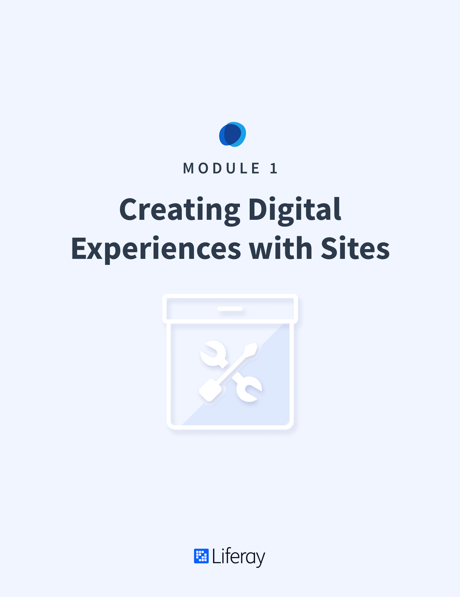

# Creating Digital Experiences with Sites

#### Learning Objectives

* Understand what Sites are in Liferay DXP
* Understand how to add Pages and create Page Templates
* Learn what Site Templates are and how to use them
* Learn how to manage Sites and configure Site Settings

#### Tasks to Accomplish

* Start an instance of Liferay DXP
* Add Pages to the default Site
* Create a Landing Page Template to be used across the platform
* Create a Site Template to rapidly add similar Sites to the platform
* Manage Site configurations

#### Exercise Prerequisites

* Unzipped module exercise files in the following folder structure:
	- Windows: <code>C:\liferay</code>
	- Unix Systems: <code>[user-home]/liferay</code>
* Docker Desktop installed for your device:
	- Windows: <a href="https://docs.docker.com/docker-for-windows/install/">https://docs.docker.com/docker-for-windows/install/</a>
	- OSX: <a href="https://docs.docker.com/docker-for-mac/install/">https://docs.docker.com/docker-for-mac/install/</a>
	- Linux: <a href="https://docs.docker.com/install/linux/docker-ce/ubuntu/">https://docs.docker.com/install/linux/docker-ce/ubuntu/</a>

<h2> Table of Contents </h2>

TABLE OF CONTENTS
