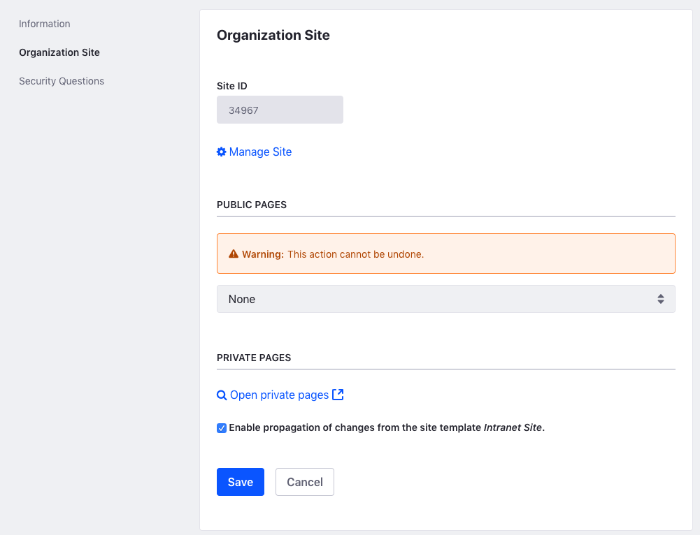

## Create an Organization Hierarchy 

#### Exercise Goals
* Create a Basic Livingstone Rewards Organization Hierarchy
* Create Livingstone Rewards Organization Sites
* Assign a Livingstone Customer to a Livingstone Rewards Organization

#### Create a New Livingstone Rewards Organization
1. **Open** the _Global Menu_.
* **Go to** _`Control Panel > Users and Organizations`_.
* **Click** on the _Organizations_ tab.
* **Click** the _Add_ icon at the top right to add a new Parent Organization.
* **Type** `Livingstone Rewards` for the _Name_.
* **Click** _Save_ at the bottom.

 

#### Create a Sub-Organization for Livingstone Rewards United States
1. **Click** the _Back_ icon at the top left.
* **Click** on the _Options_ icon to the right of the _Livingstone Rewards_ organization.
* **Click** _Add Organization_.
* **Type** `Livingstone Rewards U.S.` for the _Name_.
* **Choose** _United States_ from the _Country_ drop-down.
* **Type** `United States` in the _More Information_ field to create a new tag.
* **Press** _Enter_ to add the new tag.
* **Click** _Save_ at the bottom.

 

#### Create an Organization Site for Livingstone Rewards U.S.
1. **Click** _Organization Site_ in the left menu.
* **Click** the _Create Site_ toggle.
* **Click** _Save_ at the bottom.

 

#### Create a Sub-Organization for Livingstone Rewards Fiji
1. **Go to** _`Control Panel > Users and Organizations`_.
* **Click** on the _Organizations_ tab.
* **Click** on the _Options_ icon to the right of the _Livingstone Rewards_ organization.
* **Click** _Add Organization_.
* **Type**`Livingstone Rewards Fiji` for the _Name_.
* **Choose** _Fiji Islands_ from the _Country_ drop-down.
* **Type** `Fiji` in the _More Information_ field to create a new tag.
* **Press** _Enter_ to add the new tag.
* **Click** _Save_ at the bottom.

 

#### Create an Organization Site for Livingstone Rewards Fiji
1. **Click** _Organization Site_ in the left menu.
* **Click** the _Create Site_ toggle.
* **Click** _Save_ at the bottom.

 

#### Assign Jason Murray to the Livingstone Rewards U.S. Organization
1. **Go to** _`Control Panel > Users and Organizations`_.
* **Click** on the _Organizations_ tab.
* **Click** on the _Livingstone Rewards_ Organization.
* **Click** on the _Options_ icon to the right of _Livingstone Rewards U.S._.
* **Click** _Assign Users_.
* **Click** the checkbox next to _Jason Murray_.
* **Click** _Done_.

 

---

#### Bonus Exercise:
1. Create Sub-Organizations for the Livingstone Rewards Organization for the regions of Indonesia, Spain, and Japan. Add Contact Information for each region's Organization and create an Organization Site for the Japan Sub-Organization. Assign Hannah Jones to the Livingstone Rewards Japan Organization.

