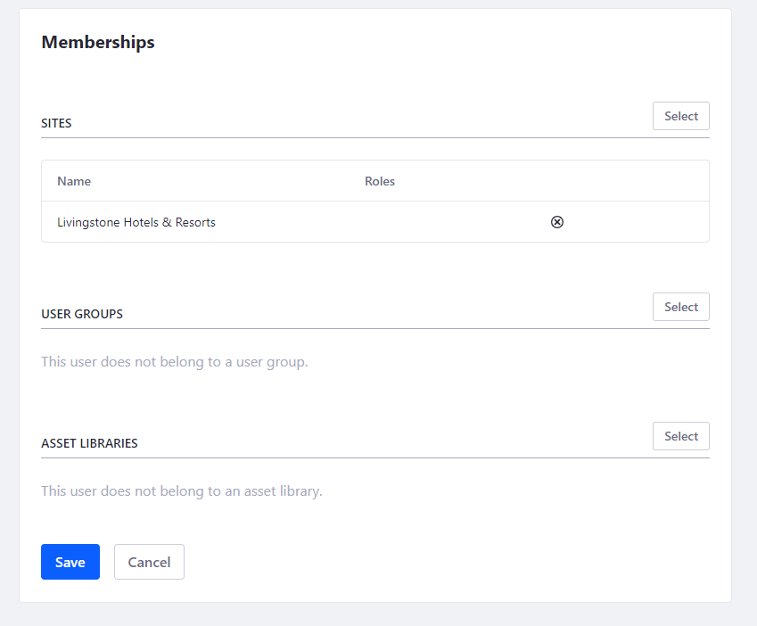

## Create New Users

#### Exercise Goals

* Create two new Users
* Give the new Users a password and access to the Livingstone Hotels & Resorts Site 

#### Create the User, Jason Murray
1. **Sign in** to Liferay, if you're not already logged in.
    * Make sure you go to _localhost:8080_ in your browser once Liferay is started.
2. **Open** the _Global Menu_.
3. **Go to** _`Control Panel > Users and Organizations`_.
4. **Click** the _Add_ icon at the top right to add a User.
5. **Type** `j.murray` for the _Screen Name_.
6. **Type** `jason.murray@livingstone.com` for the _Email Address_.
7. **Type** `Jason` for the _First Name_.
8. **Type** `Murray` for the _Last Name_.
9. **Click** _Save_ at the bottom.

 

#### Give Jason a Password
1. **Click** on _Password_ in the left menu.
2. **Type** a new password in the _New Password_ and _Enter Again_ fields.
    * For simplicity, you can just use _test_.
3. **Click** _Save_.

 

#### Give Jason Access to the Default Site
1. **Click** on _Memberships_ in the left menu.
2. **Click** _Select_ at the top right next to _Sites_.
3. **Click** _Livingstone Hotels & Resorts_.
4. **Click** _Save_.

 

#### Create the User, Hannah Jones
1. **Go to** _`Control Panel > Users and Organizations`_.
2. **Click** the _Add_ button at the top right to add a User.
3. **Type** `h.jones` for the _Screen Name_.
4. **Type** `hannah.jones@livingstone.com` for the _Email Address_.
5. **Type** `Hannah` for the _First Name_.
6. **Type** `Jones` for the _Last Name_.
7. **Click** _Save_ at the bottom.

 

#### Give Hannah a Password
1. **Click** on _Password_ in the left menu.
2. **Type** a new password in the _New Password_ and _Enter Again_ fields.
    * For simplicity, you can just use _test_.
3. **Click** _Save_.

 

#### Give Hannah Access to the Default Site
1. **Click** on _Memberships_ in the left menu.
2. **Click** _Select_ at the top right.
3. **Click** to choose the default Site.
    * If you followed the Module 1 set up, this should be _Livingstone Hotels & Resorts_.
4. **Click** _Save_.

 

---

#### Bonus Exercises:
1. Create a new User, Omar Miles. Give Omar a password, access to the Livingstone Hotels & Resorts Site, and the phone number (314) 159-2653 as Contact Information.

