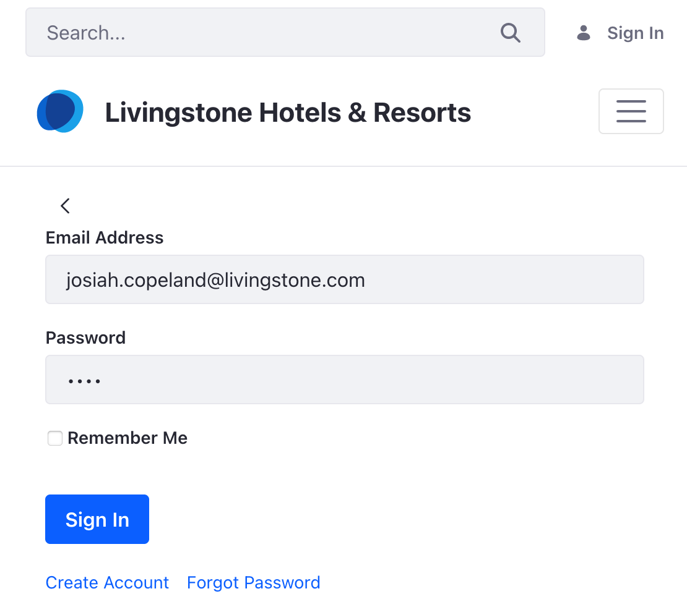
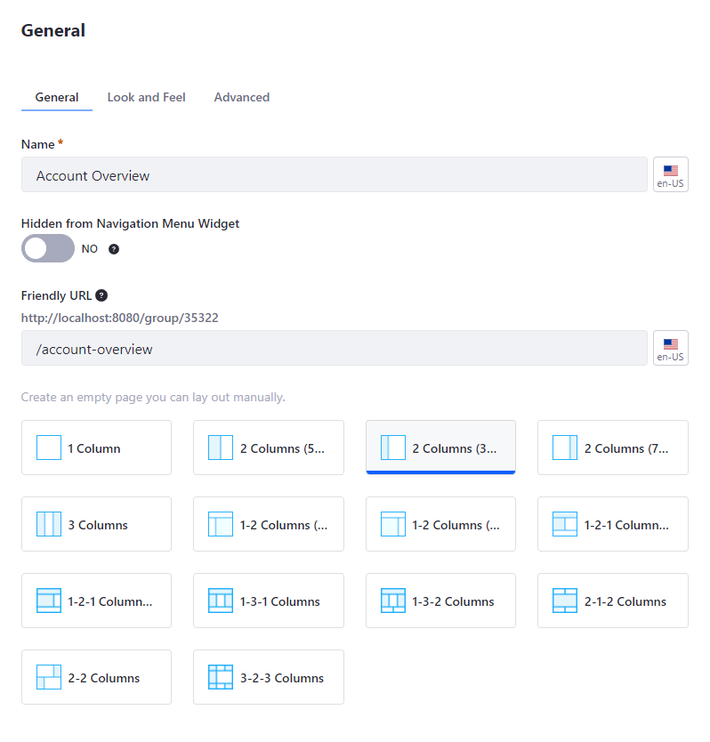
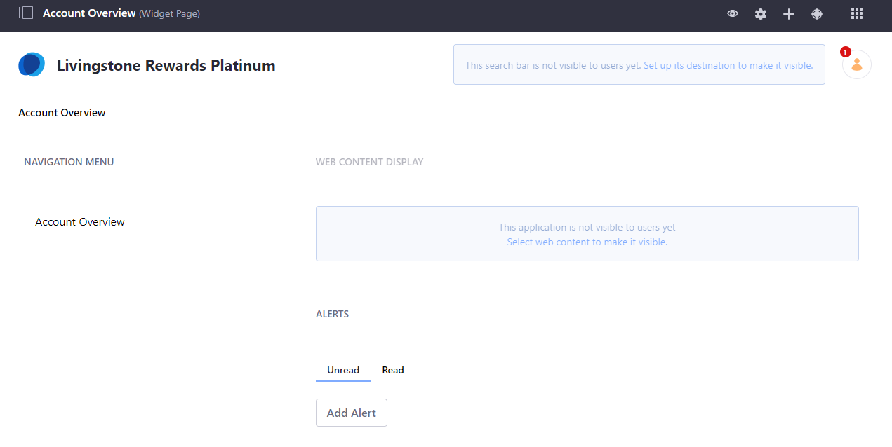

## Create and Manage User Groups 

#### Exercise Goals
* Create three User Groups for the Livingstone Rewards Levels
* Assign a User to one of the new User Groups
* Create a User Group Site

#### Log in as Your Main Administrative User
1. **Click** on the _Personal Menu_ at the top right.
* **Click** _Sign Out_ at the bottom.
* **Click** _Sign In_ at the top right.
* **Sign In** as the main administrative User.
	* If you followed the steps in _Creating Digital Experiences with Sites_, this User will have the following credentials:
		* Email Address: josiah.copeland@livingstone.com
		* Password: test

 

#### Create the Livingstone Rewards Silver User Group
1. **Open** the _Global Menu_.
* **Go to** _`Control Panel > User Groups`_.
* **Click** the _Add_ icon at the top right to add a new User Group.
* **Type** _Livingstone Rewards Silver_ for the _Name_.
* **Click** _Save_ at the bottom.

 

#### Create the Livingstone Rewards Gold User Group
1. **Click** the _Add_ icon at the top right to add a new User Group.
* **Type** _Livingstone Rewards Gold_ for the _Name_.
* **Click** _Save_ at the bottom.

 

 

#### Create the Livingstone Rewards Platinum User Group
1. **Click** the _Add_ icon at the top right to add a new User Group.
* **Type** _Livingstone Rewards Platinum_ for the _Name_.
* **Click** _Save_ at the bottom.

 

#### Assign Jason Murray to the Livingstone Platinum User Group
1. **Click** the _Options_ icon next to _Livingstone Rewards Platinum_.
* **Click** _Assign Members_.
* **Click** the _Add_ icon at the top right to add a new User.
* **Click** the checkbox next to _Jason Murray_.
* **Click** _Add_ at the bottom right.

 

#### Create a Livingstone Platinum Private User Group Site
1. **Click** on the _Options_ icon at the top right for the User Group.
* **Click** _Manage Pages_.
* **Click** the _Add_ icon at the top right to add a new page.
* **Choose** _Private Page_. 
* **Click** _Widget Page_.
* **Type** `Account Overview` for the _Name_.
* **Click** _Add_.

 

#### Add Widgets to the Livingstone Platinum Site
1. **Click** _Go to Site_ in the _Site Administration_ panel.
* **Open** the _Add_ menu at the top right.
* **Open** the _Widget_ section.
* **Open** the _Highlighted_ tab.
* **Drag and Drop** the _Navigation Menu_ widget to the left column of the page.
* **Drag and Drop** the _Web Content Display_ widget to the right of the page.
* **Open** the _News_ tab.
* **Drag and Drop** the _Alerts_ widget under the _Web Content Display_ widget.

 

 

---

#### Bonus Exercises:
1. Create new Private User Group Pages for the Livingstone Rewards Gold and Silver Groups with different widgets than the Livingstone Rewards Platinum Group Page (e.g. Asset Publisher, Message Board, Calendar, etc.). Add Hannah Jones to the Livingstone Rewards Gold User Group and verify access to the Account Overview page.
