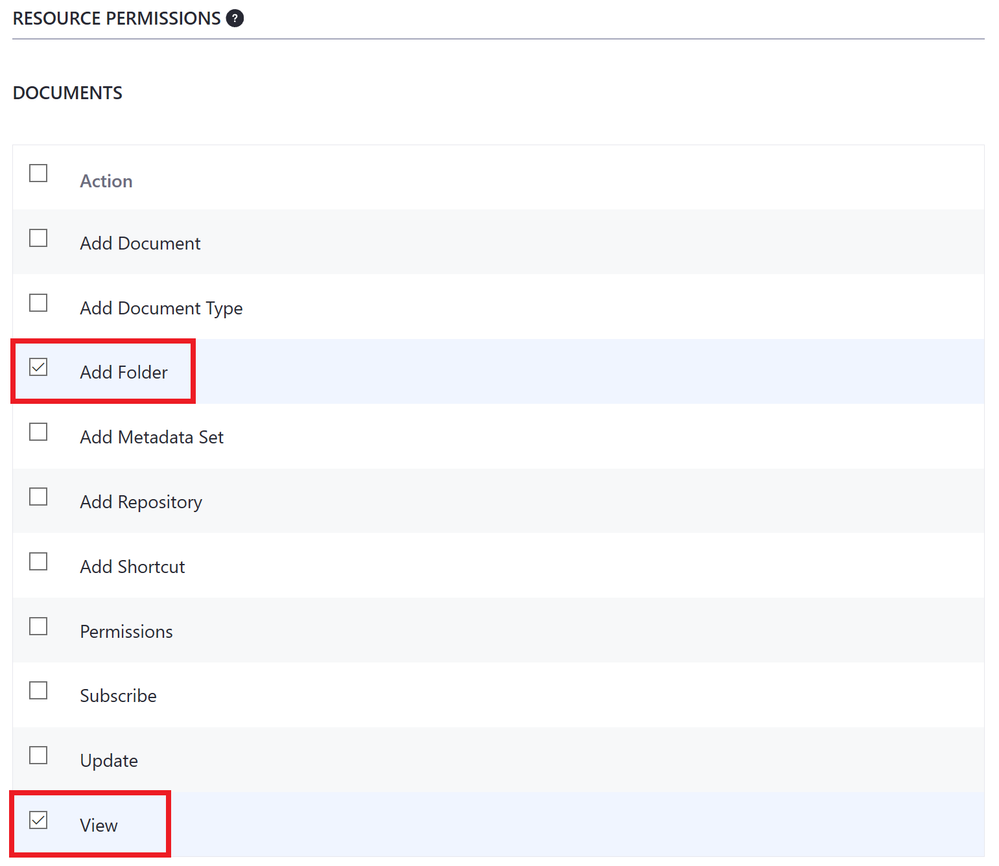

## Accessing Assets 

#### Exercise Goals

* Create a Content Creator role that allows the content team to do the following:
    * Add and Edit Web Content
    * Add and Edit Blogs
    * Add and Edit Images
* Create the user Omar Miles
* Assign Omar the Content Creator role
* Log in as Omar Miles and create a Blog post

#### Create a New Site Content Creator Role
1. **Open** the _Menu_.  
* **Go to** _`Control Panel > Users > Roles`_.  
* **Click** the _Site Roles_ tab.
    - The _Site Content Reviewer_ Role was auto-generated from the last exercise we did.
* **Click** the _Add_ button at the top right.
* **Type** `Site Content Creator` for the _Title_.
* **Type** a _Description_ for the new _Role_.
* **Click** _Save_.

 

#### Add Site Administration Access and View Permissions for Web Content
1. **Click** the _Define Permissions_ tab.  
* **Open** the _Site Administration_ drop-down.
* **Open** the _Content & Data_ drop-down.
* **Click** the _Web Content_ option.
* **Check** _Access in Site Administration_ under _General Permissions_.
* **Check** _View_ under _General Permissions_.

 

#### Add the Add Folder and View Permissions for Web Content
1. **Check** _Add Folder_ under _Web Content_.
* **Check** _View_ under _Web Content_.

 

#### Add the Add Subfolder, Web Content, Update, and View Permissions
1. **Check** _Add Subfolder_ under _Web Content Folder_.
* **Check** _Add Web Content_ under _Web Content Folder_.
* **Check** _Update_ under _Web Content Folder_.
* **Check** _View_ under _Web Content Folder_.

 

#### Add the Update and View Permissions for Web Content Articles
1. **Check** _Update_ under _Web Content Article_.
* **Check** _View_ under _Web Content Article_.
* **Click** _Save_ at the very bottom.

 

#### Add Site Administration Access and View Permissions for Blogs
1. **Open** the _Site Administration_ drop-down.
* **Open** the _Content & Data_ drop-down.
* **Click** the _Blogs_ option.
* **Check** _Access in Site Administration_ under _General Permissions_.
* **Check** _View_ under _General Permissions_.

 

#### Add the Add Entry Permission for All Blog Entries
1. **Check** _Add Entry_ under _Blog Entries_.

 

 
 

#### Add the Add, Delete, Update Discussion, Update, and View Permissions for Blogs
1. **Check** _Add Discussion_ under _Blogs Entry_.
* **Check** _Delete Discussion_ under _Blogs Entry_.
* **Check** _Update_ under _Blogs Entry_.
* **Check** _Update Discussion_ under _Blogs Entry_.
* **Check** _View_ under _Blogs Entry_.
* **Check** _Save_.

 

#### Add Site Administration Access and View Permissions for Documents and Media
1. **Open** the _Site Administration_ drop-down.
* **Open** the _Content & Data_ drop-down.
* **Click** the _Documents and Media_ option.
* **Check** _Access in Site Administration_ under _General Permissions_.
* **Check** _View_ under _General Permissions_.

 

#### Add the Add Folder and View Permissions for Documents
1. **Check** _Add Folder_ under _Documents_.
* **Check** _View_ under _Documents_.

 

#### Add the Add Subfolder, Document, Update, and View Permissions for Document Folders
1. **Check** _Add Document_ under _Documents Folder_.
* **Check** _Add Subfolder_ under _Documents Folder_.
* **Check** _Update_ under _Documents Folder_.
* **Check** _View_ under _Documents Folder_.

 

#### Add the Update and View Permissions for Individual Documents
1. **Check** _Update_ under _Document_.
* **Check** _View_ under _Document_.
* **Click** _Save_ at the very bottom.

 

#### Disable Email Address Verification Requirement
1. **Open** the _Menu_.
* **Go to** _`Control Panel > Instance Settings > User Authentication`_.
* **Uncheck** the box next to where it says _Require strangers to verify their email addresses?_.
* **Click** _Save_.

Note: We are only disabling email address verification because we do not have an email server set up. It is recommended to keep this default setting in a production environment.

#### Add Omar Miles as a User in the Platform
1. **Open** the _Menu_.  
* **Go to** _`Control Panel > Users > Users and Organizations`_.
* **Click** the _Add_ button.
* **Type** the following under _User Display Data_:
    - `omar.miles` as the _Screen Name_
    - `omar.miles@livingstone.com` as the _Email Address_
* **Type** the following under _Personal Information_:
    - `Omar` as the _First Name_
    - `Miles` as the _Last Name_
* **Click** _Save_ at the bottom of the page.

 

#### Make Omar a Member of the Livingstone Life Site
1. **Click** _Memberships_ on the left.
* **Click** _Select_ next to _Sites_.
* **Choose** _Livingstone Life_.
* **Click** _Save_.

 

#### Assign Omar to the Site Content Creator Role
1. **Click** _Roles_ on the left.
* **Click** _Select_ next to _Site Roles_.
* **Choose** _Site Content Creator_.
* **Click** _Save_.

 

#### Set a Password for Omar
1. **Click** _Password_ on the left.
* **Type** `test` as the password.
* **Type** the new password again.
* **Click** _Save_.

 

#### Log in as Omar Miles
1. **Click** the _User_ icon in the top right corner of the screen.
* **Choose** _Sign Out_ at the bottom of the drop-down.
* **Click** _Sign In_ at the top right corner of the page.
* **Type** `omar.miles@livingstone.com` for the _Email Address_.
* **Type** `test` as the password.
* **Click** _Sign In_.
* **Click** _I Agree_.
* **Type** a new password for Omar's account.
    - This must be a different password from the one we set in the _Control Panel_ above.
* **Click** _Save_.
* **Choose** a password reminder query.
* **Type** in your answer.
* **Click** _Save_.

 

#### Go to the Livingstone Life Site
1. **Click** the _User_ icon in the top right corner of the screen.
* **Choose** _My Sites_.
* **Click** the _My Sites_ tab.
* **Choose** the _Livingstone Life_ site.

 

#### Add a Blog
1. **Open** the _Menu_.  
* **Go to** _`Content & Data > Blogs`_ in the _Site Administration_ panel.
* **Click** the _Add_ button.
* **Type** `I Dream of Fiji` as the _Title_.
* **Type** `Reflections on my time in the islands of the South Pacific` as the _Subtitle_.
* **Open** your `fiji.txt` file found in your module exercises folder.
* **Copy** the text.
* **Paste** the text below the subtitle.
* **Drop** the `fiji.jpg` file from your Course Module exercises folder into the box at the top of the page.
* **Click** _Publish_ at the bottom of the page.

 

 

---

#### Bonus Exercises:
1. Create a new user named Maria Flores in _Users and Organizations_ and make her a member of the main site.
2. Grant the new user the _Site Content Creator_ role.
3. Log in as Maria Flores.
4. Create Basic Web Content and publish it on the main _Livingstone Hotels & Resorts_ site.
