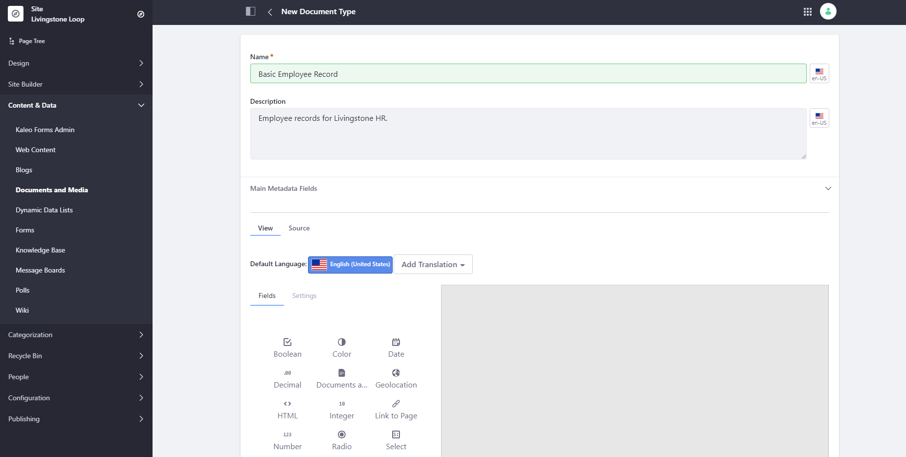
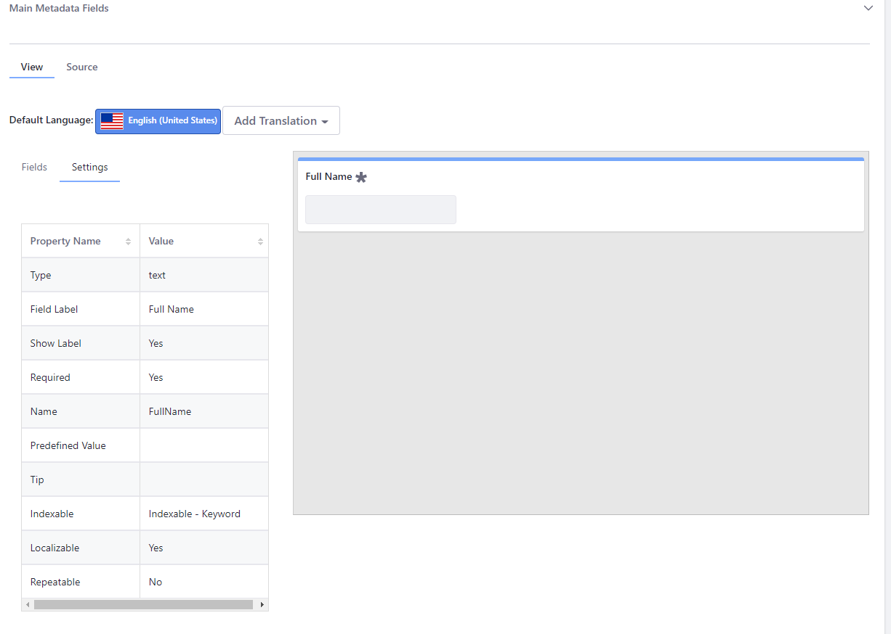
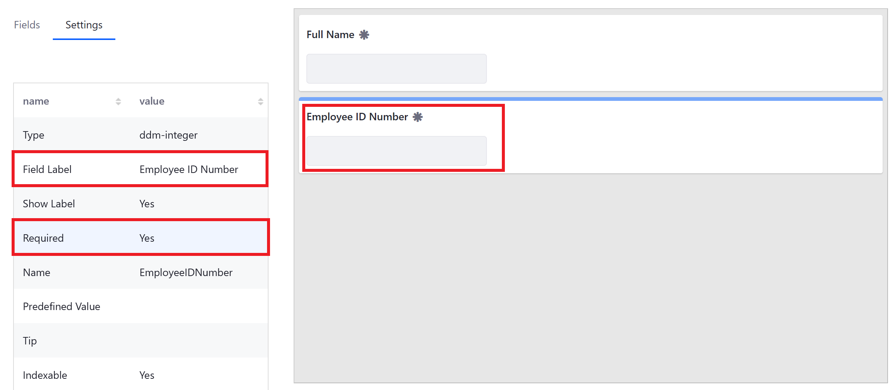
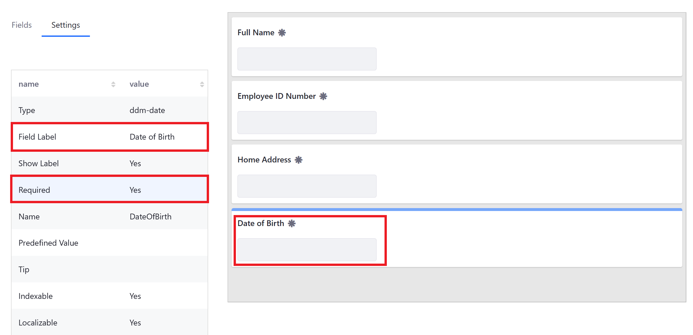
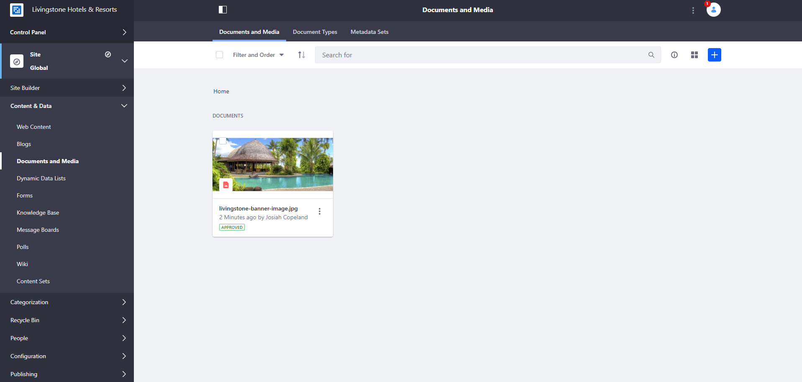
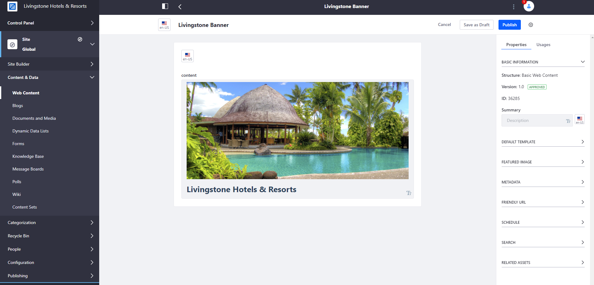
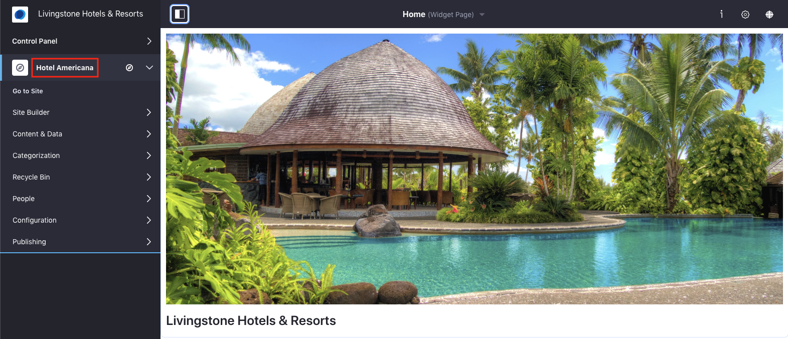

## Add Assets to the Platform

#### Exercise Goals
* Create new document types
* Add assets to the platform

#### Add the Livingstone Loop Employee Intranet
1. **Go to** _`Control Panel > Sites > Sites`_ in the _Global Menu_.
	* If you have already created the Livingstone Loop Site, you may proceed to the next section.
* **Click** the _Add_ icon.
* **Choose** _Blank Site_.
* **Type** `Livingstone Loop`.
* **Check** the _Create default pages as private ..._ box.
* **Click** the _Save_ button.
* **Type** `Livingstone's main employee intranet site.` as the _Description_.
* **Open** the _Membership Type_ drop-down under the _Membership Options_ heading.
* **Choose** _Private_.
* **Click** the _Save_ button at the bottom of the page.

 

#### Add the Livingstone Life Blog Site
1. **Go to** _`Control Panel > Sites > Sites`_ in the _Global Menu_.
	* If you have already created the Livingstone Life Site, you may proceed to the next section.
* **Click** the _Add_ icon.
* **Choose** _Blank Site_.
* **Type** `Livingstone Life`.
* **Click** the _Save_ button.
* **Type** `Livingstone's blog site.` as the _Description_.
* **Open** the _Membership Type_ drop-down under the _Membership Options_ heading.
* **Choose** _Restricted_.
* **Click** the _Save_ button at the bottom.

 

#### Create a Basic Employee Record Document Type
1. **Open** the _Global Menu_.
* **Click** _Livingstone Loop_ in the _Sites_ panel.
* **Go to** _`Site Administration > Content & Data > Documents and Media`_. 
* **Click** on the _Document Types_ tab near the top.  
* **Click** the _Add_ icon on the top right.  
* **Type** `Basic Employee Record` in the _Name_ field.  
* **Type** `Employee records for Livingstone HR.` under _Description_.
* **Click** the _Main Metadata Fields_ section to open it.

 

#### Add a Text Field for the Full Name
1. **Drag** a _Text_ field into the right column.
* **Click** on the field to open the editing options. 
* **Double-click** to edit the _Field Label_ value. 
* **Type** `Full Name` in the box next to _Field Label_.  
* **Click** _Save_.  
* **Double-click** the _Required_ field value.
* **Click** _Yes_ to make it a required field.
* **Click** _Save_.

 

#### Add an Integer Field for the Employee ID Number
1. **Click** the _Fields_ tab at the top left of the editor.  
* **Drag** an _Integer_ field into the right column under the new _Full Name_ field.  
* **Click** on the _Integer_ field to edit it.
* **Double-click** to edit the _Field Label_ value for the _Integer_ field.
* **Type** `Employee ID Number` in the box next to _Field Label_.  
* **Click** _Save_.  
* **Double-click** the _Required_ field value.
* **Click** _Yes_ to make it a required field.
* **Click** _Save_.

 

#### Add a Text Field for the Home Address
1. **Click** on the _Fields_ tab.  
* **Drag** a _Text_ field into the right column under the _Employee ID Number_ field.
* **Click** on the _Text_ field to edit it.
* **Double-click** to edit the _Field Label_ value.  
* **Type** `Home Address` in the box next to _Field Label_.  
* **Click** _Save_.  
* **Double-click** the _Required_ value field.
* **Click** _Yes_ to make it a required field.
* **Click** _Save_.

 

#### Add a Date Field for the Date of Birth
1. **Click** on the _Fields_ tab.  
* **Drag** a _Date_ field into the right column under the _Home Address_ field.
* **Click** on the _Date_ field to edit it.
* **Double-click** to edit the _Field Label_ value.  
* **Type** `Date of Birth` in the box next to _Field Label_.  
* **Click** _Save_.  
* **Double-click** the _Required_ field value.
* **Click** _Yes_ to make it a required field. 
* **Click** _Save_.

 

#### Add a Text Field for the Employee Job Title
1. **Click** on the _Fields_ tab.  
* **Drag** a _Text_ field into the right column under the _Date of Birth_ field.
* **Click** on the _Text_ field to edit it.
* **Double-click** to edit the _Field Label_ value.   
* **Type** `Job Title` in the box next to _Field Label_.  
* **Click** _Save_.  
* **Double-click** the _Required_ field value.
* **Click** _Yes_ to make it a required field.
* **Click** _Save_.  
* **Click** the _Save_ button at the bottom.

 

#### Create a New Employee Record Document for Omar Miles
1. **Click** on the _Documents and Media_ tab at the top of the page.
* **Click** on the _Add_ button. 
* **Choose** the _Basic Employee Record_ option.
* **Click** _Browse/Choose File_.
* **Choose** the `omar-miles.pdf` file from your module exercises folder.
* **Type** `Omar Miles Employee Record` for the _Title_.

 

#### Fill Out the Document with Employee Information
1. **Type** `Omar Miles` as the _Full Name_.
* **Type** `174903` as the _Employee ID Number_.
* **Type** `123 Main Street, Anytown, USA` as the _Home Address_.
* **Type** `04/18/1983` as the _Date of Birth_.
* **Type** `Editor, Livingstone Life` as the _Job Title_.
* **Click** _Publish_.

 

#### Create a New Document Type on the Global Site
1. **Open** the _Global Menu_.
* **Click** _Global_ in the _Sites_ panel.
* **Go to** _`Site Administration > Content & Data > Documents and Media`_. 
* **Click** on the _Document Types_ tab near the top.  
* **Click** the _Add_ icon on the top right.  
* **Type** `Image Type` in the _Name_ field.  
* **Click** the _Main Metadata Fields_ section to open it.
* **Drag and Drop** a _Select_ field into the right column.
* **Click** the newly added _Select_ field.
* **Type** `Image Type` for _Field Label_.
* **Click** _Save_.
* **Type** `Front Page, Blog Entry, Web Content` for _Options_.
* **Click** _Save_.
* **Click** _Save_.

 

 

#### Add an Image Type Document to the Global Site
1. **Click** _Add_.
* **Choose** _Image Type_ from the drop-down.
	* This is the new Document Type we just added to the Global site.
* **Click** _Browse/Choose File_.
* **Choose** the `livingstone-banner-image.jpg` file from your module exercises folder.
	- The _Name_ field will automatically be populated with the file name.

 

#### Fill Out the Banner Image Description
1. **Type** `Livingstone Banner` in the _Name_ field to add a more descriptive name.
* **Choose** `Front Page` from the _Image Type_ drop-down menu.
* **Click** _Publish_.

 

#### Create Web Content that Utilizes the Banner Image
1. **Go to** the _`Content & Data > Web Content`_ in the _Site Administration_ panel.
* **Click** the _Add_ button near the top right corner.
* **Choose** _Basic Web Content_ from the drop-down.
* **Click** where it says _Untitled Basic Web Content_ at the top of the page.
* **Type** `Livingstone Banner`.
* **Click** in the field below where it says _Content_.
* **Click** the _Add_ button next to the field.
* **Choose** _Insert Image_.
	- This is the first of the four icons that appears.
* **Click** on the _livingstone-banner-image.jpg_ that we just uploaded.
* **Click** _Add_.
* **Type** `Livingstone Hotels & Resorts` beneath the image.
* **Click** and drag to highlight the text we just typed.
* **Choose** _Heading 1_ from the drop-down on the left.
* **Click** the _Publish_ button at the top right corner of the page.

 

 

#### Add the Livingstone Banner to the Hotel Landing Page Template
1. **Go to** _`Site Builder > Pages`_ in the _Site Administration_ panel.
* **Click** on the _Hotel Landing Page_.
* **Click** the _Options_ icon on the top left of the _Web Content Display_ at the top of the page.
* **Choose** _Configuration_.
* **Click** _Select_.
* **Choose** the _Livingstone Banner_.
* **Click** the _Save_ button.
* **Close** the pop-up.

 

_Note: Our Web Content will not show up in the Web Content Display widget since this is a Page Template._

#### View the Web Content in a Page
1. **Open** the _Global Menu_.
* **Choose** the _Hotel Americana_ site in the _Sites_ panel.
	- The Web Content we created is already on display thanks to the _Inherit Changes_ feature discussed in the last course module.

 

---

#### Bonus Exercises
1. Go through all the Hotel landing sites and check that the Web Content we created is displayed at the top of the page.
2. Change the the top Banner Web Content to have a _Barebone_ Application Decorator configuration in the Hotel Landing Page Page Template.
3. Add an _Image Type_ document to the main Livingstone site using the `grand-hotel.jpg` file provided in your module exercise folder. Use _Front Page_ as the image type.
