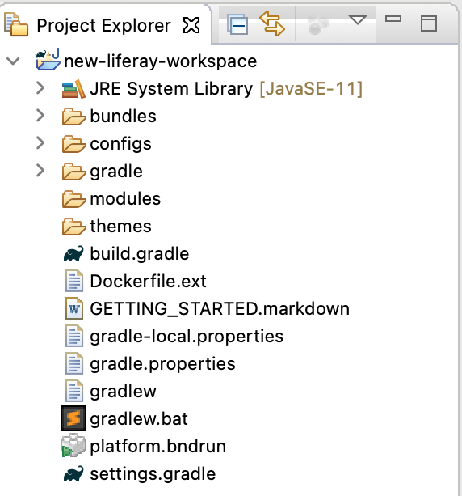

## Installing a Bundle in your Workspace

#### Exercise Goals

- Install a bundle during Liferay Workspace wizard
- Install a bundle using Developer Studio + Gradle Task

#### Install a Bundle Using Liferay Workspace Wizard
1. **Launch** Developer Studio if it's not already running.
2. **Create** a _New Liferay Workspace_.
	* Use _new-liferay-workspace_ as the Project name
	* You may have to delete your eclipse-workspace
* **Check** the box with the option to _Download Liferay Bundle_.
* **Click** _Finish_.
    * Notice that under the project explorer we have a folder called _bundles_. If you review the contents of this folder then you will see that it's the same as your typical LIFERAY_HOME.
    * Also notice that in the _Servers_ pane, we now have a reference to a server that is in a stopped state.

 

#### Create a New Liferay Workspace Using Developer Studio
1. **Close** Developer Studio.
* **Start** _Liferay Developer Studio_ back up again.
* **Choose** _New Liferay Workspace_.
* **Type** _gradebook-workspace_ for the Project name.
	* This will be the workspace we use for the next training modules
	* You may have to delete the _new-liferay-workspace_ directory and start this exercise sub-section over again. 
* **Click** _Finish_ to complete the setup process.
    * Once complete the screen should reload and you should now be on the workbench for the Gradebook Liferay Workspace.

 

Notice that, at the moment, there is no _bundles_ directory in our project (see the project pane). In the next section will we add a bundle to it using a gradle task.

#### Install a Bundle using Developer Studio + Gradle Task
1. **Expand** _gradebook-workspace_ and _bundle_ nodes under the _Gradle Tasks_ sidebar.
* **Double click** on the _initBundle_ task to run it.

    > NOTE:  
    > Remember that the bundle that will be referenced by this action is something we can configure with the liferay.workspace.bundle.url in our gradle.properties file that is in the root of our workspace 

    * If this is your first time running the task then it might take a few minutes as it needs to download the bundle from the referenced URL. Subsequent runs, with the same version will omit the download though and simply unpack the archive. 

* **Refresh** your project and notice that we now have a _bundles_ directory.
	* You can either use _F5_ or _right-click_ on the workspace in the Project Explorer to _Refresh_

 

