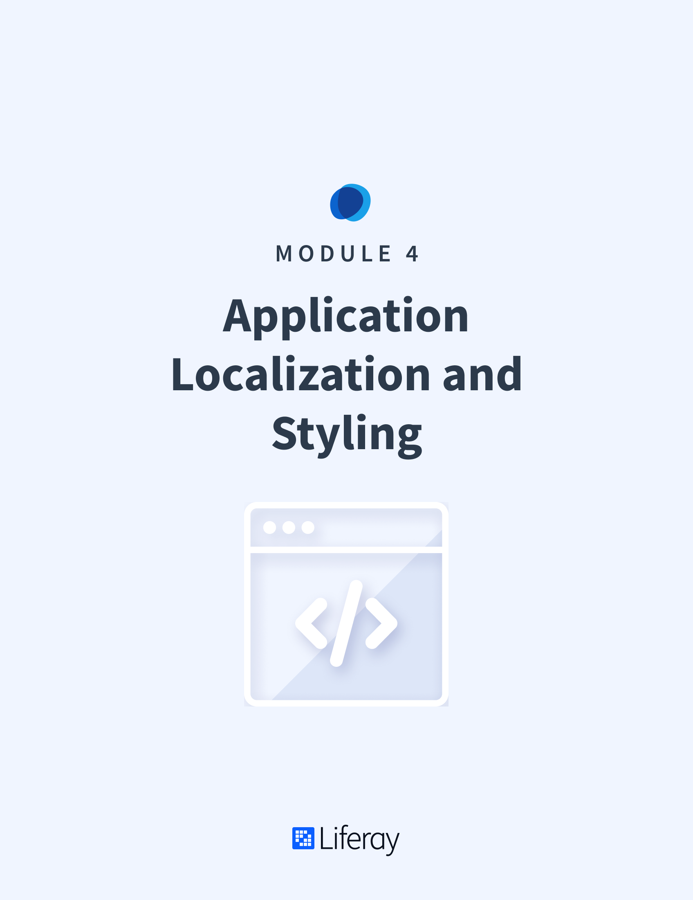

# Application Localization and Styling

#### Learning Objectives

* Understand the processes of localizing and internationalizing Liferay DXP applications
* Learn the methods by which CSS and JavaScript resources are added to applications in Liferay DXP

#### Tasks to Accomplish

* Add Localization Resources
* Add CSS Resources
* Add JavaScript Resources (optional)

#### Exercise Prerequisites

* Java JDK installed to run Liferay
    - Download here: <a href="https://www.oracle.com/technetwork/java/javase/downloads/jdk8-downloads-2133151.html">https://www.oracle.com/technetwork/java/javase/downloads/jdk8-downloads-2133151.html</a>
    - Instructions on installation here: <a href="https://www.java.com/en/download/help/download_options.xml">https://www.java.com/en/download/help/download_options.xml</a>
* Liferay Developer Studio installed with the "Gradebook Workspace" already created
	- This was done in the first training module
* Exercise Prereqs added to workspace or previous training modules completed

<h2>Table of Contents</h2>

TABLE OF CONTENTS