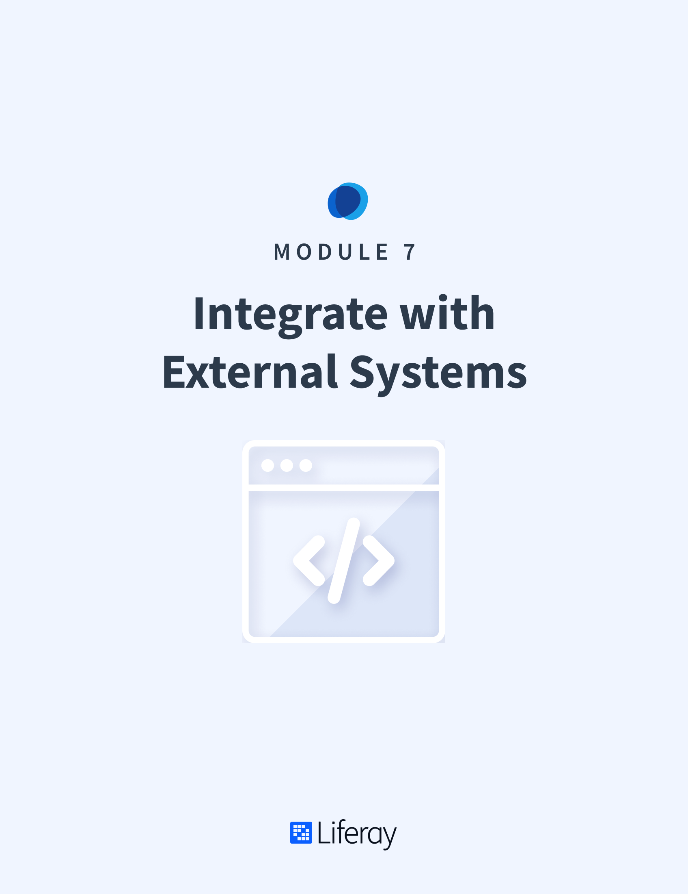

# Integrate with External Systems

#### Learning Objectives

* Learn how to make your custom application configurable
* Learn how to implement workflows in your application
* Understand JSON and SOAP web service APIs
* Understand JAX-RS and JAX-WS endpoint publishing

#### Tasks to Accomplish

* Test the Gradebook application in the Liferay DXP UI
* Add an Assignment through a JSON API test page
* Delete an Assignment through a JSON API test page

#### Exercise Prerequisites

* Java JDK installed to run Liferay
    - Download here: <a href="https://www.oracle.com/technetwork/java/javase/downloads/jdk8-downloads-2133151.html">https://www.oracle.com/technetwork/java/javase/downloads/jdk8-downloads-2133151.html</a>
    - Instructions on installation here: <a href="https://www.java.com/en/download/help/download_options.xml">https://www.java.com/en/download/help/download_options.xml</a>
* Liferay Developer Studio installed with the "Gradebook Workspace" already created
	- This was done in the first training module
* Exercise Prereqs added to workspace or previous training modules completed

<h2>Table of Contents</h2>

TABLE OF CONTENTS