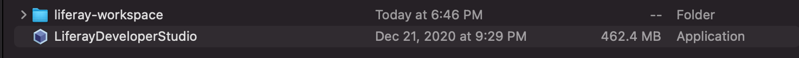

## Installing the Liferay IDE

#### Exercise Goals

- Download Liferay Developer Studio installation file
- Run the installation executable 
- First start and Quick Tour of the IDE

> NOTE:  
> The IDE comes in two different flavors. The the open source users there is a community version of IDE which is referred to as 
Liferay IDE. DXP subscribers have the ability to download and install an enhanced version of the IDE which is named 
"Developer Studio". Developer Studio contains all the same features and options that are part of Liferay IDE but also provides
several additional features that are not part of the community edition. If you have a subscription, it is recommended that you 
install the Developer Studio version of the IDE.  

#### Download Liferay Developer Studio Installation File
1. **Login** to Liferay's Help Center:  https://help.liferay.com/hc/en-us
    * Once you are logged in you should see the option to *Browse by Product*

    > NOTE:  
    If you do not see this option after login, then it could mean that the account you have with Liferay has not been
    associated with a customer profile. You'll need to contact the member of your organization who has access to open
    Liferay support tickets and ask them to open a ticket to have your user added to the customer account.

* **Choose** DXP 7.3.
* **Choose** the _Downloads_ tab
* **Click** _Latest Release_.
* **Select** _Developer Tools_ for the Product and _Developer Studio_ for the File Type.
* **Find** _Liferay Workspace with Developer Studio 3.9.x_.
    * Typically you will opt for the latest version since the newer versions are backwards compatible with older workspaces.
* **Select** your target OS.
* **Click** the _Download_ button.

 

#### Run the Installation Executable
1. **Open** a finder or windows explorer window and navigate to the location of the download.
2. **Double click** the download to start the installation wizard.
    > NOTE:  
    For OSX users, you may need to go into your security settings and authorize the file to be run as the Developer will likely
    come up as unrecognized.
3. **Select** the JVM you wish to use.
    * You should see the _Setup -- Liferay Workspace_ dialog
* **Click** _Next_ when you come to the Liferay Workspace with DevStudio Setup welcome page.
* **Click** _Next_ to go with the default installation directory.
* **Click** _Next_ to install the Command Line Tools.
* **Click** _Next_ to choose _Liferay DXP_ to use in your workspace.
* **Click** the _choose file_ icon to add the activation key file given to you in course materials.
* **Click** _Next_.
* **Click** _Next_ to skip the proxy configuration.
* **Click** _Next_ to begin the installation.
* **Click** _Finish_ to close the dialog.

 

#### Quick Tour of the IDE
1. **Navigate** to the location where you installed Liferay Developer Studio.
2. **Double click** the _LiferayDeveloperStudio_ executable to start the application. 
    * A dialog will open prompting you to select the location where you will store the settings for Developer Studio. The instructions in the dialog may be a little confusing but if you have worked with Eclipse, this is the same question you see when you first start the Eclipse IDE as well. In our case we're going to select the location where we chose to install Liferay Developer Studio just to keep everything together, but you don't have to choose this location.
* **Choose** the location you would like to for your workspace.
* **Click** the _Launch_ button.
    * The next screen you will see should once again feel familiar to those of you who are experienced with the Eclipse IDE. The Liferay Workspace can be thought of as the space that encapsulates the details of a Liferay project that you are working on. It contains settings, configs, code, and more. You may have noticed a folder *liferay-workspace* along side the executable to start Developer Studio. This workspace was generated by the installer.
* **Choose** _Import Liferay Workspace from Installer_.
    * You should now see the *Workbench* which defaults to the Liferay Perspective. When working with your Liferay solutions this is the preferred perspective for a few reasons. For starters, the layout (window panels) include the views that you are most commonly using when actively developing (Project Explorer, Gradle Tasks, Servers, etc). The second reason is because when working in this view context menu and file menu options that are specific to Liferay will become available for you to use.     
    
Ok -- that's it! You now have Developer Studio installed and ready to start building your Liferay 
applications. For those of you who would rather use an existing Eclipse installation, or prefer to work with
Intellij over Eclipse, the good news is that you can install the plugins that allow you to access Liferay
functionality and shortcuts separately. If that's your workflow, then check out the next section.
    

 

 

---

#### Bonus Exercises:
1. Explore the Liferay Workspace wizard 
    * Click on **File** > **New** > **Liferay Workspace Project**
    * The dialog that opens allows you to specify the details for creating a new workspace
    * Create a few additional workspaces choosing different options each time to review the differences in the generated workspaces
2. Try creating your first widget module
    * Click on **File** > **New** > **Liferay Module Project**
    * **Enter** *sample-module-web* for the project name
    * Leave the rest of the default options and click **Next**
    * For the **Component Class Name** enter *SampleModulePortlet*
    * For the **Package name** enter *com.sample.web*
    * Leave the properties section empty and click **Finish**
    * Notice now in the *Project Explorer* under the **modules** folder you have a new child folder with the
      name of the module you just created
    * **Navigate** down through the tree of files and try to understand how this structure might align with what you
      are already familiar with in WAR based portlet development
    
    
    
    
    