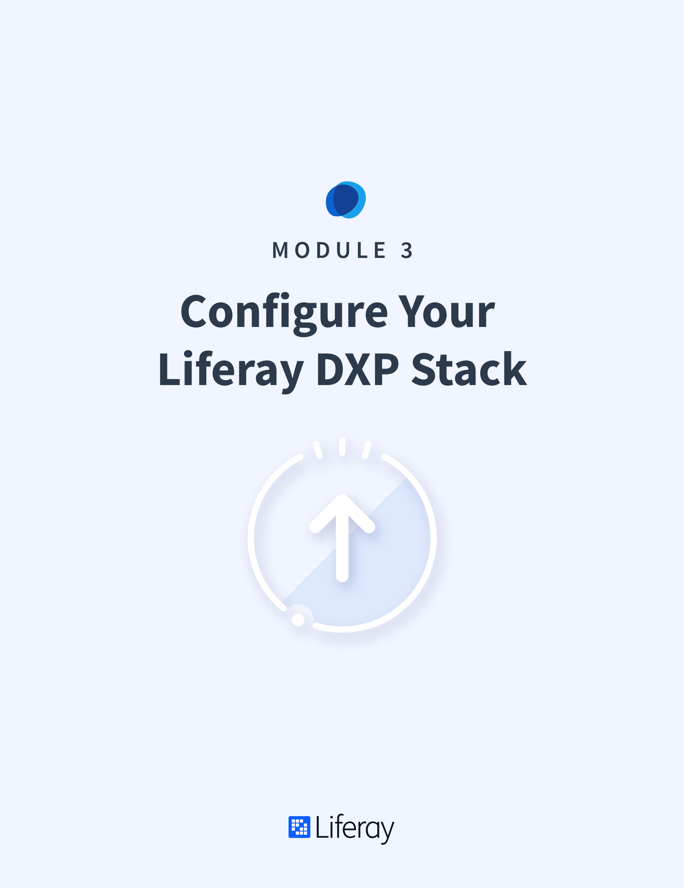

# Configure Your Liferay DXP Stack

#### Learning Objectives

In this module, you'll learn how to configure Liferay DXP to suit the needs of your business. Translating your business needs into a working solution requires a thorough understanding of DXP's configurability which this module intends to provide.

#### Tasks to Accomplish

* Configure Liferay DXP 7.3 throught the UI
* Modify Liferay's config properties and files
* Change the dockerfile and docker images based on your specifications

#### Exercise Prerequisites

* Java JDK installed to run Liferay
* Unzip module exercise files to an empty directory

<h2> Table of Contents </h2>

TABLE OF CONTENTS