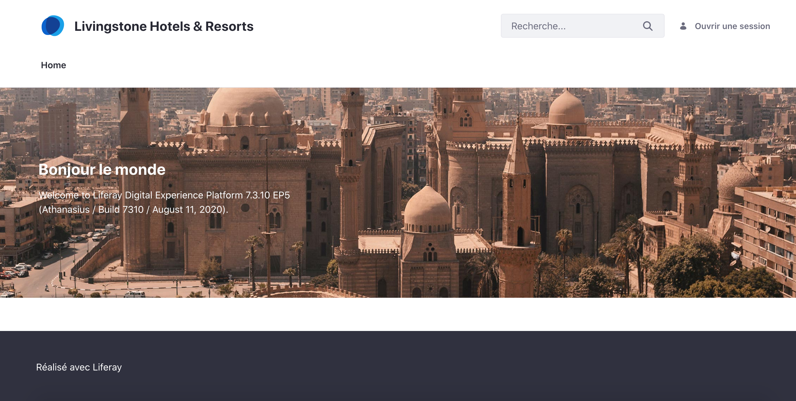
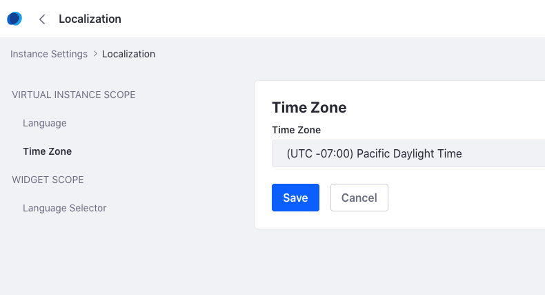
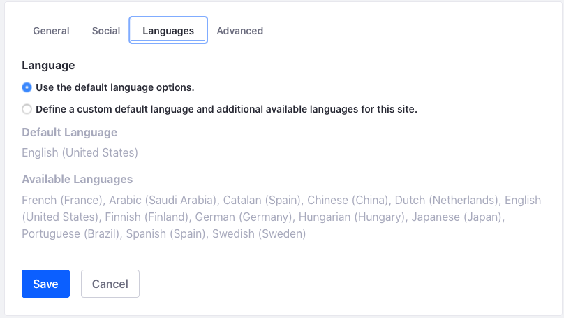
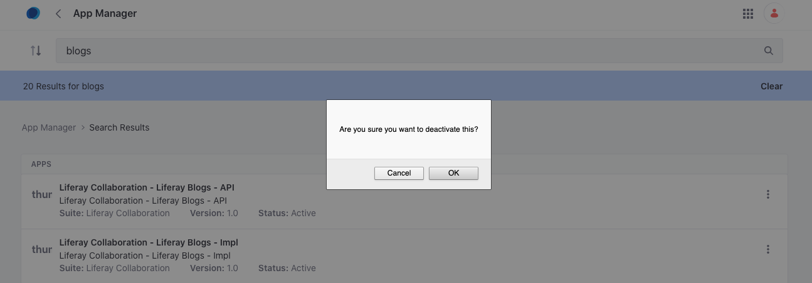

## Configuring Liferay DXP as an Administrative User

<div class="ahead">

#### Exercise Goals

* Configure the default language for the platform
* Configure the default time zone for the platform
* Manage an OSGi module via the App Manager in the UI

</div>

#### Build and Start the Container for the Tomcat Service
1. **Open** a new _Terminal_ window.
2. **Go to** the _liferay-tomcat_ folder in your exercise source.
3. **Run** the following command to build the _tomcat_ and _mysql_ services if they are not already running:

```shell
docker-compose build liferay-tomcat-1 mysql
```

4. **Run** the following command to start the service and its dependencies:

```shell
docker-compose up -d liferay-tomcat-1
```

<div class="page"></div>

#### Log in to the Server and Find the Instance Settings
1. **Go to** `localhost:8081` in your browser to access the site.
2. **Sign in** to the platform with the following credentials:
    * User name: _test@liferay.com_
    * Password: _test_
3. **Click** through the startup steps if necessary.
	* Accept the _Terms of Use_.
	* Create a password reminder.
4. **Open** the *Applications Menu* for your running instance.
5. **Go to** _`Control Panel → Configuration → Instance Settings`_.
6. **Click** on the *Localization* option on the *Instance Settings* page.

<div class="note">
Note: there are a number of options for both locales and time zones. For now, let's focus on just the locales, specifically the default language. When setting a default language, whatever is selected will be applied first.
</div>

#### Set a New Default Language for the Platform
1. **Choose** *French (France)* under the *Default Language* drop-down menu.
2. **Click** *Save* at the bottom of the page to save the change.

#### Verify the Language Change in a New Browser
1. **Open** another browser or your current browser in private/incognito mode to see the changes in effect.
2. **Go to** *localhost:8081*, and you'll see specific areas of the homepage in the language you selected.

<br />



#### Revert to the Original Default Language
1. **Go to** your original browser again, where we were configuring the default language.
2. **Choose** *English (United States)* as the default language, under the *Default Language* drop-down menu.
3. **Click** *Save*.

#### Set a Custom Time Zone for the Platform
1. **Click** on the *Time Zone* section on the right.
2. **Choose** whatever time zone is applicable to you.
3. **Click** *Save*.

<br />



#### Find the Site-Level Configuration Options
1. **Open** the *Applications Menu*.
2. **Click** _Livingstone Hotels & Resorts_.
4. **Open** the *Site Administration* panel.
5. **Go to** _`Configuration → Settings`_.
6. **Click** the *Languages* tab.

<br >



#### Find the App Manager Settings
1. **Open** the *Applications Menu*.
2. **Go to** _`Control Panel → System → App Manager`_.
3. **Click** in the search box.
* **Type** `blogs`.
2. **Click** on the *Options* menu next to the _Liferay Blogs API_.
3. **Choose** *Deactivate*.
4. **Click** *OK* when prompted with *"Are you sure you want to deactivate this?"* 

<br />



<br />
