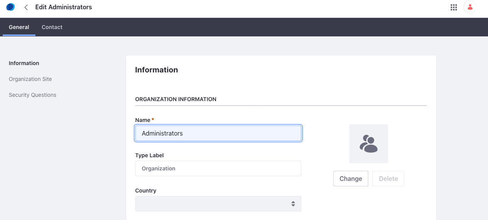
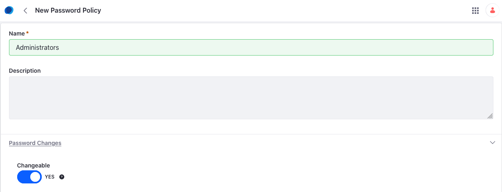
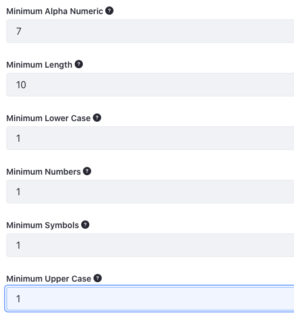
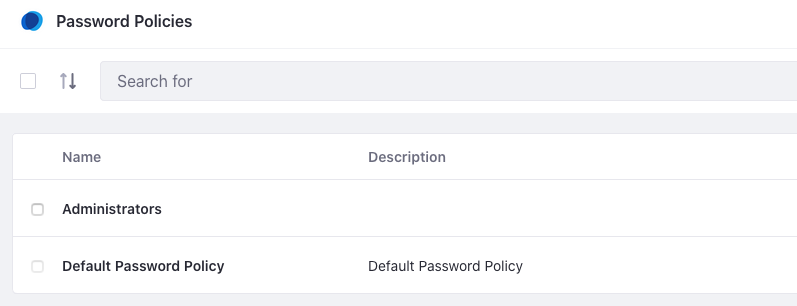
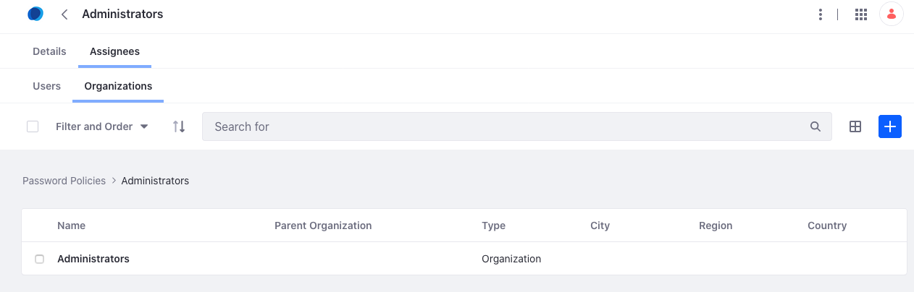
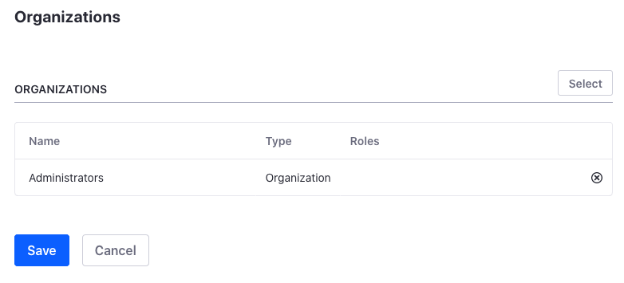
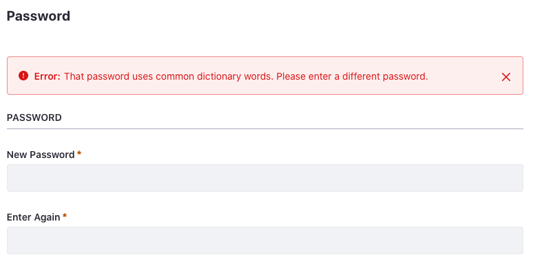

## Password Policies

#### Exercise Goals

* Create an Administrator Organization
* Create a new password policy
* Assign the password policy to the Admin Organization

#### Create a New Organization
1. **Start** the liferay-tomcat container by running `docker-compose up -d liferay-tomcat` if it is not already running.
* **Go to** *localhost:8081* in your web browser. This should be the port where your liferay-tomcat container is pointing.
* **Sign in** to Liferay if you are not already logged in.
* **Open** the _Applications Menu_.
* **Go to** _`Control Panel → Users → Users and Organizations`_.
* **Click** the *Organizations* tab.
* **Click** the *Add* button to create a new organization.
* **Type** to name the organization `Administrators`.
* **Click** *Save*.

 

#### Update the Password Policy
1. **Open** the Applications Menu.
* **Go to** _`Control Panel → Security → Password Policies`_.
* **Click** the *Add* button to add a new policy.
* **Type** _Administrators_ as the _Name_.
* **Click** to expand the _Password Changes_ section.
* **Click** the _Changeable_ slider so that it says _YES_.

 

#### Define Password Syntax
1. **Click** to expand the _Password Syntax Checking_ section.
* **Click** the _Enable Syntax Checking_ slider so that it says _YES_.
* **Type** the following:
    - `7` in the Minimum Alpha Numeric field
    - `10` in the Minimum Length field
    - `1` in the Minimum Lower Case field
    - `1` in the Minimum Numbers field
    - `1` in the Minimum Symbols field
    - `1` in the Minimum Upper Case field

 

#### Complete and Save the Password Policy
1. **Click** to expand the _Password History_ section.
* **Click** the _Enable History_ slider so that it says _YES_.
* **Click** to expand the _Password Expiration_ section.
* **Click** the _Enable Expiration_ slider so that it says _YES_.
* **Click** to expand the _Lockout_ section.
* **Click** the _Enable Lockout_ slider so that it says _YES_.
* **Type** _5_ in the _Maximum Failure_ field.
* **Click** _Save_ to save the policy.

 

#### Assign the Password Policy
1. **Click** the *Administrator* password policy.
* **Click** the *Assignees* tab at the top for the new *Administrators* policy.
* **Click** the *Organizations* tab.
* **Click** the *Add* button.
* **Check** the box next to *Administrators*.
* **Click** *Add.*

 

#### Test the New Password Policy
1. **Open** the _Applications Menu_.
* **Go to** _`Control Panel → Users → Users and Organizations`_ in the *Menu*.
* **Click** on the _Add_ button to add a new user.
* **Type** in information for a new user.
* **Click** *Save* to create the new user.
* **Click** on the _Organizations_ link in the _General_ tab of the user you just created.
* **Click** on _Select_ to choose an organization for the new user.
* **Click** _Choose_ next to the _Administrators_ organization.
* **Click** _Save_.

 

#### Change Your Password
1. **Click** on the *Password* section under the _General_ tab for the new user.
1. **Add** a password that doesn't meet the criteria set.
1. **Click** *Save*.
1. **Replace** the password with something that should work.
1. **Click** *Save*.

 

 

---

#### Bonus Exercises:
1. Create a new password policy that requires at least two symbols and a minimum of twelve characters. Assign the new policy to a different organization.
