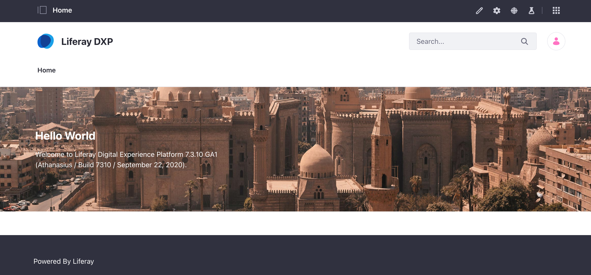

## Using Docker Commands

<div class="ahead">

#### Exercise Goals

* Review the configuration files for the Liferay instance deployed to the Tomcat server
* Start up the Tomcat instance in a container and login to the platform

</div>

<div class="note">
Note: Before beginning this exercises, please see if you have docker images in your computers. To check to see if you have any images, please execute the command this command in your terminal:<br />
<br />
docker images<br />
<br />
If you find any images that you do not recognize from the previous 7.3 SRE training module or your own use, please use the following docker command to remove it:<br />
<br />
docker rmi -f [image id]
</div>

#### Add the Tomcat Folder to Your Liferay Directory
1. **Find** the _liferay-tomcat_ folder in your exercise-src files.
* **Copy** the folder.
* **Paste** it in your _liferay_ directory you created as part of the exercise prerequisites.

We'll be using the _docker-compose.yml_ file found in the liferay-tomcat folder for setting up our environment. Docker Compose will help us manage and run multiple containers at once. By using `docker-compose` commands we can easily control all of the individual images we'll be using throughout the course. 

<div class="page"></div>

#### Examine the docker-compose File
1. **Go to** _liferay-tomcat/_ in your _liferay_ folder.
2. **Open** the `docker-compose.yml` file in your favorite text editor.
3. **Find** the `liferay-tomcat-1` service around line 51:

```Dockerfile
liferay-tomcat-1:
    build: .
    container_name: liferay-tomcat-1
    depends_on:
#   	- apacheds
#   	- elasticsearch
	- mysql
    networks: 
      - network-liferay-tomcat
    ports: 
      - 8081:8080
      - 127.0.0.1:11311:11311
    volumes:
      - volume-liferay-tomcat-data:/opt/liferay/[liferay-version]/data
      - volume-liferay-tomcat-1-work:/opt/liferay/[liferay-version]/work
```

<div class="page"></div>

Here the docker-compose file is referencing the Tomcat server _Dockerfile_ that will be used to build our first Liferay instance. It is also configuring a few other options for the service:
	* The `build` command let's docker-compose know where to look for the tomcat server _Dockerfile_ that provides configurations that will be applied to the service at build time.
	* The `container_name` option gives the container it's custom name ("_liferay-tomcat-1_").
	* The `depends_on` configuration declares any dependencies between services. 
	* The `networks` configuration specifies which network the service is to join. This allows containers to be both reachable and discoverable by other containers on the same network.
	* The `ports` configuration maps the ports for the service. The first port is the host port. The second is the container port
	* The `volume` configuration mounts named volumes (for example, _volume-liferay-tomcat-data_) to a specified directory in the container. Named volumes can be declared at the bottom of the docker-compose file:

_Volumes_ are the best way to persist data from a Docker container and should be used in production environments. Volumes differ from _Bind Mounts_ which are often used in testing settings. A bind mount will mount a designated folder or file on the host machine to your container. The container will access the folder or file on the host at the relative or absolute path given when creating the bind mount. While this initially may seem like an easy way to manage files and folders, especially on a smaller scale, it can lead to issues if the host machine's directory structure changes and the file or folder is removed from where a container expects it to be. In this sense, bind mounts must be managed manually. In contrast, when a Volume is created Docker automatically generates a new directory in Docker's storage base alongside the containers and images you've created. Docker will then automatically manage the folder's content. When a Volume is mounted to a container, much like the bind mount, the folder generated by Docker is mounted to a specified location in the container, but paths are all managed by Docker. Additionally, a single Volume can be simultaneously mounted to multiple containers. And by taking advantage of Volume drivers, you can safely store Volume data on a remote host or cloud service. Volumes can be created explicitly, as we do in our docker-compose file, or can be generated automatically when creating a new service or container.

Now lets take a look the _Dockerfile_ that the docker-compose file is referencing. This is where the Tomcat specific options are defined and will be used to create our Tomcat services.

#### Examine the Tomcat Dockerfile
1. **Open** the `Dockerfile` in the _liferay-tomcat/_ directory.
2. **Find** the following line at the beginning of the file:

```Dockerfile
	FROM openjdk:8u171-jdk-alpine3.8
```

The `FROM` command sets the _base image_ that will be used in the instructions following the command. In our case we'll be using an OpenJDK image based on Alpine Linux, a light-weight distribution of Linux.

<div class="note">
Note: It is important to understand that Alpine Linux is not technically supported by Liferay, however because of its small size we have chosen to use it as an example for this training. It is not recommended to use Alpine JDK 8 in your production environment.
</div>

3. **Find** the following lines:

```Dockerfile
ENV BUNDLE_BASE=liferay-dxp-[version]
ENV BUNDLE_FILE=liferay-dxp-[version].tar.gz
ENV LIFERAY=/opt/liferay
ENV LIFERAY_HOME=$LIFERAY/$BUNDLE_BASE
ENV DOWNLOADS=$LIFERAY/downloads
ENV TOMCAT_HOME=$LIFERAY_HOME/tomcat-[version]
```

Here we're setting a few environment variables for our container. We'll use these later in commands throughout the dockerfile.

<div class="page"></div>

4. **Find** the following lines:

```Dockerfile
RUN apk update && \
	apk add curl bash tar tree unzip && \
	adduser -D -h /home/liferay liferay && \ 
	addgroup liferay liferay && \
	mkdir -p $LIFERAY && \
	chown -R liferay $LIFERAY
```

Here we are setting up our system. First we update Alpine's `apk` package manager and install packages we'll need. We'll then create a new user and group (_liferay_ for both). Next we create the `/opt/liferay` directory by referencing an environment variable and finally we set the owner of the directory and files within to the new _liferay_ user.

5. **Find** the following line:

```Dockerfile
USER liferay
```

Here we set the User and User group that will be used when running the `RUN`, `COPY` and `CMD` commands in the dockerfile. It's always a good idea to avoid running as the `root` user when possible. From this point on, all actions in the container are run as the _liferay_ user.

6. **Find** the following lines:

```Dockerfile
RUN mkdir -p $LIFERAY_HOME
RUN mkdir -p $DOWNLOADS
COPY --chown=liferay:liferay ./dependencies/bundles/$BUNDLE_FILE $DOWNLOADS
```

Here we crate the directories we've designated as our Liferay Home and downloads directories. We also copy over the Tomcat bundle to the _downloads/_ directory in the container.

<div class="page"></div>

7. **Find** the following lines:

```Dockerfile
WORKDIR $DOWNLOADS
RUN tar -xzf $DOWNLOADS/$BUNDLE_FILE && \
	mv $DOWNLOADS/$BUNDLE_BASE/* $LIFERAY_HOME && \
	rm -rf $DOWNLOADS/*
```

Here we set the working directory to `/opt/liferay/downloads` and extract the Tomcat bundle we copied over from the host machine. Once the bundle is extracted we move it's contents into the Liferay Home directory we've created.

8. **Find** the remaining lines:

```Dockerfile
COPY --chown=liferay:liferay ./config/portal-ext.properties $LIFERAY_HOME/portal-ext.properties
COPY --chown=liferay:liferay ./config/activation-key-digitalenterprisedevelopment-[version].xml $LIFERAY_HOME/deploy/activation-key-digitalenterprisedevelopment-[version].xml
COPY --chown=liferay:liferay ./dependencies/bundles/mysql-connector-[version].jar $TOMCAT_HOME/lib/ext/mysql-connector-[version].jar

# Configure Liferay to point to an external Elasticsearch container for production use
#COPY --chown=liferay:liferay ./config/com.liferay.portal.search.elasticsearch6.configuration.ElasticsearchConfiguration.config $LIFERAY_HOME/osgi/configs/com.liferay.portal.search.elasticsearch6.configuration.ElasticsearchConfiguration.config

# Configure the AdvancedFileSystemStore
#COPY ./config/com.liferay.portal.store.file.system.configuration.AdvancedFileSystemStoreConfiguration.config $LIFERAY_HOME/osgi/configs/com.liferay.portal.store.file.system.configuration.AdvancedFileSystemStoreConfiguration.config

# Configure cluster link to use JDBC PING so that the cluster network works in the cloud
#COPY --chown=liferay:liferay ./config/jdbc_ping.xml $TOMCAT_HOME/webapps/ROOT/WEB-INF/classes/jdbc_ping.xml

# Configure the TunnelAuthVerifier for live remote staging
#COPY ./config/com.liferay.portal.security.auth.verifier.internal.tunnel.module.configuration.TunnelAuthVerifierConfiguration-default.cfg $LIFERAY_HOME/osgi/configs/com.liferay.portal.security.auth.verifier.internal.tunnel.module.configuration.TunnelAuthVerifierConfiguration-default.cfg

COPY --chown=liferay:liferay ./config/wait-for-it.sh /usr/local/bin/wait-for-it.sh
RUN chmod +x /usr/local/bin/wait-for-it.sh

CMD /usr/local/bin/wait-for-it.sh -s -t 60 mysql:3306 -- $TOMCAT_HOME/bin/catalina.sh run
```

In these final lines we copy over a few configuration files from our host machine into the container and simultaneously change the owner of those files to the _liferay_ user. You'll notice a couple of these configuration files are commented out. We'll take at look again at this later in the course. We also copy over a simple shell script, `wait-for-it.sh`. The script tests if a specific TCP host/port is available. It will ping the MySQL container and wait for it to start up before issuing the command in the Tomcat container to start up the Tomcat server . When working with containers you will run into scenarios where you'll have to manage these kinds of container dependencies. After copying the script over we make it executable by using the `chmod +x` command. (Remember, in the docker-compose file the Tomcat service is dependent on a MySQL service also defined in that file as well as its respective _dockerfile_). Finally we use the `CMD` to provide the default command that the container will run once it has fully started up. In this case the command will run the `wait-for-it` script which will run the Tomcat sever startup script once the MySQL container is running. You can only have one `CMD` command per Dockerfile. You can have multiple `RUN` commands which are executed when generating the image. The `CMD`command will be executed only once a container generated from an image is up and running. 

#### Examine the MySQL Service
1. **Go to** _services/mysql_ in your _liferay-tomcat/_ folder.
2. **Open** the _Dockerfile_.

```dockerfile
FROM mysql:5.7
COPY ./config/my.cnf /etc/mysql/my.cnf
COPY ./config/create-mysql.sql /docker-entrypoint-initdb.d/create-mysql.sql
```

You'll see the initial provisioning is very simple. We are using the _mysql:5.7_ base image and copying over a `.cnf` and `.sql` file. The base image provisions a MySQL server on a Debian base and our configurations are copied to directories specified in the Dockerfile. When our container is started for the first time a new database will be initialized with the name and configurations we've predetermined in the configuration files copied over to the container. Any files with the `.sh`, `.sql` or `.sql.gz` extensions copied over to the `/docker-entrypoint-initdb.d./` directory will be executed on the initial container startup. Note that these files will be run in alphabetical order. In our case we've only added the one `create-mysql.sql` file to the `docker-entrypoint` directory. This file simply creates an empty `lportal` database. All of the database's tables will be added by Liferay on portal startup.

With the background information out of the way, let's start up our first Tomcat instance. 

#### Start Up Liferay-Tomcat-1
1. **Open** a new _Terminal/Command Prompt_ window.
2. **Go to** the _liferay-tomcat/_ folder in your terminal:
3. **Run** the following command to build the _liferay-tomcat-1_ image:

```shell
docker-compose build liferay-tomcat-1
```

4. **Run** the following command to build the _mysql_ image:

```shell
docker-compose build mysql
```

5. **Run** the following command to start up the liferay-tomcat-1 service:

```shell
docker-compose up -d liferay-tomcat-1
```

The `docker-compose up` command will build an image if it isn't already built, create and start the container and attach any services required by the container. In our case the command will start the MySQL service that _liferay-tomcat-1_ requires (as determined in the _docker-compose.yml_ file) before it creates and starts the tomcat container. The `-d` option runs containers in _detached_ mode. This means you won't see the live logs in the your current terminal session. You can always view the logs by running the `logs` command for a specified service. For example you could run `docker-compose logs -f liferay-tomcat-1` to follow the logs for the tomcat-1 service.

6. **Run** `docker ps` to see a list of all containers currently running.

Here you can see the container ID, the image name (note that the project name is the name of the directory that contains the docker-compose file), the `CMD` executed when the container was started, information on creation and up time, exposed ports and the service's friendly name. Our tomcat-1 server is being exposed to host port 8081.

<div class="page"></div>

#### Sign-in to Liferay in Your Browser
1. **Go to** _localhost:8081_ in a web browser.
	* You should see the welcome page for Liferay DXP after a minute or two.
	* You may notice that we didn't have to run through the initial setup wizard to create a user and set up the instance. This is because we disabled the setup wizard in our `portal-ext.properties` configuration file. (This file is located in the _liferay-tomcat/config_ directory and was copied over to our container when the image was built.) In this file we also set up out MySQL database and enable developer mode which allows access to the OSGi console via telnet. This feature should be disabled in production. We'll look at this properties file again later in the course.
2. **Click** on the _Sign In_ link.
3. **Type** in the following:
	* Email: `test@liferay.com`
	* Password: `test`
4. **Click** _Sign In_ to continue.
5. **Click** _I Agree_ on the _Terms of Use_ page.
6. **Type** in a password reminder prompt.
7. **Click** _Save_.

<br />


