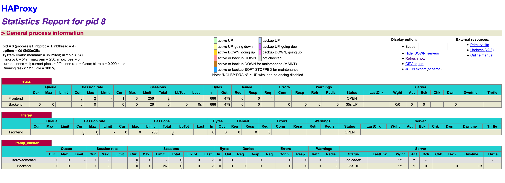

## Finish Provisioning Your DXP Stack

<div class="ahead">

#### Exercise Goals

* Review the HAProxy configuration files
* Start up the reverse proxy

</div>

#### Review the HAProxy Configuration Files
1. **Open** up the _docker-compose.yml_ file located in the _liferay-tomcat/_ directory.
2. **Find** the following lines:

```dockerfile
haproxy:
    build: ./services/haproxy
    container_name: haproxy
    networks:
      - network-liferay-tomcat
    ports:
      - 80:80
      - 9999:9999
```

Here we are defining the container name, network and exposing ports.

3. **Open** the _Dockerfile_ for HAProxy located in _/liferay-tomcat/services/haproxy_.

```dockerfile
COPY ./config/haproxy.cfg /usr/local/etc/haproxy/haproxy.cfg
```
 
You'll see it's a very simple configuration. The file simply copies the configuration file provided into the container. Let's take a look at that configuration file.

4. **Open** the _haproxy.cfg_ file located in _haproxy/config_.

Here we'll find the configuration settings for our reverse proxy. We'll setting up the _stats_ socket at localhost:9999. As that has been mapped to the same port in the host machine in the docker-compose file we'll be able to access these settings there.

```cfg
listen stats
    bind 0.0.0.0:9999
    stats enable
    stats hide-version
    stats uri /
    stats auth test@liferay.com:test
```

In the _frontend_ settings, we'll choose how frontend requests are forwarded to the backend. Here, requests at port 80 will be forwarded to the liferay_cluster backend.

```cfg
frontend liferay
    bind 0.0.0.0:80
    use_backend liferay_cluster
```

In the _backend_ settings we define how our servers are to handle frontend requests. You'll notice a few items have been commented out. For now we are using HAProxy exclusively as a reverse proxy. We'll come back to the additional load balancing configuration options later on.

```cfg
backend liferay_cluster
    #balance roundrobin
    #cookie JSESSIONID prefix
    #server liferay-tomcat-1 liferay-tomcat-1:8080 cookie liferay_1 check
    server liferay-tomcat-1 liferay-tomcat-1:8080
```

It's important to remember that in production, aside from our reverse proxy's ports, we should never expose server ports. In this course we've exposed our server ports for testing purposes, but this is bad practice in production and can lead to a number of security issues. When going live we only want to expose ports that we are prepared for users to access, which in this case is HAProxy's port 80.

<div class="page"></div>

#### Start the HAProxy Container
1. **Open** a new _Terminal/Command Prompt_ session.
2. **Go to** the _liferay-tomcat/_ folder containing the _docker-compose.yml_ file.
3. **Run** the following command to build the HAProxy image:

```shell
docker-compose build haproxy
```

Make sure that the _liferay-tomcat-1_ service is already running.

4. **Run** the following command to start the haproxy service:

```shell
docker-compose up -d haproxy
```

5. **Go to** _http://localhost_ in your web browser.
    * We can now access our liferay-tomcat-1 server at localhost.
6. **Go to** _localhost:9999_ in your web browser.
7. **Type** in the following login credentials:
    * Username: `test@liferay.com`
    * Password: `test`
    * These credentials were defined in the _haproxy.cfg_ file.

We can now see the statics reports for all of the servers we've configured to handle frontend requests.

<br />


