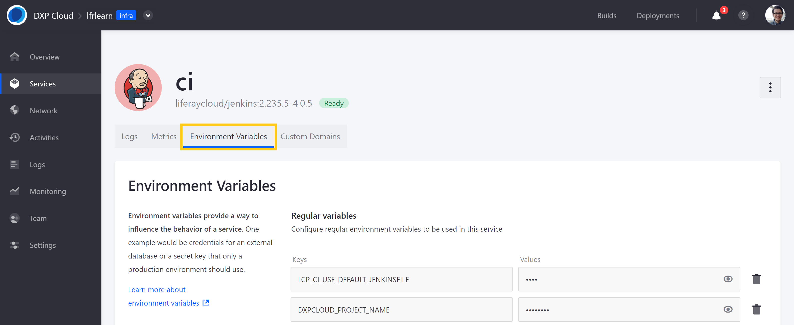

# Automatically Deploying CI Service Builds

With DXP Cloud, you can use webhooks to automatically trigger Jenkins builds for changes pushed or merged to your project's Git repository (e.g., [GitHub](../getting-started/configuring-your-github-repository.md#integrating-with-the-jenkins-service), [Bitbucket](../getting-started/configuring-your-bitbucket-repository.md#connecting-bitbucket-to-your-jenkins-service), [GitLab](../getting-started/configuring-your-gitlab-repository.md#connecting-gitlab-to-your-jenkins-service)). These builds can then be manually deployed to project environments via the DXP Cloud Console. Alternatively, you can speed up the deployment process by configuring the CI service to automatically deploy successful builds from a specific branch to a specified environment.

By default, automatic deployment is controlled by the `LCP_CI_DEPLOY_BRANCH` and `LCP_CI_DEPLOY_TARGET` variables. Together they determine which branch is used to trigger automatic deployments as well as the environment to which the builds are automatically deployed. Their default values are set to `develop` and `dev` respectively.

If desired, you can configure automatic deployment by editing the `LCP_CI_DEPLOY_BRANCH` and `LCP_CI_DEPLOY_TARGET` variables via the DXP Cloud Console:

1. Navigate to the `infra` environment for your DXP Cloud Project.

1. Go to the *CI* service's page, and click on the *Environment Variables* tab.

   

1. Add the following variables to the CI service:

   * **Key**: `LCP_CI_DEPLOY_BRANCH`

      **Value**: enter the desired branch name (e.g., `useracceptance`).

   * **Key**: `LCP_CI_DEPLOY_TARGET`

      **Value**: enter the desired environment name (e.g., `uat`).

1. Click on *Save Changes*. This causes the CI service to restart with the new variables.

Once restarted, any changes pushed or merged to your specified branch are automatically built and deployed to the target environment.

## Additional Information

* [Overview of the DXP Cloud Development Workflow](./overview-of-the-dxp-cloud-deployment-workflow.md)
* [Deploying Changes via the DXP Cloud Console](./deploying-changes-via-the-dxp-cloud-console.md)
* [Deploying Changes via the CLI Tool](./deploying-changes-via-the-cli-tool.md)
