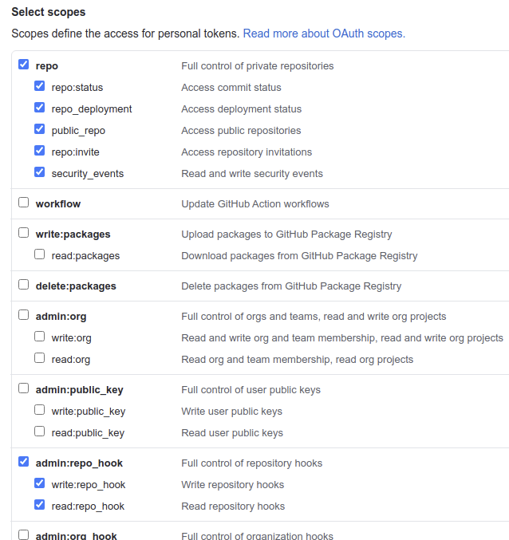
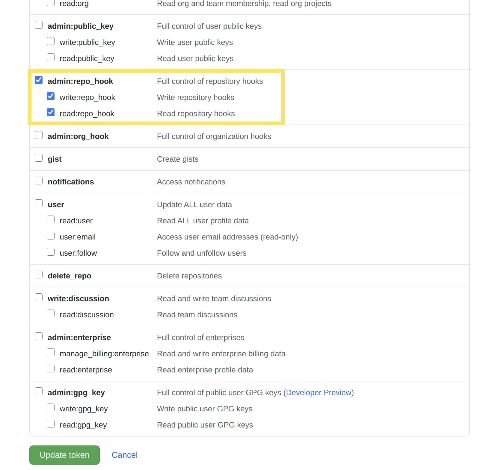

# Configuring Your GitHub Repository

Upon receiving a DXP Cloud onboarding email, you're provisioned a GitHub repository hosted in the `dxpcloud` organization. This repository is a template for a team's separate private DXP Cloud development repository and is typically removed after 10 business days. Users must:

1. Transfer the provisioned repository to their own private GitHub repository.

1. Integrate their private repository with the Jenkins (CI) service in DXP Cloud using a Webhook.

```{note}
If you are using an organization account, then you must have administrative privileges to transfer the repository to the organization.
```

## Transferring the Repository

Follow these steps to transfer the provisioned repository to your own GitHub repository:

1. Create a new private GitHub repository.

1. Clone your provisioned `dxpcloud` repository locally.

1. Push the cloned repository from step two to the remote repository you created in step one.

If you need help creating, cloning, and pushing GitHub repositories, see [GitHub's documentation](https://help.github.com).

## Integrating with the Jenkins Service

Now you must integrate your new repository with the Jenkins service in DXP Cloud. Set up a webhook in GitHub that pushes to the Jenkins service:

1. In GitHub, go to your repository's *Settings* page and select *Webhooks*.

1. Click *Add Webhook*. This opens the *Add webhook* form.

1. In the *Payload URL* field, add the domain of your DXP Cloud `infra` environment's Jenkins service. For example, the URL of the `infra` environment's `ci` service for a project named `acme` is `https://ci-acme-infra.lfr.cloud/github-webhook/`. Note that the relative path `github-webhook` is required to integrate with the Jenkins GitHub plugin.

1. In the *Content type* selector menu, select *application/json*.

1. Leave the *Secret* field blank and ensure that *Enable SSL verification* is selected.

    

1. Under *Which events would you like to trigger this webhook?*, select *Let me select individual events*. A list of events then appears.

1. Select *Pushes* and *Pull Requests* from the list of events.

    

    

1. Make sure *Active* is selected, then click *Add webhook*.

    

### Setting Environment Variables

Set these environment variables in the Jenkins service to point to your new repository:

1. Log in to the DXP Cloud Console and navigate to your Jenkins service in the `infra` environment.

1. Navigate to the *Environment Variables* tab.

1. Configure the following environment variables:

| Name | Value |
| :--- | :--- |
| `LCP_CI_SCM_PROVIDER` | github  |
| `LCP_CI_SCM_REPOSITORY_OWNER` | [repo_owner] |
| `LCP_CI_SCM_REPOSITORY_NAME` | [repo_name] |
| `LCP_CI_SCM_TOKEN` | [access_token] |

For the `LCP_CI_SCM_TOKEN` value, use the personal access token created for your GitHub organization. For instructions on creating and accessing this token, see [GitHub's documentation](https://help.github.com/articles/creating-a-personal-access-token-for-the-command-line).

The personal access token created must have all of the scope permissions under *repo* and *admin:repo_hook* checked. The *admin:repo_hook* scope permissions specifically can be removed later if you [disable automatic web hook management](#personal-access-token-usage) after your repository is successfully integrated with DXP Cloud.



```{note}
If you are using an organization account with SAML single sign-on authentication, then you must take additional steps to authorize your access token. See [GitHub's official documentation](https://docs.github.com/en/free-pro-team@latest/github/authenticating-to-github/authorizing-a-personal-access-token-for-use-with-saml-single-sign-on) for more information.
```

After updating these environment variables, the Jenkins service will restart. Any pushed branches and pull requests in the new repository now trigger builds.

```{note}
Jenkins versions prior to `2.222.1-3.2.0` use the environment variables `GITHUB_REPOSITORY` and `GITHUB_TOKEN` instead. To use the `LCP_CI_SCM_*` environment variables, ensure you are running Jenkins `2.222.1-3.2.0` or higher.
```

### Personal Access Token Usage

The personal access token referenced by the `LCP_CI_SCM_TOKEN` value is needed for DXP Cloud to integrate with your repository.

```{warning}
If the personal access token belongs to a personal user account and that user is removed from the organization, all builds will fail to complete. Instead, use an account specifically belonging to the organization. See [GitHub's official documentation](https://docs.github.com/en/actions/learn-github-actions/security-hardening-for-github-actions#considering-cross-repository-access) for more information.
```

By default, the GitHub organization's [Personal Access Token](https://docs.github.com/en/github/authenticating-to-github/creating-a-personal-access-token) must also have the `admin:repo_hook` permissions in order for the CI service to successfully integrate using the default web hook.

However, it is recommended to set the `LCP_CLI_SCM_MANAGE_HOOKS` [environment variable](../reference/defining-environment-variables.md) to `false` in your [CI service](../platform-services/continuous-integration.md). This disables automatic management of the web hook (which is no longer needed after you have finished setting up integration with your repository), and allows you to remove the (admin-level) `admin:repo_hook` permissions from the personal access token DXP Cloud uses:



Removing these permissions from the web hook improves security by minimizing access given to your repository.

## Verifying Builds

Pushed branches and pull requests trigger builds that you can see or deploy from the _Builds_ tab in the DXP Cloud Console. After setting up integration with the Jenkins service, a good next step is to verify these builds, to ensure that the integration was successful.

### Verifying Builds from Pushed Branches

Verify that new Git pushes trigger Jenkins builds:

1. Make a change to the repository (like adding a file), then commit it to the branch:

    ```bash
    git commit -m "Add file to test builds"
    ```

1. Push the branch up to GitHub:

    ```bash
    git push origin branch-name
    ```

1. Navigate to the _Builds_ page in the DXP Cloud Console.

1. Verify that the build displays for the pushed branch on the _Builds_ page.

### Verifying Builds from Pull Requests

Verify that new pull requests trigger Jenkins builds:

1. Create a pull request from any branch to the `develop` branch.

1. Verify that a new build is created for the pull request.

1. Navigate to the _Builds_ page in the DXP Cloud Console.

1. Click the links for the branch and commit in the appropriate build.

1. Verify that the links redirect to the correct GitHub pages.

## Additional Information

* [Configuring Your BitBucket Repository](./configuring-your-bitbucket-repository.md)
* [Configuring Your GitLab Repository](./configuring-your-gitlab-repository.md)