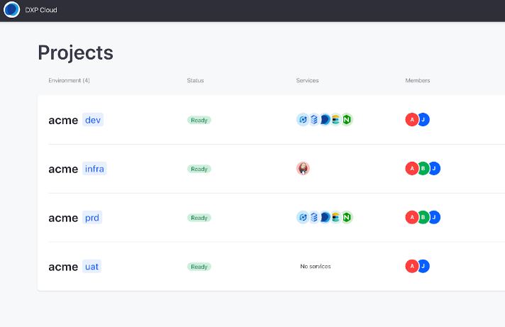
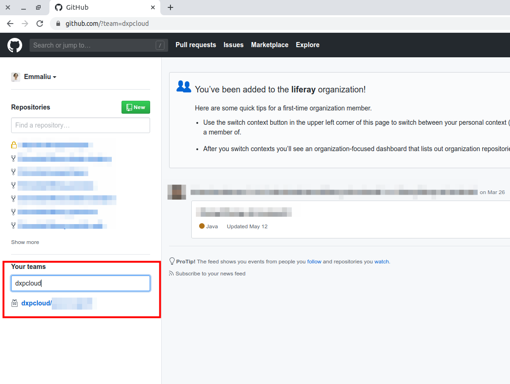
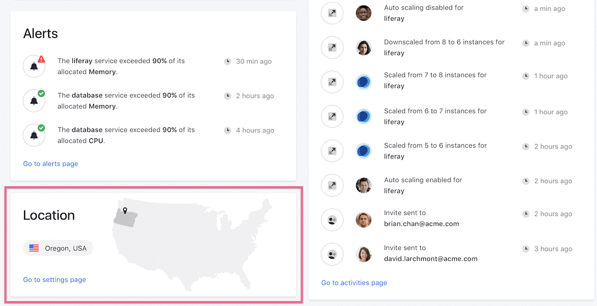
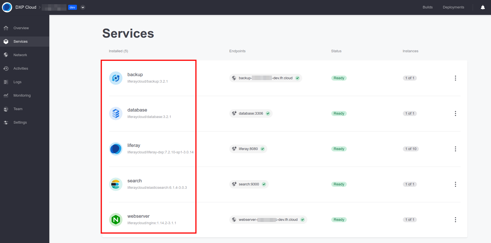

# Initial Setup Overview

Getting started with Liferay DXP Cloud involves ensuring all accounts, environments, and services have been successfully provisioned and deployed in your instance. Begin with the following steps:

- [Check Setup Emails](#check-setup-emails)
- [Access the DXP Cloud Console](#access-the-dxp-cloud-console)
- [Access the Provisioned Project Source Code](#access-the-provisioned-project-source-code)
- [Log in to Your CI and DXP Services](#log-in-to-your-ci-and-dxp-services)
- [Verify Setup](#verifying-setup)

## Check Setup Emails

Check the email account associated with your Liferay DXP Cloud subscription for setup emails. You should receive a DXP Cloud onboarding email along with email invitations to each purchased DXP Cloud environment.

The onboarding email provides necessary credentials for accessing Jenkins and Liferay DXP on non-production environments, as well as important steps for getting started with DXP Cloud.

Each environment invitation grants access to a single purchased DXP Cloud environment. Be sure to accept all environment invitations.

## Access the DXP Cloud Console

Returning users can [log in to the DXP Cloud Console](https://console.liferay.cloud/login) using their existing accounts. New users must [create an account](https://console.liferay.cloud/signup?undefined) using the email account associated with the DXP Cloud subscription.

After logging in, users are directed to the Liferay DXP Cloud Console [home page](https://console.liferay.cloud/projects).



From here, you can access and manage environments and deployments, as well as invite other team members.

## Access the Provisioned Project Source Code

New DXP Cloud projects are provisioned a temporary GitHub repository hosted in the `dxpcloud` organization. This repository contains the necessary source code for your projects.

To gain access to your new project repository, follow instructions in the DXP Cloud onboarding email and accept the subsequent GitHub invitation.

After accepting the invitation, locate your provisioned project repository:

1. Log in to GitHub

1. Search `dxpcloud` in the _Your teams_ search box.



Once you have found your provisioned repository, you must:

1. Transfer the provisioned repository's content to a private Git repository.

1. Integrate the private repository with the Jenkins (CI) service in DXP Cloud using a Webhook.

See [Configuring Your GitHub Repository](https://learn.liferay.com/dxp-cloud-latest/getting-started/configuring-your-github-repository.html) for detailed instructions.

```note::
   Using an alternative hosting service? See how to configure your `Bitbucket <https://learn.liferay.com/dxp-cloud-latest/getting-started/configuring-your-bitbucket-repository.html>`_ or `GitLab <https://learn.liferay.com/dxp-cloud-latest/getting-started/configuring-your-gitlab-repository.html>`_ repositories.
```

## Log in to Your CI and DXP Services

Log in to Jenkins (CI) and Liferay DXP to directly access their web interfaces.

Both login credentials are provided in the initial onboarding email, but they are also listed under *Environment Variables* in the *ci* service page of the *infra* environment.

See [Logging into Your DXP Cloud Services](https://learn.liferay.com/dxp-cloud-latest/getting-started/logging-into-your-dxp-cloud-services.html) for detailed instructions.

## Verifying Setup

Before beginning deployment in Liferay DXP Cloud, verify that the correct environments and services have been successfully provisioned and deployed.

### Verifying Environments

Verify all purchased environments are listed in the DXP Cloud Console [home page](https://console.liferay.cloud/projects) under *Projects*.


If any environments are missing after you've accepted all environment invitations, please contact the Liferay Support team.

### Verifying Environment Locations

Verify that the location for each environment matches the location requested by your team.

All environment locations are listed on the DXP Cloud Console [home page](https://console.liferay.cloud/projects).

You can also view an environment's location by navigating to its *Overview* page or *Settings* page.



If the environment location does not match the location requested by your team, please contact the Liferay Support team.

### Verifying Cloud Stack Services

Verify the DXP Cloud stack services are properly deployed:

1. Access the *dev* environment from the DXP Cloud Console.

1. Navigate to the *Services* page.



When properly deployed, the status of all 5 default Cloud Stack services should be 'Ready'.

## Additional Information

- [Configuring Your GitHub Repository](https://learn.liferay.com/dxp-cloud-latest/getting-started/configuring-your-github-repository.html)
- [Understanding DXP Cloud Environments](https://learn.liferay.com/dxp-cloud-latest/getting-started/understanding-dxp-cloud-environments.html?highlight=location)
- [Logging into Your DXP Cloud Services](https://learn.liferay.com/dxp-cloud-latest/getting-started/logging-into-your-dxp-cloud-services.html)