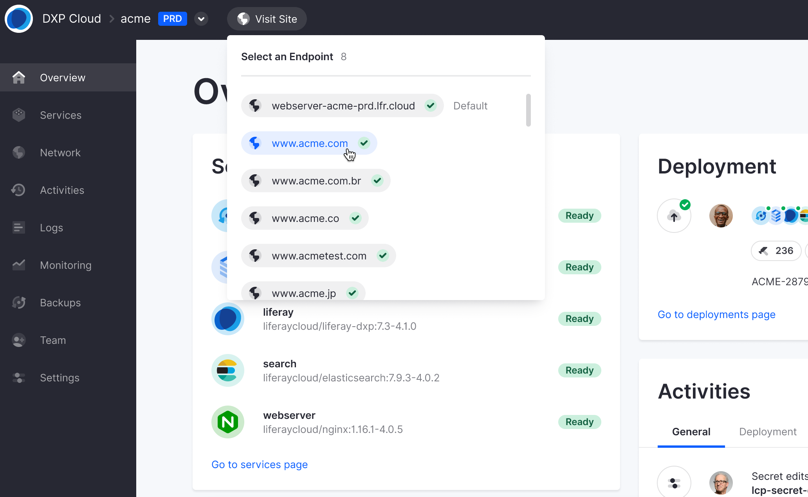
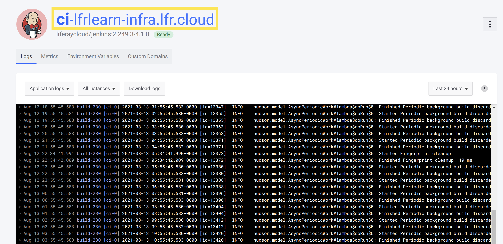

# Logging into Your DXP Cloud Services

By default, login is required to directly access the web interfaces for the DXP and Infrastructure services. Login credentials for these services are typically provided in an initial onboarding email - but may be located in the DXP Cloud Console if needed.

## Locating Login Credentials

1. Navigate to the _infra_ environment.
1. Click _Services_ in the left menu.
1. Select the _ci_ service.
1. Click the _Environment Variables_ tab.
1. Click _show_ icon next to `JENKINS_CUSTOMER_PASSWWORD` to retrieve the password.
1. Click _show_ icon next to `JENKINS_CUSTOMER_USER_NAME` to retrieve the user name.

## Logging In

1. Navigate to your chosen environment (_dev_, _prd_, etc.).

1. Click the *Visit Site* dropdown menu at the top of the page.

    

    The dropdown menu lists all of the available endpoints to your `liferay` service you can access, including the default `webserver` service endpoint and any custom domains you have added to the environment.

1. Click on the desired endpoint to access your Liferay instance with the corresponding URL.

1. Enter the DXP Cloud [Jenkins user name and password](#locating-login-credentials) when prompted.

    

1. This will redirect the user to the Liferay DXP 7.x instance (in this example, Liferay DXP 7.2 GA1).

    

### Finding Default Service URLs

You can also find the default `webserver` endpoint's URL by navigating to the service's page and clicking on the `webserver` logo at the top of the page (which expands into a URL):

Your [Jenkins login credentials](#locating-login-credentials) are still required when accessing Liferay through this method.

You can follow similar steps to access the Jenkins CI web interface. Navigate to the `ci` service in the `infra` environment to find the Jenkins URL:

## Additional Information

* [Using the DXP Service](../using-the-liferay-dxp-service.md)
* [Continuous Integration](../platform-services/continuous-integration.md)
* [Web Server Service](../platform-services/web-server-service.md)
