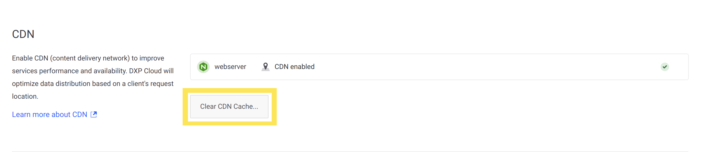

# Load Balancer

The Ingress Load Balancer gives internet access to your environment's services via proxied HTTP(S) connections using TLS (1.0 to 1.2) protocol. Each load balancer has a static IP that can set up custom domains.


Having a dedicated load balancer provides a myriad of enhanced features, such as port configuration, custom SSL certificates, and a CDN. Here's an example configuration for a load balancer in an `LCP.json` file:

```json
{
  "id": "webserver",
  "loadBalancer": {
    "cdn": true,
    "targetPort": 80,
    "customDomains": ["acme.liferay.cloud"],
    "ssl": {
      "key": "...",
      "crt": "..."
    }
  }
}
```

## CDN

Liferay's Content Delivery Network (CDN) is a built-in feature provided with DXP Cloud. This CDN caches your content globally, greatly enhancing your delivery speed. This CDN is disabled by default but you can turn it on in your `LCP.json`:

```json
"cdn": true
```


## Port

You can set which internal port (`targetPort`) the load balancer's service endpoint routes to. DXP Cloud automatically configures the correct port for the services it provides.

```json
"targetPort": 3000
```



## Custom SSL

When you specify the load balancer attribute for a service, it adds a service endpoint named after this pattern:

- `<SERVICE-NAME>-<PROJECT-NAME>-<ENVIRONMENT-NAME>.lfr.cloud`

Consider this example:

- Service: webserver
- Project: acme
- Environment: prd
- Service endpoint name: `webserver-acme-prd.lfr.cloud`

These domains created by DXP Cloud's infrastructure at `.lfr.cloud` are covered by a wildcard certificate that will not display in the Network page's SSL certificates section.

For all custom domains added through the console or `LCP.json`, Liferay DXP Cloud reaches out to [Let's Encrypt](https://letsencrypt.org/) for a certificate that renews automatically and covers all custom domains you create.

### Custom SSL Certificates

You can also add your own SSL certificate to cover any custom domains that you want to create. Only one custom certificate can be added to `LCP.json`, so it must cover all custom domains. Only one certificate at a time can exist for a service's custom domains: the one Let's Encrypt provides, or the custom one you specify in `LCP.json`. If both exist, your custom certificate takes precedent.

Note that you must manage your own custom certificate. This includes updating it when new custom domains are added and renewing it when it expires. To add a custom certificate, provide a key and certificate in Base64 format:

```json
"ssl": {
  "key": "...",
  "crt": "..."
}
```

```important::
   The ``ssl`` property (containing the ``key`` and ``crt`` properties) must be contained within the ``loadbalancer`` property to work properly.
```

```warning::
   DXP Cloud accepts only properly formatted PEM certificates and keys which must include the encapsulation boundaries. See the `spec <https://tools.ietf.org/html/rfc4648#section-4>`_ to learn more.
```

If it has not already been encoded, then the certificate and key files may both contain text like the following snippet (with either `CERTIFICATE` or `KEY` in the begin/end tags, respectively):

```xml
-----BEGIN CERTIFICATE-----
base64encodedcertificate
-----END CERTIFICATE-----
```

To encode the contents of these files and use them, perform the following steps:

1. Create a new file for both the `key` and `cert` contents:

    ```bash
    touch originalkeyfile.key
    ```

    ```bash
    touch originalcertfile.crt
    ```

1. Open the `key` file and copy all of the contents **between and including the begin and end key tags**, and then copy them into the new file created for it (in this example, `originalkeyfile.key`). Save the file.

1. Open the `cert` file and copy all of the contents **between and including the begin and end cert tags**, and then copy them into the new file created for it (in this example, `originalcertfile.crt`). Save the file.

1. Run the following commands (or use any other preferred encoding method) to convert the files into new files with base64 encoding:

    ```bash
    openssl base64 -in originalkeyfile.key -out base64keyfile.key
    ```

    ```bash
    openssl base64 -in originalcertfile.crt -out base64certfile.crt
    ```

1. Copy all of the contents from the new, encoded `key` file (in this example, `base64keyfile.key`) and paste them into the `key` variable in your `webserver` service's `LCP.json` file.

1. Copy all of the contents from the new, encoded `cert` file (in this example, `base64certfile.crt`) and paste them into the `crt` variable in your `webserver` service's `LCP.json` file.

The `key` and `cert` values are now encoded and usable in your web server configuration.

```tip::
   It is possible to include multiple values for the ``cert`` by concatenating the base64-encoded results into a single string, within the ``crt`` field.
```

The Network page shows any custom certificates, with a maximum of one per service. For more information, see [Custom Domains](./custom-domains.md).


## Environment Variables Reference

| Name | Value | Description |
| --- | --- | --- |
| `cdn` | false | CDN is disabled by default; can be enabled by setting to `true` |
| `customDomain` | ["example.com", "www.example.com"] | Name of the custom domain; can list more than one |
| `targetPort` | 3000 | Port number for the load balancer |
| `key` | | SSL certificate's key in Base64 format |
| `crt` | | SSL certificate's crt in Base64 format |
