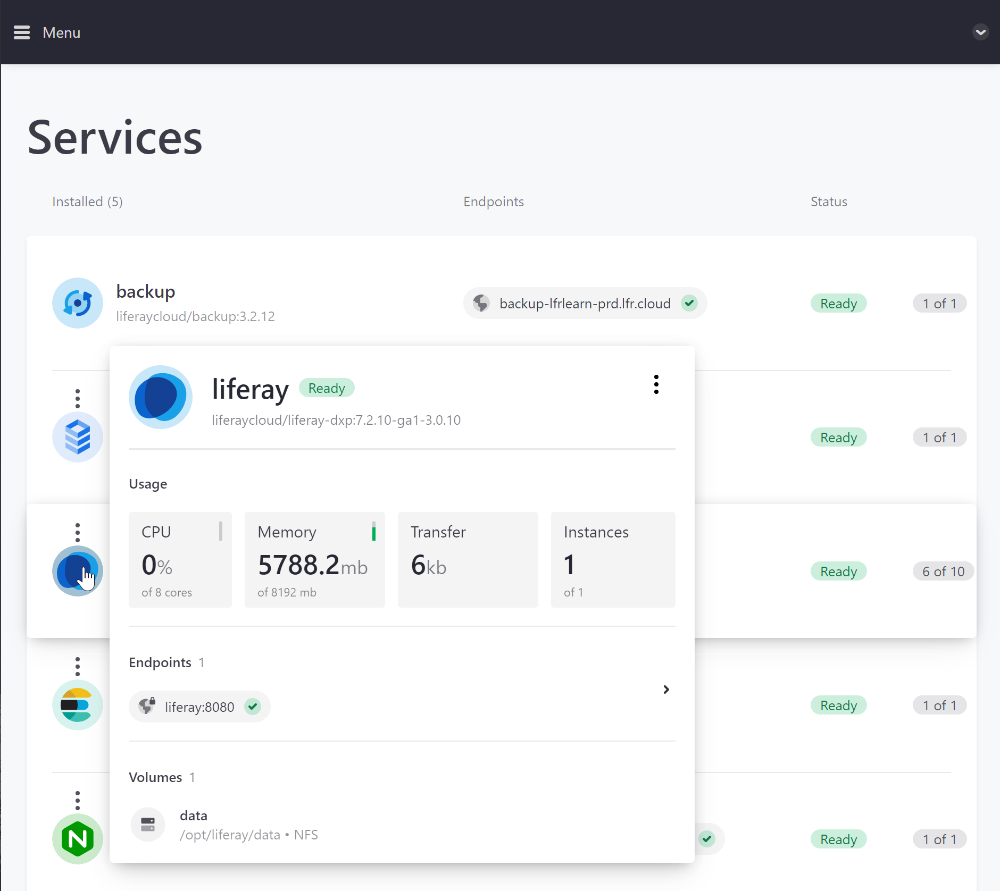
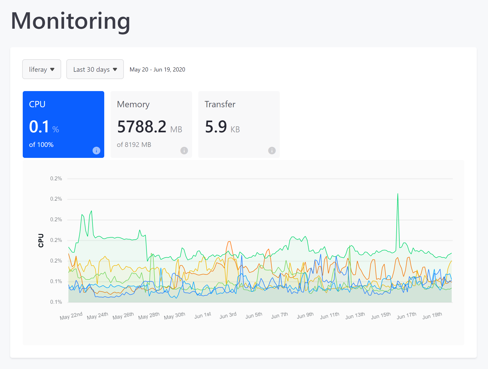
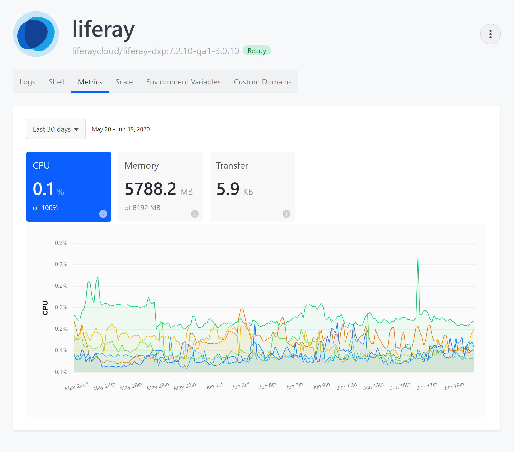
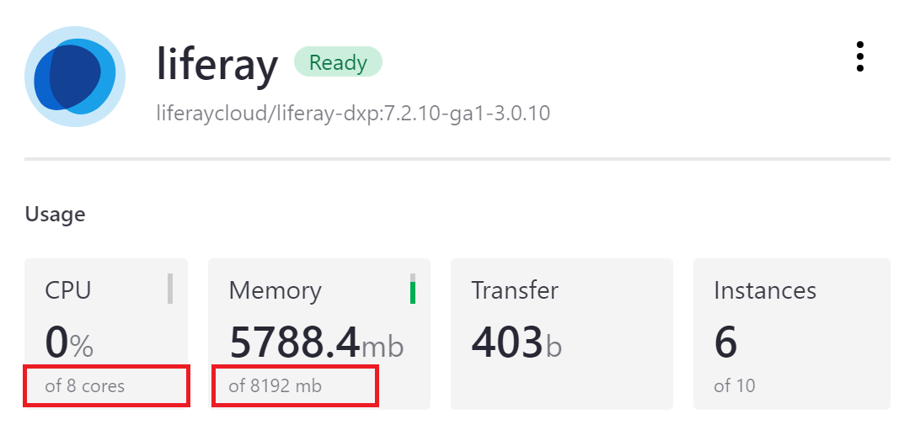

# Application Metrics

With Liferay DXP Cloud's built-in monitoring, you can track resources used by each environment service.

## Quick View

Quickly view a service's current resource usage by hovering over its icon, wherever it appears.



## Extended Application Metrics

Users can view extended service metrics from the *Monitoring* page:

1. Click *Monitoring* in the environment menu.
1. Use the drop-down menus to select the service and time frame/period you want to monitor.



Users can also view extended service metrics from the *Services* page:

1. Click *Services* in the environment menu.
1. Click on the *Service* you want to monitor.
1. Click on the *Metrics* tab.



## Advanced Application Metrics (Production Only)

With Liferay DXP Cloud, you can integrate [Dynatrace's](https://www.dynatrace.com/) advanced performance monitoring with your production environments.

### Integrating Dynatrace with Production Environments

Follow these steps to integrate Dynatrace:

1. Create a Dynatrace account.
1. Generate the Dynatrace secret `token` and `tenant` values.
1. Add Dynatrace environment variables to the `LCP.json` file in the DXP Service's production environment. <!-- "...in the DXP Service's production environment" is unclear to me. --> For example:

```json
{
	"environments": {
	  "prd": {
	    "env": {
	      "LCP_PROJECT_MONITOR_DYNATRACE_TENANT": "tot02934",
	      "LCP_PROJECT_MONITOR_DYNATRACE_TOKEN": "dDKSowkdID8dKDkCkepW"
	    }
	  }
	}
}
```

| Name | Description |
| --- | --- |
`LCP_PROJECT_MONITOR_DYNATRACE_TENANT` | A string with eight characters. It is part of the URL (prefix) of your Dynatrace SaaS account. |
`LCP_PROJECT_MONITOR_DYNATRACE_TOKEN` | A string with 22 characters that you can find in your Dynatrace account at *Deploy Dynatrace* &rarr; *Start installation* &rarr; *Set up PaaS monitoring* &rarr; *Installer Download*. |

### Accessing Dynatrace

Now you can access Dynatrace's advanced performance monitoring from the DXP Cloud console:

1. Navigate to a production environment.
1. Click *Monitoring* in the environment menu.
1. Click the *Advanced* tab.
1. Click the *Go to Dynatrace Dashboard* button to access your Dynatrace dashboard.

	

Log in with your Dynatrace credentials to check log trails and create custom dashboards.

## Additional Information

* [Advanced Monitoring: APM Tools - Dynatrace](https://help.liferay.com/hc/en-us/articles/360017896452-Advanced-Monitoring-APM-Tools-Dynatrace)
