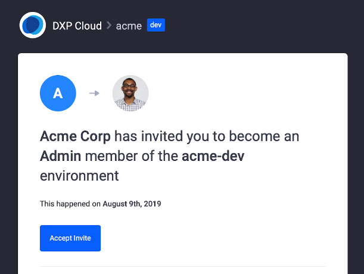
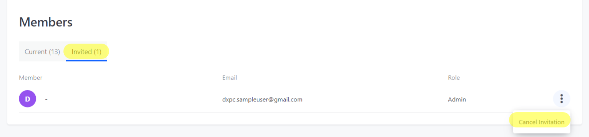

# Environment Teams and Roles

Administrators can manage team members and roles in each project environment from the DXP Cloud Console. Each environment can have unique members, and each member can have different roles in different environments.

Invite members and assign roles with varying access levels to achieve your desired team structure in each project environment.

## Inviting Team Members

Follow these steps to invite users to your environment:

1. Navigate to a project environment.
1. Click on *Team* in the environment menu.
1. Enter the user's email into the *Email* field.
1. Click the drop-down *Role* menu to assign a role to the new user.
1. Click on *Send Invite*.

Email invitations grant users access to a single project environment. Invited users must open the invitation email and click *Accept Invite*.

New DXP Cloud users must create an account, while returning users can *Log in* using their DXP Cloud credentials.

## Managing Team Members

Current and invited team members appear in separate tabs of the *Members* section. Here administrators can manage team members via the *Actions* button in each tab.

From the *Invited* tab, administrators can cancel pending environment invitations.

   

From the *Current* tab, administrators can change team member roles or remove a member from the environment.

   

## Understanding Team Roles

Roles determine a user's access level within an environment. Liferay DXP Cloud comes with three default user roles: Admin, Contributor, and Guest.

**Admin:** Administrators have full control over the DXP Cloud environment and its members. The following permissions belong exclusively to administrators:

- Enable/disable auto scaling
- Manually downscale a service
- Restore from a backup
- Change user roles
- Invite members to the environment
- Remove members from the environment
- Enable/disable support access
- Delete a service

**Contributor:** Contributors can handle application management and most of the development life cycle, but can't manage team members or perform other Admin-exclusive actions. Contributors have the following permissions:

- Start a backup
- Change VPN settings
- Restart a service
- Deploy a build
- Remove themselves from the environment

**Guest:** Guests have view-only access. Guests can see what is happening in the environment, but can't perform actions or make any changes. They only have permission to remove themselves from the environment.

## Additional Information

- [Initial Setup Overview](../getting-started/initial-setup-overview.md)
- [Understanding DXP Cloud Environments](../getting-started/understanding-dxp-cloud-environments.md)
- [Team Activities](./team-activities.md)
