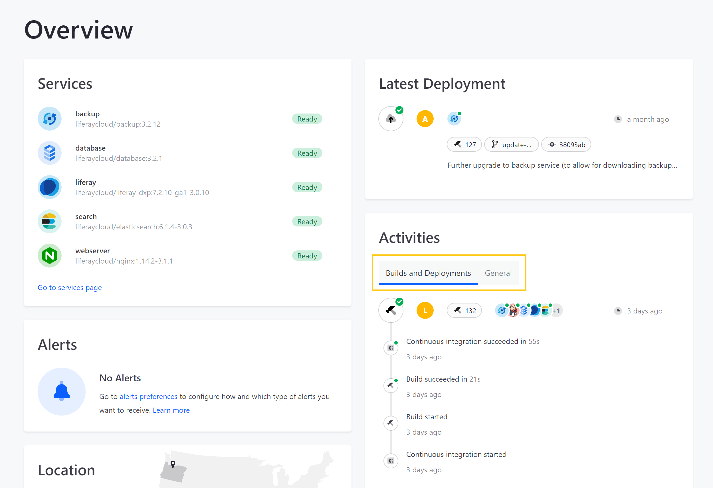
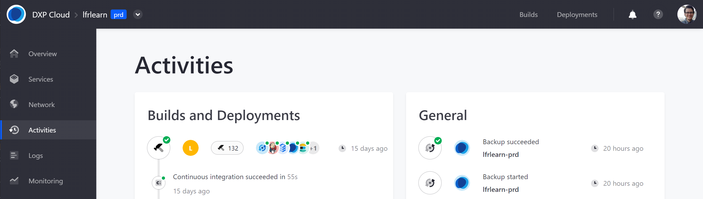
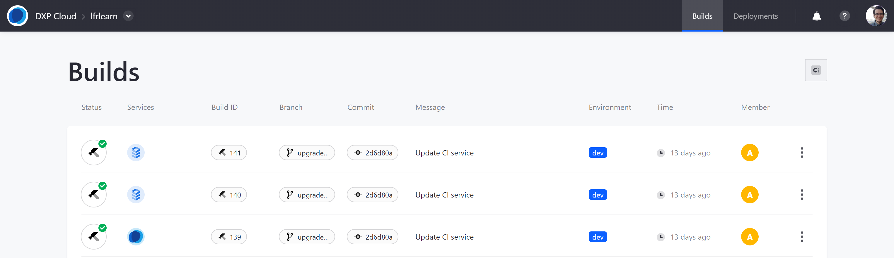
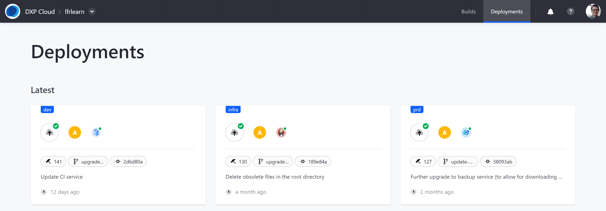

# Team Activities

Keeping track of activities within each project environment is essential. With Liferay DXP Cloud, you can monitor builds, deployments, and other project activities via the web console.

## Types of Environment Activities

Within each environment, activities are organized into two sections: *Builds and Deployments* and *General Activities*.

**Builds and Deployments**: This section lists all build, deployment, and ci related activities in a project environment. Each entry includes a Build ID, start time, duration, and status (e.g., in process, successful, failed, interrupted).

**General Activities**: This section lists automated service events and manual team member activities other than build, deployment, and ci activities. General activities include the following categories:

* Services Activities (e.g., when environment variables are updated, when services are installed, restarted, or deleted)
* Settings Activities (e.g. when environment Secrets are added, edited, or viewed by team members, when support access is disabled or enabled)
* Backup Activities (e.g., when automated or manual backups start and whether they succeed).
* Scaling Activities (e.g., when auto-scaling is disabled or enabled for the Liferay DXP service)
* Membership Activities (e.g., when environment invitations are sent, when new members join the environment)

Both sections specify the acting team member and the time of the activity.

## Viewing Environment Activities

You can view summaries of recent environment activities from the environment *Overview* page under *Activities*.

Toggle between activity types by clicking on the *Builds and Deployments* or *General* tabs.

View extended records of environment activities from the *Activities* page:

1. Navigate to a project environment.

1. Click on *Activities* in the environment menu.

This page lists all activities that have occurred on the DXP Cloud instance.

## Viewing All Project Builds and Deployments

You can view and manage build and deployment activities across all project environments via the *Builds* and *Deployments* pages:

1. Navigate to a project environment.

1. Click on *Builds* or *Deployments* at the top-right of the console navigation bar.

The following information is listed for each build and deployment activity: Status, Services, Build ID, Branch, Commit, Message, Environment, Time, and Member.

### Builds Page

The Builds page lists the full history of project builds across all project environments. For information about the build process, see [Overview of the DXP Cloud Deployment Workflow](../build-and-deploy/overview-of-the-dxp-cloud-deployment-workflow.md).

### Deployments Page

The Deployment page lists the latest deployments for each environment, followed by the full history of project deployments across all project environments. For information about the deployment process, see [Overview of the DXP Cloud Deployment Workflow](../build-and-deploy/overview-of-the-dxp-cloud-deployment-workflow.md).

## Additional Information

* [Environment Teams and Roles](./environment-teams-and-roles.md)
* [Overview of the DXP Cloud Deployment Workflow](../build-and-deploy/overview-of-the-dxp-cloud-deployment-workflow.md)
* [Log Management](../troubleshooting/log-management.md)
