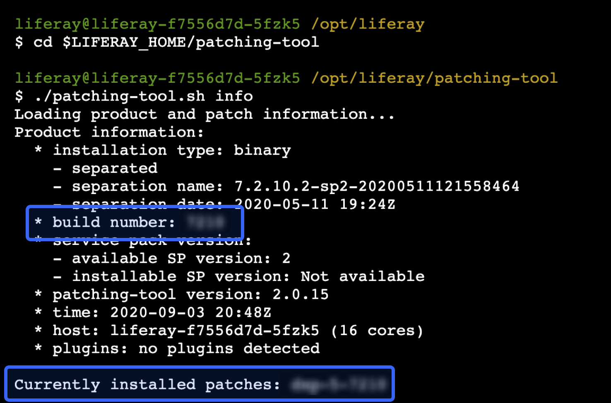
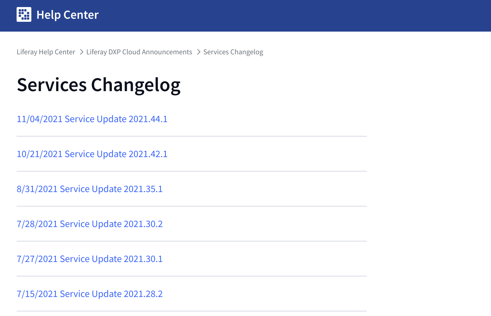
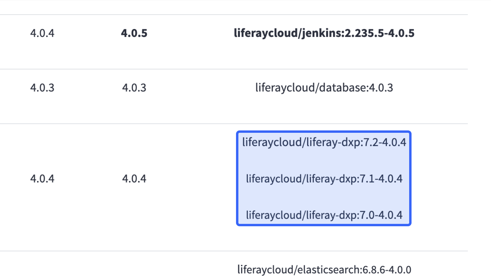
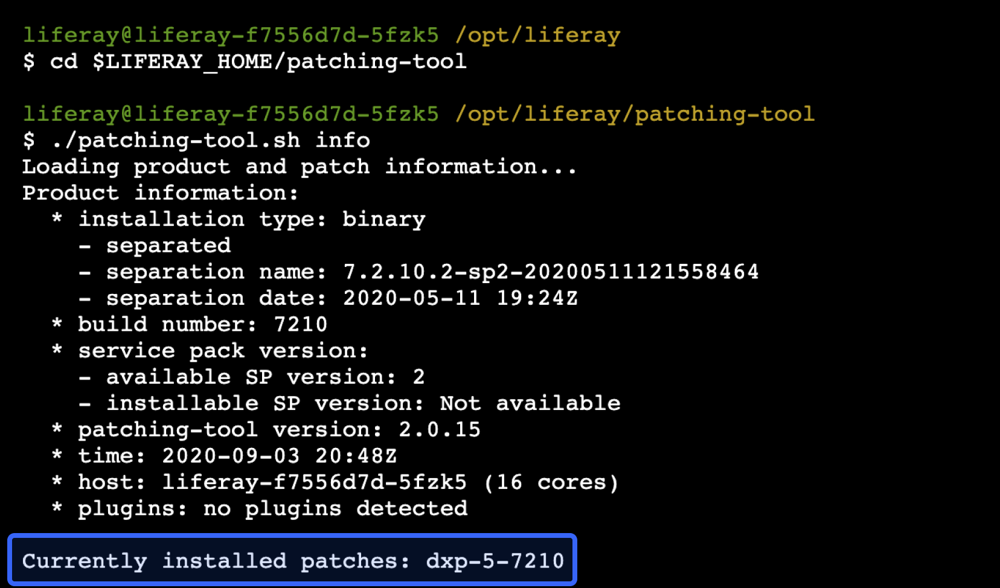

# Stage 1: Matching DXP Versions

The first stage of migration is to configure the Liferay service running on DXP Cloud to run the same version of the installation you want to migrate.

This requires cloning the DXP Cloud repository, configuring version changes to it, and then applying such updates back to DXP Cloud by deploying a build.

## Find Liferay Version Information

First, find the version number and installed patches for the Liferay DXP installation you want to migrate. You need these values to properly configure the Liferay service in DXP Cloud.

To find these values, use the patching tool:

1. Follow the instructions [here](https://learn.liferay.com/dxp/latest/en/installation-and-upgrades/maintaining-a-liferay-installation/reference/installing-the-patching-tool.html) to install the patching tool to the installation you want to migrate.

1. Navigate with any command line tool to the patching tool folder:

    ```bash
    cd $LIFERAY_HOME/patching-tool
    ```

1. Use the patching tool to get your installation's version information:

    ```bash
    ./patching-tool.sh info
    ```

The patching tool displays patch and version information including the build version, and any installed fix packs and hotfixes.



Take note of this information for future steps.

## Clone the DXP Cloud Repository

DXP Cloud provides a repository on [GitHub](https://github.com/) together with your project. You must have a clone of the repository locally to make configurations to some files in your project, such as each service's [LCP.json file](../reference/configuration-via-lcp-json.html).

If you have not already cloned the repository, then use any terminal with [Git installed](https://git-scm.com/book/en/v2/Getting-Started-Installing-Git) to clone it locally:

```bash
git clone https://github.com/dxpcloud/acme
```

## Update the Liferay DXP Image in the Repository 

Next, update the Liferay DXP image in the repository you [cloned previously](#clone-the-dxp-cloud-repository). This requires you to find the Docker image that is compatible with your Liferay installation's version information.

1. Go to the [Liferay DXP images](https://hub.docker.com/r/liferay/dxp/tags) page on Docker Hub.

1. Using the *Filter Tags* field, filter the list of images using the major version and fix pack number you [found previously](#find-liferay-version-information) (for example, with the form `7.2.10-dxp-5`). Copy this Docker image name.

    

    ```{tip}
    If you find multiple Docker images, then copy the latest match. With the list sorted by latest, the latest Liferay DXP image is listed at the top even if its name has a timestamp appended.
    ```

1. In your repository, open the `liferay/gradle.properties` file.

1. Set the value of `liferay.workspace.docker.image.liferay` to the Docker image name you copied previously.

    For example, if the Liferay DXP image name is `7.2.10-dxp-5`, then set this in `gradle.properties`:

    ```
    liferay.workspace.docker.image.liferay=liferay/dxp:7.2.10-dxp-5
    ```

This ensures that your DXP Cloud environment runs the correct version of Liferay DXP, so you can successfuly upload your data to it.

## Update the Liferay Service Image in the Repository

Next, update the Liferay service image in the Liferay service's `LCP.json` file in your repository. This requires you to find an up-to-date Docker image compatible with your Liferay installation's version.

1. Go to DXP Cloud's [Services Changelog](https://help.liferay.com/hc/en-us/sections/360006251311-Services-Changelog) page.

1. Click on the most recent services update at the top of the list.

    

1. Look for the **Liferay** service images listed on the page. Copy the image name that matches the *major version* of your on-premises Liferay installation.

    

1. In your repository, open the `liferay/LCP.json` file.

1. Set the value of the `image` field to the Docker image name you copied previously.

    For example, if the Liferay service image name is `liferaycloud/liferay-dxp:7.2-4.0.4`, then set this in `LCP.json`:

    ```
    "image": "liferaycloud/liferay-dxp:7.2-4.0.4"
    ```

This ensures that your Liferay service uses a version that is up-to-date and compatible with your version of Liferay DXP.

## Add Hotfix Information

You must also add hotfix information for the [patches installed in your on-premises installation](#find-liferay-version-information) to the CI service's `LCP.json` file.

1. To check the list of installed patches, run the `./patching-tool.sh info` command again from the `$LIFERAY_HOME/patching-tool` folder.

    

    Copy the name of the currently installed hotfix (or "patch") in your installation. If multiple hotfix names appear, then copy the name of the latest available hotfix.

1. In your repository, open the `ci/LCP.json` file.

1. Add the hotfix name you copied previously as a new [environment variable](../reference/defining-environment-variables.html) named `LCP_CI_LIFERAY_DXP_HOTFIXES_COMMON`:

    ```
    "env": {
        "LCP_CI_LIFERAY_DXP_HOTFIXES_COMMON": "dxp-5-7210"
    }
    ```

```{info}
The hotfix defined in `LCP_CI_LIFERAY_DXP_HOTFIXES_COMMON` and its dependencies are downloaded and integrated as part of the Jenkins build process.
```

## Create and Deploy a Build

Now that you have updated the version information in your repository, you must deploy it to your environment in a build.

### Create a Jenkins Build with Your Changes

Run Git commands to submit your changes using any terminal with Git installed.

1. Add the changed files to Git:

    ```bash
    git add .
    ```

1. Make a commit with your changes and a message:

    ```bash
    git commit -m "DXP Cloud Migration Stage 1"
    ```

1. Push the changes to GitHub:

    ```bash
    git push origin master
    ```

Since your project is linked to the GitHub repository, pushing the changes automatically creates a build. Wait for the build to complete before proceeding.

### Deploy the Build to Your Chosen Environment

Finally, use the [DXP Cloud Console](https://console.liferay.cloud/) to deploy the completed build to your chosen environment.

1. In the DXP Cloud Console, go to the Builds page (using the link at the top of the page).

1. Find the build you created previously in the list, and from the Actions menu, click *Deploy build to*.

    

1. Select the environment to deploy the build to (e.g., `acme-dev`).

1. Read the information below and select the confirmation boxes to confirm the results of the deployment.

    

1. Click *Deploy Build*.

The build is deployed to your chosen environment, and the correct versions are applied when the services start up.

```{note}
The deployment takes some time to complete and for your services to be ready. The process may take longer than usual if it is the first deployment to that environment.
```

## Next Steps

Now you have a deployment to your chosen environment with all of the correct Liferay DXP version information. Next, you will [create backup files](./creating-data-backup-files.md) for your instance's data to prepare it for DXP Cloud.