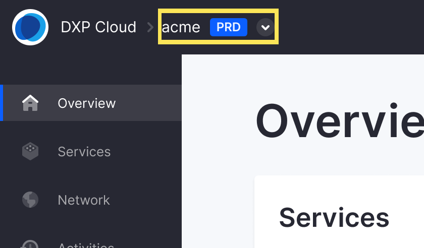
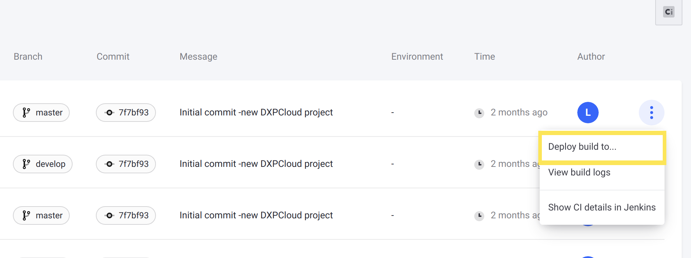

# Stage 6: Migrating Search Configurations

Now that your web server configurations are deployed to DXP Cloud, the next stage of migration is to migrate your search configurations. This involves migrating your search engine to Elasticsearch (if needed), and deploying all of your Elasticsearch configuration files and plugins to your DXP Cloud environments.

## Migrate Your Search Engine to Elasticsearch

If you are not using Elasticsearch in your on-premises environment, then migrate to Elasticsearch before proceeding.

Migrating to Elasticsearch involves installing and then connecting your Liferay installation to it. See [Getting Started with Elasticsearch](https://learn.liferay.com/dxp/latest/en/using-search/installing-and-upgrading-a-search-engine/elasticsearch/getting-started-with-elasticsearch.html) for more information.

```{tip}
If you need help with migrating to Elasticsearch, please contact [DXP Cloud Support](https://help.liferay.com/hc/en-us).
```

## Organize Configurations and Shell Scripts

```{note}
Skip this step if you do not have any specific Elasticsearch configurations or scripts to organize.
```

In the project repository you [cloned previously](./matching-dxp-versions.md#clone-the-dxp-cloud-repository), navigate to the `search/configs/{ENV}/` folders (which correspond to your DXP Cloud environments), and put all of your Elasticsearch configuration files and shell scripts into the appropriate environment folders, following this pattern: 

* Put Elasticsearch configuration files into `search/configs/{ENV}/config/`
* Put all custom shell scripts into `search/configs/{ENV}/scripts/`

All custom shell scripts in the appropriate folder run each time the `search` service is redeployed.

```{tip}
To see what an Elasticsearch configuration file looks like, see the example configuration [here](../reference/example-configuration-files.md#search-service-configuration-elasticsearch-yml).
```

## Add Extra Search Plugins

```{note}
Skip this step if you do not have any extra plugins to add.
```

First, review the list of plugins that are already installed on DXP Cloud by default:

1. In your DXP Cloud environment, navigate to a production (`prd`) environment.

    

    Production environments contain all of the pre-installed Elasticsearch plugins.

1. Navigate to the `search` service, and click on the `Shell` tab.

1. In the shell, run this command:

    ```bash
    bin/elasticsearch-plugin list
    ```

The shell lists all pre-installed Elasticsearch plugins when you run the command.

If you have extra search plugins that are not listed, add them to your DXP Cloud project's repository:

1. In your repository, open the `search/LCP.json` file.

1. Add an [environment variable](../reference/defining-environment-variables.md) named `LCP_SERVICE_SEARCH_ES_PLUGINS` with a comma-separated list of Search plugins you need to add to the pre-installed plugins.

    For example, to install the `analysis-kuromoji` plugin, add this environment variable:

    ```
    "env: {
        "LCP_SERVICE_SEARCH_ES_PLUGINS": "analysis-kuromoji"
    }
    ```

## Create and Deploy a Build

Next, create and deploy a build with these changes to apply them to your DXP Cloud environments.

### Create a Jenkins Build with the Change

Run Git commands to submit your changes using any terminal with Git installed.

1. Add the changed files to Git:

    ```bash
    git add .
    ```

1. Make a commit with your changes and a message:

    ```bash
    git commit -m "DXP Cloud Migration Stage 6"
    ```

1. Push the changes to GitHub:

    ```bash
    git push origin master
    ```

Since your project is linked to the GitHub repository, pushing the changes automatically creates a build. Wait for the build to complete before proceeding.

### Deploy the Build to Your Chosen Environment

Finally, use the [DXP Cloud Console](https://console.liferay.cloud/) to deploy the completed build to your chosen environment.

1. In the DXP Cloud Console, go to the Builds page (using the link at the top of the page).

1. Find the build you created previously in the list, and from the Actions menu, click *Deploy build to*.

    

1. Select the environment to deploy the build to (e.g., `acme-dev`).

1. Read the information below and select the confirmation boxes to confirm the results of the deployment.

    

1. Click *Deploy Build*.

The build is deployed to your chosen environment, and your Elasticsearch configurations, shell scripts, and plugins are applied to the chosen environment once the `search` service restarts.

## Next Steps

Now you have finished migrating your Elasticsearch configurations to your DXP Cloud environments. Next, you will [configure and connect a VPN server](./migrating-search-configurations.md).
