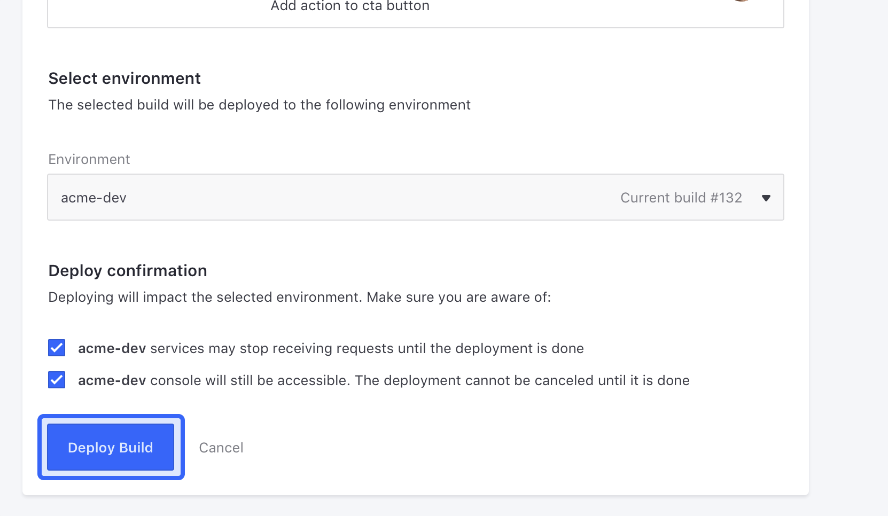

# Stage 5: Migrating Web Server Configurations

Now that your Liferay configurations and customizations are deployed to DXP Cloud, the next stage is to migrate your web server configurations. This involves migrating your web server to Nginx (if needed), and deploying all of your Nginx configuration files and customizations (shell scripts and static content) to your DXP Cloud environments.

## Migrate Your Web Server to Nginx

DXP Cloud only supports Nginx for its web server. If you are not using Nginx already, then migrate your web server and configurations to Nginx first. See the [Nginx site](http://nginx.org/en/docs/beginners_guide.html) for more information.

```{tip}
If you need help with migrating to Nginx, please contact [DXP Cloud Support](https://help.liferay.com/hc/en-us).
```

## Organize Nginx Configurations

Next, move your Nginx configurations into your repository, where you can deploy them to DXP Cloud.

```{note}
Skip this step if you do not have any specific Nginx configurations to organize.
```

In the project repository you [cloned previously](./matching-dxp-versions.md#clone-the-dxp-cloud-repository), navigate to the `webserver/configs/{ENV}/` folders (which correspond to your DXP Cloud environments), and put all of your Nginx configuration files into the appropriate environment folders, following this pattern: 

* Put Nginx configuration (`.conf`) files into `webserver/configs/{ENV}/conf.d/`
* Put overrides for the `var/www/html/` directory into `webserver/configs/{ENV}/public/`
* Put any other overrides (for the `/etc/nginx/` directory) into `webserver/configs/{ENV}/`

```{tip}
Any files put into the `webserver/configs/common/` folder applies to all environments when deployed.
```

See [Web Server Service Configurations](../platform-services/web-server-service.md#configurations) for more information.

```{tip}
As an example Nginx configuration, download this [sample Nginx .conf file](https://drive.google.com/file/d/10nt2ys4GWh-M40NOljrQsWlbOIjuYnf8/view).
```

## Organize Web Server Customizations

```{note}
Skip this step if you do not have these custom shell scripts or static content for your web server.
```

In your DXP Cloud project repository, put all of your custom shell scripts into each appropriate `webserver/configs/{ENV}/scripts/` environment folder.

Put all of your static content into each appropriate `webserver/configs/{ENV}/public/` environment folder.

Once you have all of your custom content organized into your repository, you are ready to deploy the changes to your DXP Cloud environments.

## Create and Deploy a Build

Next, you must create and deploy a build with these changes to apply them to your DXP Cloud environments.

### Create a Jenkins Build with the Change

Run Git commands to submit your changes using any terminal with Git installed.

1. Add the changed files to Git:

    ```bash
    git add .
    ```

1. Make a commit with your changes and a message:

    ```bash
    git commit -m "DXP Cloud Migration Stage 5"
    ```

1. Push the changes to GitHub:

    ```bash
    git push origin master
    ```

Since your project is linked to the GitHub repository, pushing the changes automatically creates a build. Wait for the build to complete before proceeding.

### Deploy the Build to Your Chosen Environment

Finally, use the [DXP Cloud Console](https://console.liferay.cloud/) to deploy the completed build to your chosen environment.

1. In the DXP Cloud Console, go to the Builds page (using the link at the top of the page).

1. Find the build you created previously in the list, and from the Actions menu, click *Deploy build to*.

    

1. Select the environment to deploy the build to (e.g., `acme-dev`).

1. Read the information below and select the confirmation boxes to confirm the results of the deployment.

    

1. Click *Deploy Build*.

The build is deployed to your chosen environment, and your Nginx configurations and customizations are applied to the chosen environment once the `webserver` service restarts.

## Next Steps

Now you have finished migrating your web server configurations to your DXP Cloud environments. Next, you will migrate your [Elasticsearch configurations](./migrating-search-configurations.md).
