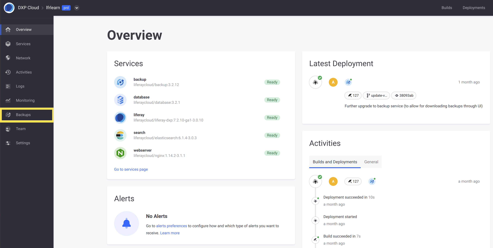

# Backup Service

Maintaining regular backups is vital to protecting your project's data. The DXP Cloud backup service stores iterations of environment data that can be used to restore your environments if needed.

These backups include both the Liferay DXP Database and the full contents of the Liferay image's `LIFERAY_HOME/data` folder.

From the Backups page in `prd` environments, you can create backups, view or download retained backups, and restore an environment from a backup.

You can also configure the backup service to meet your project's needs via the DXP Cloud console or the backup service's `LCP.json` file.

* [The Backups Page](#the-backups-page)
* [Configuring the Backup Service](#configuring-the-backup-service)
* [Environment Variables Reference](#environment-variables-reference)


## The Backups Page

From the Backups page in `prd` environments, you can view backup service information and retained backups, create manual backups, download backups, or restore environments from backups.

```note::
   The Backups page is only available in production environments.
```

Follow these steps to access the Backups page:

1. Navigate to your project's `prd` environment.

1. Click on *Backups* in the environment menu.

   

From here, you can perform the following tasks:

**View Backup Info**: You can quickly view backup service information for the `prd` environment. This includes the frequency of automated backups, the backup retention period, and timestamp information for the next scheduled backup, the latest created backup, and the oldest retained backup.

**View Backup History**: You can view the name, size, and time of creation for each backup retained in the `prd` environment under *Backup history*.

**Create Manual Backups**: You can manually create a backup of the `prd` environment. See [Performing a Manual Backup](#performing-a-manual-backup) for more information.

**Download Backups**: You can manually download both `.tgz` archives that comprise a backup from the Backups page. Simply click on the *Actions* button ( ⋮ ) for the backup you want to download, and select *Download*. See [Downloading and Uploading Backups](./downloading-and-uploading-backups.md) for more information and instructions on how to use backup service APIs to download or upload backups.

**Restore Environments from Backups**: You can restore an environment from one of the backups retained in the `prd` environment. Simply click on the *Actions* button ( ⋮ ) for the backup you want to use, and select *Restore To...*. You can also apply custom SQL scripts with a data restore. See [Restoring Data from a Backup](./restoring-data-from-a-backup.md) for more information.

```note::
   Backup timestamps are displayed automatically based on your browser location, while backup schedules are based on the UTC±00 time zone.
```

### Performing a Manual Backup

To manually backup your `prd` environment from the Backups page, simply click on *Backup Now*. This process can take several minutes or hours depending on the size of your services.

Once started, the backup service icon will indicate a backup is in progress, and a new backup will appear in the *Backup history*.


Clicking *View logs* redirects you to the Logs page, where you can view the backup stages in real-time. You can also view backup logs in the *Logs* tab of the backup service's page. See [Log Management](../troubleshooting/log-management.md) for more information about viewing service logs.

## Configuring the Backup Service

You can configure the backup service to meet your project's needs via the DXP Cloud console or the backup service's `LCP.json` file.

See [Environment Variables Reference](#environment-variables-reference) for a list of variables you can use to configure the backup service.

```important::
   Whenever the backup service is reconfigured, the backup service will restart and may stop receiving requests for some minutes or behave differently depending on the regular variable values.
```

### Configuring the Backup Service via the DXP Cloud Console

Follow these steps to configure the backup service via the DXP Cloud Console:

1. Navigate to an environment where the backup service is installed.

1. Click on *Services* in the environment menu.

1. Click on the *Backup* service.

1. Click on the *Environment Variables* tab.

   

   You can also access the backup service's page by clicking on *Backup* in the environment Overview page.

1. Add variables from the [Environment Variables Reference](#environment-variables-reference) list to configure the backup service.

1. Click on *Save Changes*.

Besides *Regular variables*, you can also set *Secret Variables* via the DXP Cloud console, see [Managing Secure Environment Variables with Secrets](../infrastructure-and-operations/security/managing-secure-environment-variables-with-secrets.md) for more information.

### Configuring the Backup Service via the Backup `LCP.json` File

Follow these steps to configure the backup service via its `LCP.json` file:

1. Use a text editor to open the backup `LCP.json` file located at the following path: `/{your_project_name}/lcp/backup/LCP.json`.

1. Scroll down to the environment section.

   ```
    "env": {
      "LCP_BACKUP_FOLDER": "/opt/liferay/data",
      "LCP_DATABASE_SERVICE": "database",
      "LCP_MASTER_USER_PASSWORD": "           "
    },
   ```

1. Add variables from the [Environment Variables Reference](#environment-variables-reference) list to configure the backup service.

1. Save the file and deploy to your project to implement the configuration.

See [Configuration via LCP.json](../reference/configuration-via-lcp-json.md) for more information about configuring environment services via their `LCP.json` files.

### Scheduling Automated Backups and Cleanups

Determining how frequently backups are created and removed is vital to protecting your data and optimizing storage.

Use the following variables to set when backups are created and removed:

* **Automated Backups**: Add the `LCP_BACKUP_CREATE_SCHEDULE` variable with a [cron scheduling](https://crontab.guru/) value to set the frequency of automated backups.
* **Automated Cleanups**: Add the `LCP_BACKUP_CLEANUP_SCHEDULE` variable with a [cron scheduling](https://crontab.guru/) value to set the frequency of automated backup cleanups.
* **Retention Period**: Add the `LCP_BACKUP_RETENTION_PERIOD` variable with a numerical value (between 1-30) to set the number of days backups are retained before being removed by automated cleanups. By default, the retention period is set to 30 days.

```note::
   Both standard and non-standard `cron scheduling syntax<https://crontab.guru/>`_ are based on the UTC±00 time zone. When using non-standard cron syntax, automated backups and cleanups run at the start of the specified value. For example, @daily runs backups every day at 00:00 UTC.
```

The following `LCP.json` example creates backups every 12 hours (i.e., 00:00 and 12:00 UTC) and performs monthly cleanups that remove backups over 30 days old:

```
 "env": {
   "LCP_BACKUP_FOLDER": "/opt/liferay/data",
   "LCP_DATABASE_SERVICE": "database",
   "LCP_MASTER_USER_PASSWORD": "           ",
   "LCP_BACKUP_CREATE_SCHEDULE": "0 0,12 * * *",
   "LCP_BACKUP_CLEANUP_SCHEDULE": "@monthly",
   "LCP_BACKUP_RETENTION_PERIOD": "30"
 },
```

## Environment Variables Reference

Name                          | Default Value              | Description |
----------------------------- | -------------------------- | ----------- |
`LCP_BACKUP_CLEANUP_SCHEDULE` | <!--n/a????--> | This variable schedules automated cleanups using [cron scheduling syntax](https://crontab.guru/). |
`LCP_BACKUP_CREATE_SCHEDULE`  | `[5-55][0-1] * * *`     | This variable schedules automated backups using [cron scheduling syntax](https://crontab.guru/). In versions `3.2.1` and above of the backup service, if no value is specified then a random default will be created. |
`LCP_BACKUP_FOLDER`           | `/opt/liferay/data`        | The Liferay folder to back up. |
`LCP_BACKUP_RESTORE_SCHEDULE` | <!--n/a????--> | This variable schedules automated restores using [cron scheduling syntax](https://crontab.guru/). |
`LCP_BACKUP_RETENTION_PERIOD` | `30`                       | This variable determines which backups are removed during scheduled cleanups. Select the number of days backups are retained before being removed by cleanups. The maximum retention period is 30 days. |
`LCP_DATABASE_SERVICE`        | `database`                 | The database service's ID. |
`LCP_DBNAME`                  | `lportal`                  | The database name. |
`LCP_MASTER_USER_NAME`        | `dxpcloud`                 | The master username. |
`LCP_MASTER_USER_PASSWORD`    | `LCP_PROJECT_MASTER_TOKEN` | The master password. |

## Additional Information

* [Downloading and Uploading Backups](./downloading-and-uploading-backups.md)
* [Restoring Data from a Backup](./restoring-data-from-a-backup.md)
* [Configuration via LCP JSON](../reference/configuration-via-lcp-json.md)
