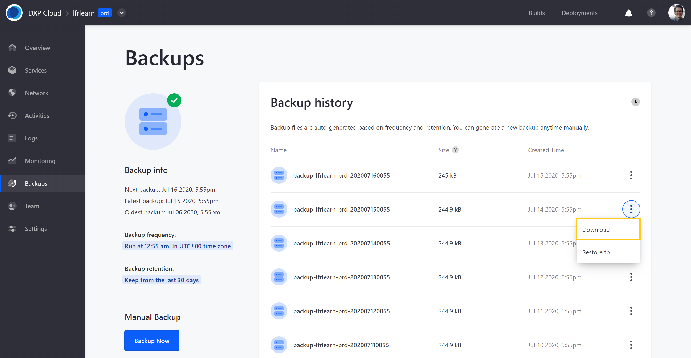
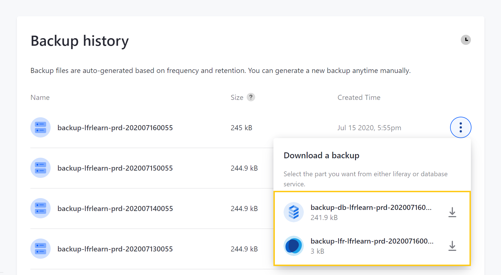
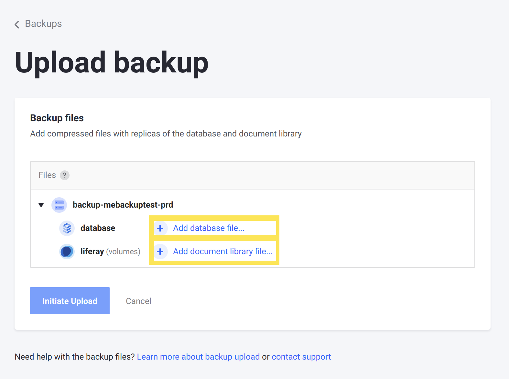

# Downloading and Uploading Backups

The DXP Cloud backup service creates backups of an environment's database and the full contents of the `LIFERAY_HOME/data` folder. This content is stored as `.tgz` files and can be downloaded via the DXP Cloud console.

Users can also download or upload environment backups using backup service APIs.

## Downloading Backups via the DXP Cloud Console

Follow these steps to download a backup from the *Backups* page in your `prd` environment:

1. Click on the *Actions* button ( ⋮ ) for the backup you want to download.

1. Click on *Download*.

   

1. Click on the *Database* or *Liferay* `.tgz` file to start downloading. Together, these zip archives comprise the environment backup.

   

```note::
   Only production environment administrators can download backups from the Backups page.
```

## Backup Service APIs

The backup service has APIs that you can use to download and upload backups. You can invoke these APIs using a command line tool such as `curl`.

### Getting the Host Name

To invoke the backup APIs, you need the backup service's host name. You can find this on the *Services* page.



The backup service's host name is a combination of the service, project, and environment names.

Consider this example:

* Service name: `backup`
* Project name: `lfrjoebloggs`
* Environment name: `prd`
* Host name: `backup-lfrjoebloggs-prd.lfr.cloud`

### Authentication

You can authenticate your request with basic authentication or a user access token.

Note that token authentication is required if SSO is enabled You can retrieve this token from the cookie `access_token` and use it with the `dxpcloud-authorization` header.

Here's an example that uses token authentication with the upload API:

```bash
curl -X POST \
  https://backup-<PROJECT-NAME>-prd.lfr.cloud/backup/upload \
  -H 'Content-Type: multipart/form-data' \
  -H 'dxpcloud-authorization: Bearer <USER_TOKEN>' \
  -F 'database=@/my-folder/database.tgz' \
  -F 'volume=@/my-folder/volume.tgz'
```

```note::
   Passing the user token in the header ``dxpcloud-authorization`` only works for versions ``3.2.0`` or greater of the backup service. Previous versions should be upgraded to at least ``3.2.0``. Requests to earlier versions must use the header ``Authorization: Bearer <PROJECT_MASTER_TOKEN>``. You can find the project master token by running the command ``env | grep LCP_PROJECT_MASTER_TOKEN`` in any shell in the Liferay DXP Cloud console.
```

### Download Database API

The API for downloading a database contains an endpoint that returns a `.tgz` file. The `id` parameter represents the backup ID, which you can find on the Backups page. This ID is comprised of three strings separated by two dashes (e.g., `dxpcloud-lqgqnewltbexuewymq-201910031723`).

#### Parameters

Name | Type     | Required |
---- | -------- | -------- |
`id` | `String` | Yes      |

#### curl Example

```bash
curl -X GET \
  https://backup-<PROJECT-NAME>-prd.lfr.cloud/backup/download/database/id \
  -u user@domain.com:password \
  --output database.tgz
```

### Download Data Volume API

The API for downloading a data volume contains an endpoint that returns a `.tgz` file. The `id` parameter represents the backup ID, which you can find on the Backups page. This ID is comprised of three strings separated by two dashes (e.g., `dxpcloud-lqgqnewltbexuewymq-201910031723`).

#### Parameters

Name | Type     | Required |
---- | -------- | -------- |
`id` | `String` | Yes      |

#### curl Example

```bash
curl -X GET \
  https://backup-<PROJECT-NAME>-prd.lfr.cloud/backup/download/volume/id \
  -u user@domain.com:password \
  --output volume.tgz
```

### Upload Backup API

Follow these steps to upload a backup to DXP Cloud with the upload backup API:

1. [Create the database file](#creating-the-database-file).

1. [Create the volume file](#creating-the-volume-file).

1. [Invoke the backup API](#invoking-the-backup-api) with the database and volume files.

#### Creating the Database File

To create a MySQL dump and compress it into a `.tgz` archive, run the following commands:

```bash
mysqldump -uroot -ppassword --databases --add-drop-database lportal | gzip -c | cat > database.gz
```

```bash
tar zcvf database.tgz database.gz
```

The `databases` and `add-drop-database` options are necessary for backup restoration to work correctly. You can also use the `/backup/download` API to see how the backup service creates its MySQL dump file.

With these options, the resulting dump file contains the following code just before the create table statements.

```sql
--
-- Current Database: `lportal`
--

/*!40000 DROP DATABASE IF EXISTS `lportal`*/;

CREATE DATABASE /*!32312 IF NOT EXISTS*/ `lportal` /*!40100 DEFAULT CHARACTER SET utf8 */;

USE `lportal`;
```

#### Creating the Volume File

Run this command to compress the data volume:

```bash
cd $LIFERAY_HOME/data && tar -czvf volume.tgz document_library
```

#### Invoking the Backup API

**Parameters**

Name       | Type   | Required |
---------- | ------ | -------- |
`database` | `File` | Yes      |
`volume`   | `File` | Yes      |

**curl Example**

```bash
curl -X POST \
  https://backup-<PROJECT-NAME>-prd.lfr.cloud/backup/upload \
  -H 'Content-Type: multipart/form-data' \
  -F 'database=@/my-folder/database.tgz' \
  -F 'volume=@/my-folder/volume.tgz' \
  -u user@domain.com:password
```

## Additional Information

* [Backup Service Overview](./backup-service-overview.md)
* [Restoring Data from a Backup](./restoring-data-from-a-backup.md)
* [Database Service (MySQL)](../database-service.md)
