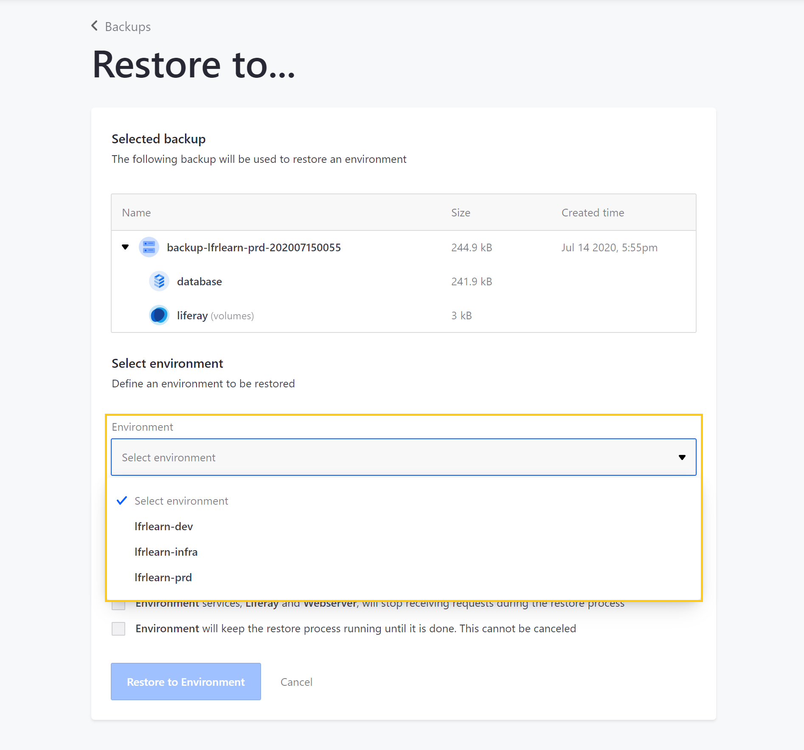
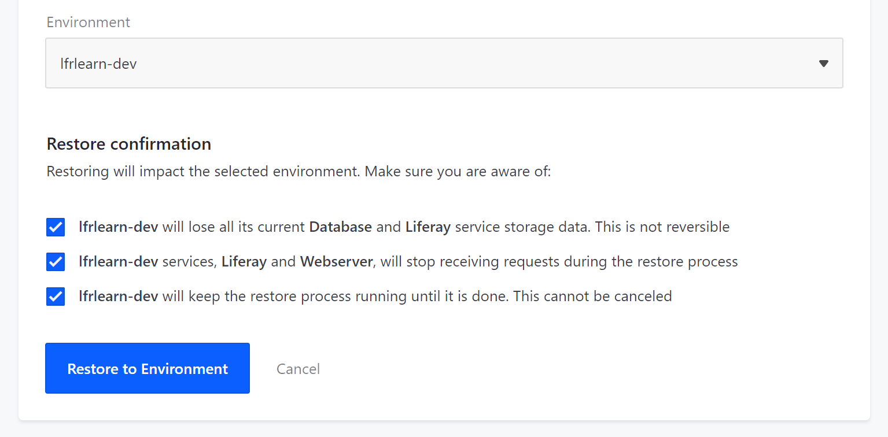

# Restoring Data from a Backup

During project development, there may be times when you need to restore data or roll back the project to an earlier state.

You can also use custom SQL scripts to perform additional updates to a database as part of the data restore.

See [Backup Service](./backup-service-overview.md) and [Downloading and Uploading Backups](./downloading-and-uploading-backups.md) for more information about the Backups page.

```important::
   The Backups page is only available for production (``prd``) environments. Only users with the Admin role for the prod environment can manually restore environments via the DXP Cloud console.
```

## Restoring an Environment from the Backups Page

Follow these steps to restore an environment from a backup:

1. Navigate to your project's `prd` environment.

1. Click on *Backups* in the environment menu.

1. Click on the *Actions* button ( ⋮ ) for the backup you want to use to restore a project environment.

1. Click on *Restore to...*

   

1. Click the drop-down *Environment* menu, and select the environment you want to restore.

   

   ```note::
      Production environment administrators can only restore environments to which they have access.
   ```

1. Click all *checkboxes* that appear below. You must check these boxes to enable the button to initiate the restore.

1. Click on *Restore to Environment* to start the restore process.

   

During the restore process, the target environment's services will restart.

You can track the status of the restore in the backup service's *Logs* and the *General* section of the Activities page.

## Applying Custom SQL Scripts with a Data Restore

You can also use custom SQL scripts to perform additional updates to your database with a normal data restore. This approach is ideal for sanitizing sensitive data, since it allows you to apply the scripts to separately maintained database backups.

```note::
   Using this feature requires version 3.0.7 or newer of the backup service.
```

### Preparing SQL Scripts

The following formats are supported for SQL scripts:

* `.sql` is used for individual scripts.
* `.zip`, `.tgz`, or `.gz` are used for multiple scripts within a compressed file.

Note that scripts are run in alphanumerical order when they are executed. SQL scripts must also reference the exact database to run on (for example, with `USE lportal;` or `lportal.User_`).

Place SQL scripts into the appropriate, environment-specific `backup/configs/{ENV}/scripts/` folder.

```note::
   If you are using version 3.x.x services, then SQL scripts instead belong in the appropriate ``lcp/backup/script/{ENV}/`` folder. See `Understanding Service Stack Versions <../../reference/understanding-service-stack-versions.md>`__ for more information on checking the version.
```

### Performing the Data Restore

Once you have prepared your SQL script(s), follow these steps to apply your custom SQL script(s) with a data restore:

1. [Deploy your backup service](../../build-and-deploy/overview-of-the-dxp-cloud-deployment-workflow.md) to include the custom SQL script(s) online.

1. Follow the instructions listed above for [Restoring an Environment from the Backups Page](#restoring-an-environment-from-the-backups-page)

Once the database has been restored, the SQL script(s) from your backup service's `scripts` folder will run:

```bash
Jun 20 14:46:41.795 build-39 [backup-57488f8b8-rjq4f] Running Script: SanitizeOrg.sql
Jun 20 14:46:41.970 build-39 [backup-57488f8b8-rjq4f] Running Script: SanitizeUsers.sql
```

## Additional Information

* [Backup Service](./backup-service-overview.md)
* [Downloading and Uploading Backups](./downloading-and-uploading-backups.md)
* [Database Service (MySQL)](../database-service.md)
