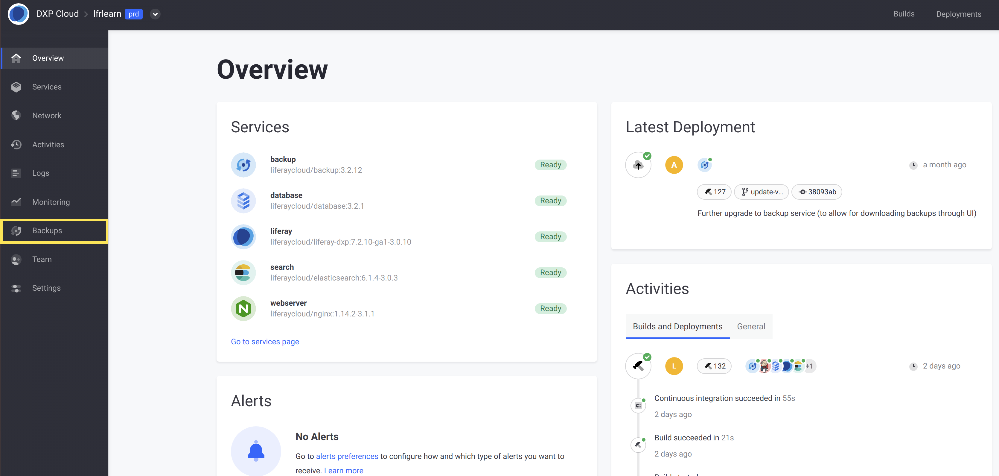
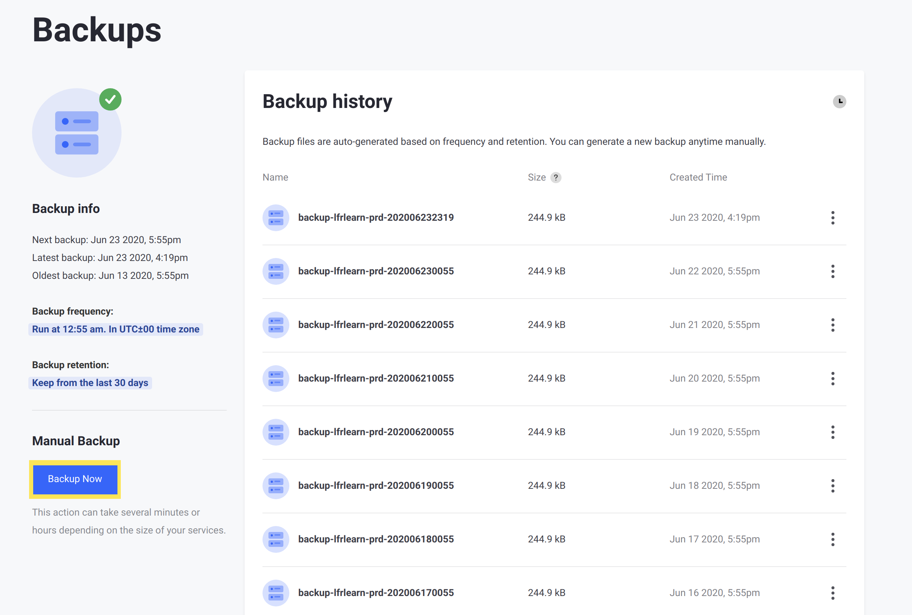
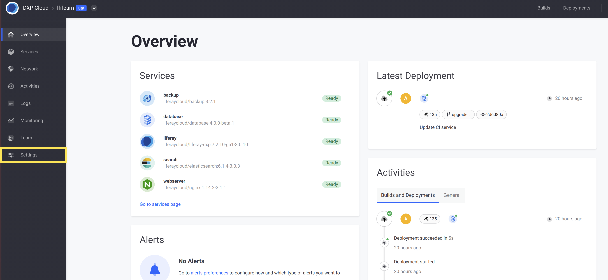
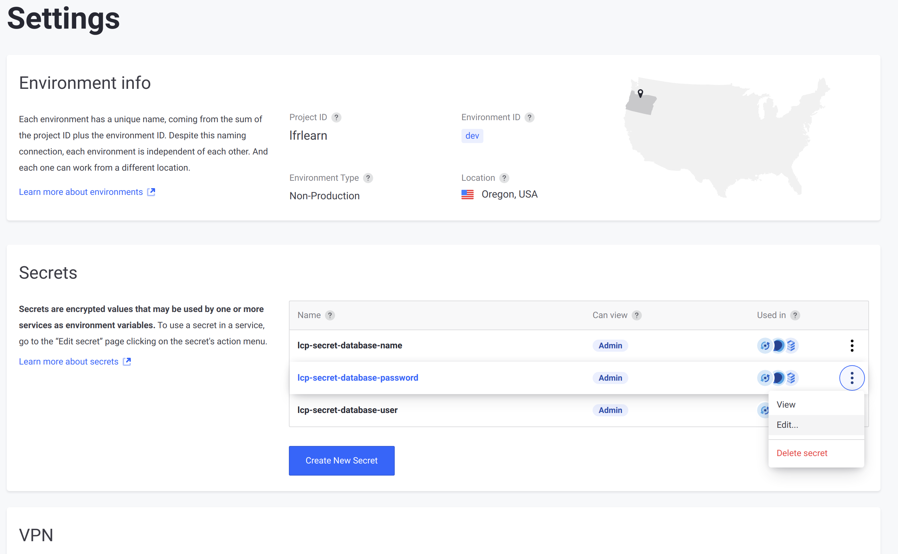
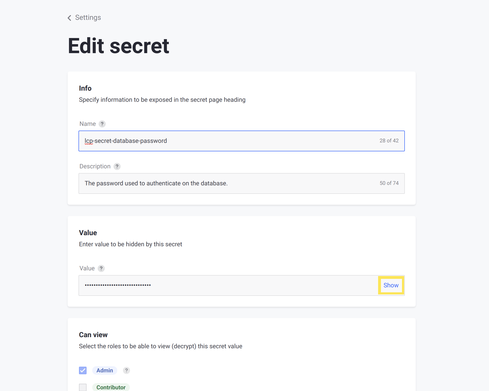
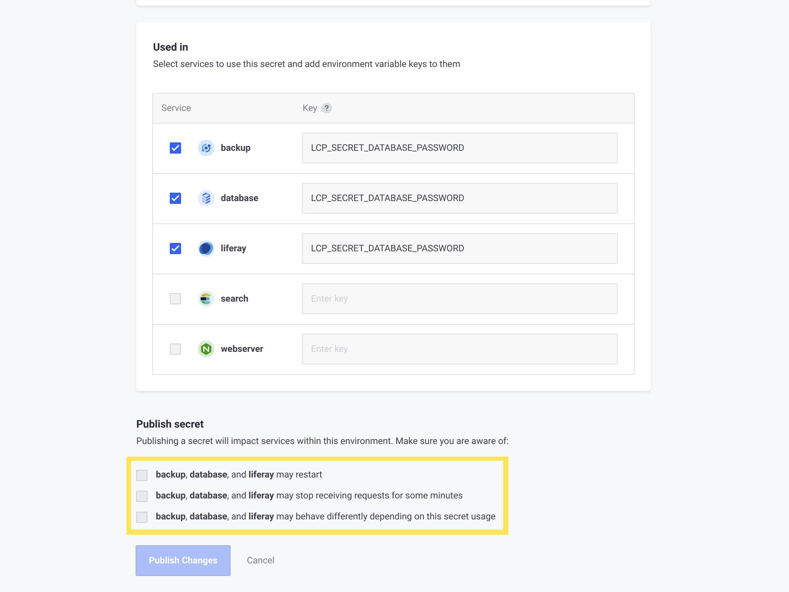
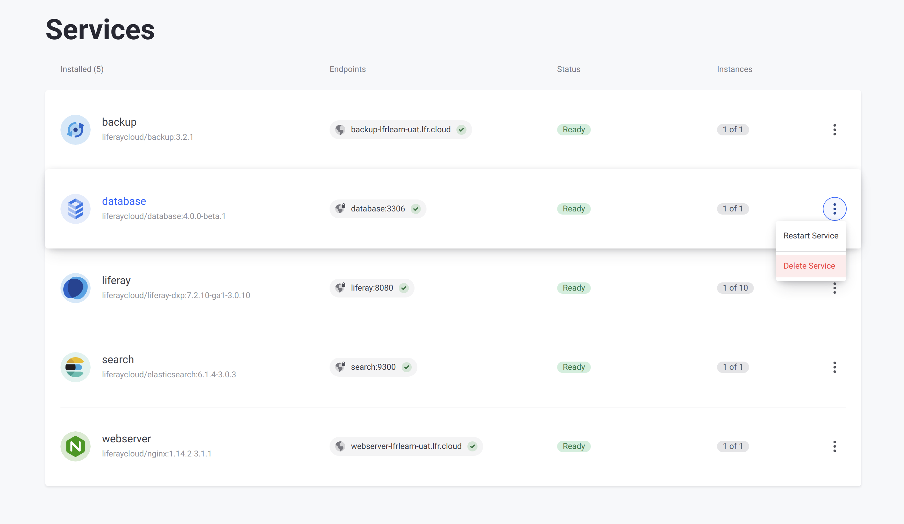

# Changing Your Database Password

Changing the MySQL password for your [`database` service](./database-service.md) also effects the other services that must connect to the database.

```warning::
   Updating your database password requires a period of downtime for you to restore a backup to your database service, and then restart all of your services. Plan ahead to make time for this before rotating your database password.
```

## Creating a Backup

If you are changing the password for a production environment, then you must ensure you have an up-to-date backup so you can restore it after the update.

To create a backup, navigate to your production (`prd`) environment and click _Backups_ from the menu on the left:



Then, click _Backup Now_ on the _Backups_ page:



## Changing the Database Password

The database password is changed directly using the [secrets](../infrastructure-and-operations/security/managing-secure-environment-variables-with-secrets.md) feature within your chosen environment. However, for the database password secret, you must follow additional steps to ensure that your services update correctly with the new value.

<!-- Mention required service versions, and link to possible section on the procedure for 3.x services -->

When you are ready, follow these steps to change your database password:

1. Navigate to your chosen environment.

1. Click _Settings_ from the menu on the left:

    

1. In the _Secrets_ section, click _Edit..._ from the Actions menu beside the `lcp-secret-database-password` secret:

    

1. In the _Value_ section, click _Show_ beside the value to reveal the secret and enable editing.

    

1. Edit the value of the secret.

1. Scroll down and check all of the boxes acknowledging the effects of changing the value of the secret.

    

1. Click _Publish secret_.

    ```note::
       The services attempt to restart when you click `Publish secret`. However, the database service can only update its password upon image creation, so the service must be deleted and redeployed to update it.
    ```

1. Return to your environment's _Services_ page.

1. From the Actions menu for the `database` service, click _Delete Service_.

    

1. Open a command prompt within your local clone of the repository.

1. Deploy the `database` service to your environment using the [command-line interface](../reference/command-line-tool.md):

    ```bash
    cd database
    ```

    ```bash
    lcp deploy
    ```

1. If you are not already logged in, enter `y` at the prompt and authenticate with your browser.

1. When prompted, enter the number corresponding to your environment:

    ```bash
    #      Project             Status
    1      lfrlearn-infra      Ready
    2      lfrlearn-uat        Ready
    3      lfrlearn-dev        Ready
    4      lfrlearn-prd        Ready

    ? Type a number (#) or project name: 2
    ```

    The database service starts up using the updated password. The `liferay` and `backup` services restart to reconnect to the database service with the correct password, as well.

1. If you [prepared a backup](#creating-a-backup), then navigate to your **production** environment's _Backups_ page, and [restore the backup](./backup-service/restoring-data-from-a-backup.md).

Your `database` service is now updated with a new password, and your other services are synchronized to connect to it properly.

## Additional Information

* [Database Service](./database-service.md)
* [Managing Secure Environment Variables with Secrets](../infrastructure-and-operations/security/managing-secure-environment-variables-with-secrets.md)