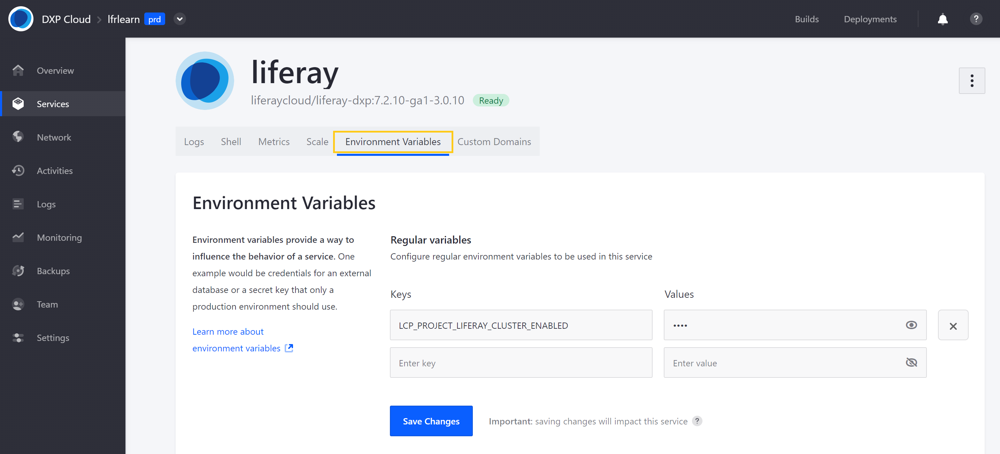
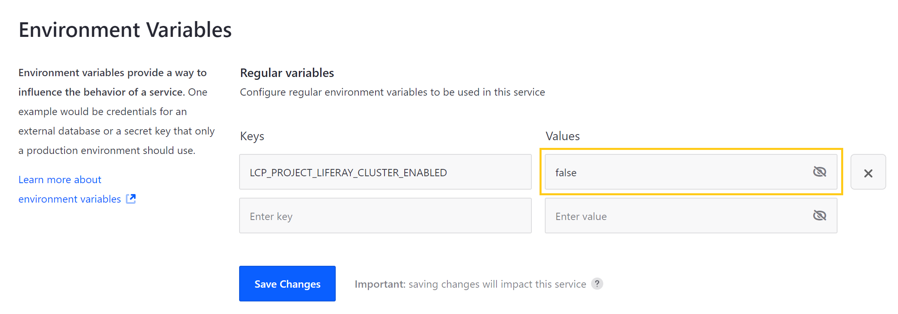

# Defining Environment Variables

Environment variables are a set of dynamic placeholders that can affect the way a service behaves within an environment.

You can define environment variables via the DXP Cloud console or by configuring the `LCP.json` file for each service.

```note::
   DXP Cloud always applies the most recent changes to settings. If the latest changes are made in the LCP.json file, upon restart, the environment variables will be reflected in the web console. However, if the environment variables are changed in the web console, the container will be restarted with those new configurations.
```

## Defining Environment Variables via the DXP Cloud Console

You can add, change, or remove environment variables for a service via the DXP Cloud console. When configuring a service in this way, all variables are scoped to the project environment in which they are defined.

```warning::
   Updating a service's environment variables restarts the service to apply the change. While restarting, the service may stop receiving requests for some minutes and behave differently depending on the variable values.
```

Follow these steps to add environment variables to a service via the DXP Cloud console:

1. Navigate to a project environment.

1. Click on *Services* in the environment menu.

1. Click on the service you want to configure.

1. Click on the *Environment Variables* tab.

   

1. Enter a new environment variable as a key-value pair. The following example disables clustering for the Liferay DXP service:

    * **Key**: `LCP_PROJECT_LIFERAY_CLUSTER_ENABLED`
    * **Value**:  `false`

1. Click on *Save Changes* to restart the service with the new environment variable.

Once an environment variable is added to a service, you can remove it or change its value at any time from the service's *Environment Variables* tab.

To remove a variable, click on the *Remove* button ( ⨉ ).

To change a variable's value, click on the *Show* icon, and enter a new value.

Once you have finished removing or changing variables, click on *Save Changes* to restart the service with updated environment variables.



## Defining Environment Variables via LCP.json

You can define environment variables for a service via its `LCP.json` file using the `env` property. When configuring a service in this way, you can define the service's behavior across all or select environments.

The following example defines the `LCP_PROJECT_LIFERAY_CLUSTER_ENABLED` variable with the value `true`. This variable is set as a top level attribute applied by default to all environments, unless otherwise specified.

```json
{
  "id": "liferay",
  "image": "liferaycloud/liferay-dxp:7.2-4.0.0",
  "env": {
    "LCP_PROJECT_LIFERAY_CLUSTER_ENABLED": "true"
  }
}
```

The following example creates an exception to the top level attribute, defining the `LCP_PROJECT_LIFERAY_CLUSTER_ENABLED` variable with the value `false` for the `dev` environment:

```json
{
  "environments": {
    "dev": {
      "env": {
        "LCP_PROJECT_LIFERAY_CLUSTER_ENABLED": "false"
      }
    }
  }
}
```

When you are finished editing the service's `LCP.json` file, save and deploy your changes to update environment variables. See [Overview of the DXP Cloud Deployment Workflow](../build-and-deploy/overview-of-the-dxp-cloud-deployment-workflow.md) for more information.

## Secret Environment Variables

Normal environment variables do not have special security measures. Any Users that can access your DXP Cloud project can also see the variable values for your services.

To store sensitive variable values (such as login credentials), you can use Secrets. Secrets are encrypted in the backend and are hidden from Users without the *Admin* role. See [Managing Secure Environment Variables with Secrets](../infrastructure-and-operations/security/managing-secure-environment-variables-with-secrets.md) for more information.

## Additional Information

* [Configuration via LCP.json](../reference/configuration-via-lcp-json.md)
* [Managing Secure Environment Variables with Secrets](../infrastructure-and-operations/security/managing-secure-environment-variables-with-secrets.md)
* [Overview of the DXP Cloud Deployment Workflow](../build-and-deploy/overview-of-the-dxp-cloud-deployment-workflow.md)
