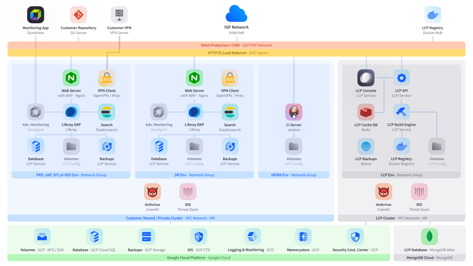

# DXP Cloud Infrastructure

DXP Cloud is a flexible platform that combines a collection of key components to provide a robust, reliable, and manageable Liferay DXP implementation. This diagram shows how all of these components fit together to complete this implementation:

See the following list for a description of the various components.

## Advanced Application Monitoring

DXP Cloud supports the use of [Dynatrace](https://www.dynatrace.com/) monitoring. This app provides monitoring of application performance, infrastructure, and more, in real time. See [Advanced Application Metrics](../manage-and-optimize/application-metrics.md#advanced-application-metrics-production-only) for more information.

## Repository Integration

DXP Cloud integrates with project source code using Git. Built-in integration with Jenkins allows new commits or pull requests to automatically trigger builds that can be deployed to any DXP Cloud environment.

[GitHub](../getting-started/configuring-your-github-repository.md), [Bitbucket](../getting-started/configuring-your-bitbucket-repository.md), and [GitLab](../getting-started/configuring-your-gitlab-repository.md) integration are all supported.

## VPN Server and Client

DXP Cloud environments can send and receive data through an encrypted tunnel using a customer's own VPN server. DXP Cloud provides a client-to-site VPN service that enables connection from a supported VPN to its environments. OpenVPN and IPSec (IKEv2) protocols are supported for this connection. See the [VPN Integration Overview](../infrastructure-and-operations/networking/vpn-integration-overview.md) for more information.

## Docker Hub

DXP Cloud uses [Docker Hub](https://hub.docker.com/) as a public platform for service images and versions (shared as tags). This implementation also allows for customers to use custom DOcker images from any public repository or local development workspace. See the [DXP Cloud profile](https://hub.docker.com/u/liferaycloud) on Docker Hub for a registry of service images.

## DDoS Protection

DXP Cloud provides built-in protection from distributed denial-of-service (DDoS) attacks. It uses a [GCP POP network](https://peering.google.com/#/infrastructure) to protect environments from being flooded with incoming traffic, and to safely and consistently deliver content to end-users globally.

## HTTP(S) Load Balancer

DXP Cloud distributes HTTP(S) traffic across multiple instances. It uses [GKE Ingress](https://cloud.google.com/kubernetes-engine) to diffuse traffic, reducing the risk of services being overloaded.

## Web Server

An [Nginx](https://www.nginx.com/) web server is used as a gateway to other services within every DXP Cloud environment. This includes a build-in firewall that provides Layer 7 attack protection, IP protection, and audit logging.

This server is configurable as one of DXP Cloud's main services. See the [Web Server Service](https://learn.liferay.com/dxp-cloud/latest/en/platform-services/web-server-service.html) for more information.

## Liferay DXP

[Liferay DXP](https://www.liferay.com/products/dxp) connects, orchestrates, and integrates data and services from a variety of applications to one central user interface platform. DXP Cloud provides a quick and reliable implementation for a DXP instance in the cloud. The [Web Server service](#web-server) provides the entry point and gateway for all HTTP(S) traffic to DXP.

By adding configurations and any custom modules to [your own project repository](#repository-integration), the DXP service is highly customizable just like a normal DXP installation. See the [Introduction to the Liferay DXP Service](../using-the-liferay-dxp-service/introduction-to-the-liferay-dxp-service.md) for more information.

## Search

DXP Cloud uses [Elasticsearch](https://www.elastic.co/elasticsearch/service) for RESTful search, indexing, and analytics capabilities within each environment. The search service is only accessible via private network traffic, through TCP or UDP connection.

The Elasticsearch engine is offered as one of DXP Cloud's main services, making it highly scalable and customizable. See the [Search Service](../platform-services/search-service.md) for more information.

## MySQL Database

DXP Cloud connects the Liferay DXP service to a separate, database storage service within its private network. A [MySQL](https://www.mysql.com/) database is used to create a reliable, secure, and scalable DXP implementation in the cloud. The database service is only accessible via private network traffic, through TCP or UDP connection.

The MySQL database is offered as one of DXP Cloud's main services, making it freely configurable and customizable. See the [Database Service](../platform-services/database-service/database-service.md) for more information.

## Persisted Storage (Volumes)

DXP Cloud uses volumes for persistent data storage for any service that needs them, within its private network. Depending on the type of service, volumes can be either be stored with an SSD drive specific to that service, or shared between services on a network file system (NFS). Volumes are only accessible via private network traffic.

By default, the Web Server, Liferay DXP, and Backup services store volumes using NFS, and the Search and CI services use dedicated SSD disks. See [Configuring Persistent File Storage Volumes](../build-and-deploy/configuring-persistent-file-storage-volumes.md) for more information.

## Backups

DXP Cloud stores a copy of the Database service and volumes from Liferay DXP within its private network. Customers can manually create a backup from any environment, and restore that backup to any other environment. By default, backups are accessible to public web traffic through HTTP(S) connections.

Backups are offered as one of DXP Cloud's main services, and its rules of operation (such as backup frequency and retention) can be freely configured. See the [Backup Service Overview](../platform-services/backup-service/backup-service-overview.md) for more information.

## CI Server

DXP Cloud automates the build and deployment processes for customer projects in development. With a project tied to a [customer repository](#repository-integration), Jenkins is used with a webhook to automatically transform new commits or pull requests into builds that can be deployed to any environment. This service exists within a special, separate `infra` environment, and it is not accessible to regular users. DXP Cloud also provides a dashboard to customers in the Cloud console to view the details of Jenkins builds.

The CI service used for Jenkins builds is offered as one of DXP Cloud's main services, and customers can configure this service and even customize the Jenkins pipeline if desired. See [Continuous Integration](../platform-services/continuous-integration.md) for more information.

## CLI Tool

DXP Cloud allows for a variety of management tasks to be performed on its environments and services by using its CLI Tool. The application serves as a central interface that can be used for all a customer's projects, and it is accessible to HTTP(S) traffic. See the [Command-line Tool](./command-line-tool.md) for more information.

## Antivirus

DXP Cloud automatically detects trojans, viruses, malware, and other malicious threats, using [ClamAV](https://www.clamav.net/). This engine operates as a background service within the cloud, and it is not accessible to users or other services. Each cluster in DXP Cloud has one instance of the antivirus running.

## Intrusion Detection System

DXP Cloud automatically detects intrusion within its components, using [Threat Stack](https://www.threatstack.com/cloud-security-platform/intrusion-detection). Like the built-in [antivirus software](#antivirus), this system also operates as a background service, and it is not accessible to users or other services. Each cluster in DXP Cloud has one instance.