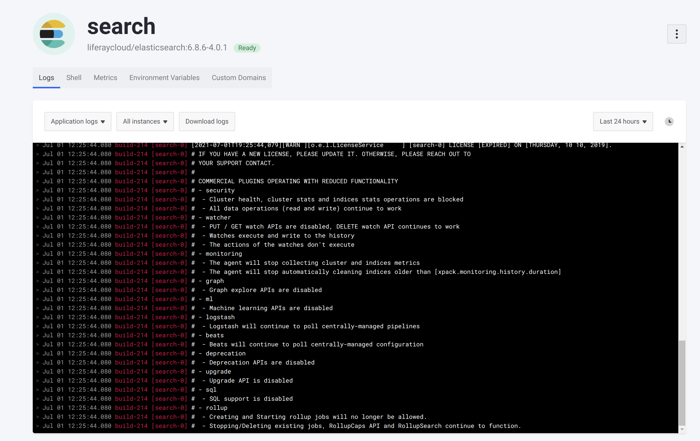

# Reading Logs in DXP Cloud

Each of the main services in DXP Cloud generates log messages that can help you to see what is happening in your services. You can find the logs from any environment by clicking on the appropriate service and selecting the *Logs* tab at the top of the  page:



You can also view all logs created for your environment from the *Logs* button on the left side of the creen whenever you are navigating within your environment.

## General Structure of Logs in DXP Cloud

Logs in DXP Cloud conform to a specific structure that gives extra, contextual information. See this log message as an example:

```
Jun 29 10:07:46.585 build-214 [webserver-699bf65bfb-4w8pl] [WARNING] 179/170746 (13) : api/backend2 changed its IP from 10.0.17.186 to 10.0.26.120 by DNS cache.
```

Many logs in DXP Cloud have a label (in this example, ``[WARNING]``) that indicates that this message came from DXP Cloud infrastructure, and not directly from the service's output. Logs can also have labels that come from DXP Cloud infrastructure but are related to the service, such as ``[LIFERAY]``. Logs that come directly from the service's output have no label.

Additionally, these components are always present in any log message in DXP Cloud:

* The **timestamp**: in this example, `Jun 29 10:07:46.585`.

* The **build ID**: in this example, `build-214`. This corresponds to the build that the currently deployed version of the service corresponds to. You can match this build ID to the list of builds shown in your project's *Builds* page.

* The **instance ID**: in this example, `[webserver-699bf65bfb-4w8pl]`. This is used to identify which instance of a service a message is related to.

The instance ID associated with a log message corresponds to one of the instances of your service. You can see (and filter by) all of the active instances in your service from the Logs page by clicking on the instances dropdown menu above the logs:


The format of the instance ID depends on what deployment type (deployment or stateful set) the service is configured as. See [Understanding Deployment Types](../build-and-deploy/understanding-deployment-types.md) for more information.

## Instance ID for Deployment Type Logs

Deployment type logs have an instance ID with multiple parts. See this example of a log message from a deployment type service:

```
Jun 29 10:07:57.102 build-214 [liferay-7485669bdd-7ktfl] [LIFERAY] Executing 010_liferay_cloud_customizable_files_override.sh.
```

The instance ID for this message (in this example, `[liferay-7485669bdd-7ktfl]`) contains these components:

* The **service name**: in this example, `liferay`.

* A randomly generated **version ID**: in this example, `7485669bdd`. This corresponds to the version of your service that has been deployed with possible changes. Note that new deployments, changes to environment variables, and even manually restarting the service all generate a new version ID (because a new change may have been made in the configuration).

* A randomly generated **container ID**: in this example, `7ktfl`. Whenever a new container is created (for example, after you deploy a new build and the service restarts), a new container ID is generated because a new container is created each time the service starts up. Note that any restart generates a new container ID, even when the version ID does not change (for example, when a [liveness or readiness probe failure](../troubleshooting/self-healing.md) triggers a restart).

## Instance ID for Stateful Set Type Logs

Stateful set type logs have a smaller and more consistent instance ID. See this example of a log message from a stateful set type service:

```
Jun 29 07:44:44.676 build-214 [search-0] #  - Creating and Starting rollup jobs will no longer be allowed.
```

These are the only components of the `instance ID` for stateful set type services:

*  The **service name**: in this example, `search`.

* An iterating (non-random) **node ID**: in this example, `0`. This ID remains the same even after deploying new versions of the service.

The entire instance ID for stateful set type services always remains the same for each node of the service. This allows you to reliably use the same instance ID to identify the node in a cluster with the same [volume](../build-and-deploy/configuring-persistent-file-storage-volumes.md), even after the service has been redeployed.

## Additional Information

* [Understanding Deployment Types](../build-and-deploy/understanding-deployment-types.md)