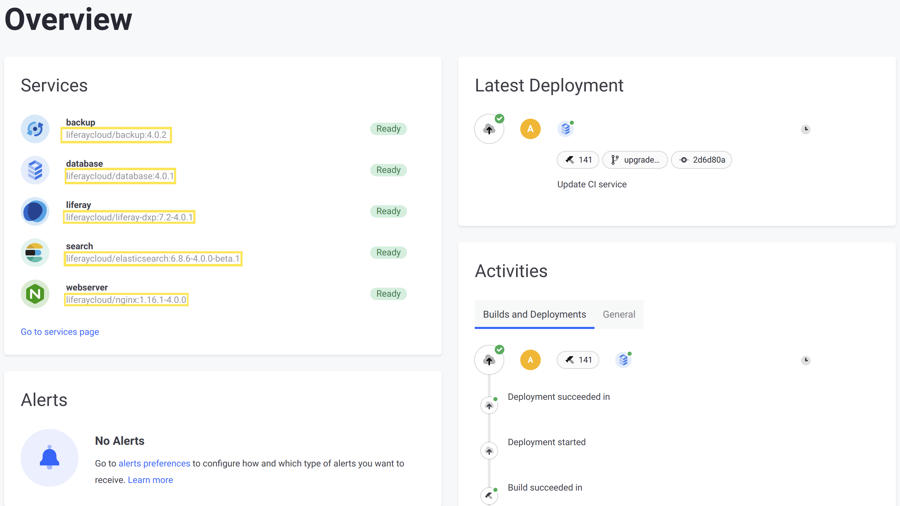

# Understanding Service Stack Versions

The DXP Cloud service stack represents the major version of all of the services in your DXP Cloud environment. Each individual service may have a different minor version, but they all share the service stack version (e.g., version 4.x.x). New service stack versions generally introduce a variety of new features (such as the addition of a default Jenkinsfile, and a new repository structure in [version 4.x.x](./dxp-cloud-project-changes-in-version-4.md)).

The version of the DXP Cloud service stack itself is indicated by the major version of your services' Docker images. This version is the last number that appears in the Docker image name.

For example, see this Docker image name for the `liferay` service:

```
liferaycloud/liferay-dxp:7.2.10-sp1-fp4-3.0.21
```

The version of this image is `3.0.21`. This indicates that the service stack for this environment is at version 3.x.x.

Any DXP Cloud environment displays the version of its services' Docker images in various locations. You can check the service stack version of your environment by examining the number at the end of the displayed image name in any of these locations -- including the environment's _Overview_ or _Services_ pages, or each individual service's page.



## Verifying the Service Stack Version from the Repository

Docker image versions are defined in different locations depending on whether or not the service stack has been upgraded to 4.x.x. Because of this, you must check different locations for each version. For more information about the differences before and after upgrading to 4.x.x, see the [DXP Cloud Project Changes in Version 4](./dxp-cloud-project-changes-in-version-4.md).

### Checking Before the Upgrade to 4.x.x

If your repository is at version 3.x.x or below, there is a `gradle.properties` article at the root of your repository that defines the versions of each of your services. Open this file and identify these properties to identify the versions of your Docker images:

```properties
liferay.workspace.lcp.backup.image=liferaycloud/backup:3.2.1
liferay.workspace.lcp.database.image=liferaycloud/database:3.2.1
liferay.workspace.lcp.search.image=liferaycloud/elasticsearch:6.1.4-3.0.3
liferay.workspace.lcp.liferay.image=liferaycloud/liferay-dxp:7.2.10-ga1-3.0.10
liferay.workspace.lcp.webserver.image=liferaycloud/nginx:1.14.2-3.1.1
liferay.workspace.lcp.jenkins.image=liferaycloud/jenkins:2.176.1-3.1.1
```

In the above example, each of the services has a name ending in `3.x.x`, indicating the service stack is at version 3.x.x.

### Checking After the Upgrade to 4.x.x

If your repository has been upgraded to version 4.x.x, then the versions of each of your services are instead defined in the `image` property, within each service's `LCP.json` file. Each of these files is contained within the folder named after the service.

For example, see this section of an `LCP.json` file for the `database` service:

```json
{
   "kind": "Deployment",
   "id": "database",
   "image": "liferaycloud/database:4.0.0",
}
```

In this example, the `image` property's value has a name ending in `4.0.0`, indicating that the service stack is at version 4.x.x.

```{tip}
Upgrading your service stack to version `4.x.x` is recommended for access to the latest improvements. See [Upgrading Your DXP Cloud Stack](./upgrading-your-dxp-cloud-stack.md)_ for steps on performing the upgrade.
```

## Additional Information

* [DXP Cloud Project Changes in Version 4](./dxp-cloud-project-changes-in-version-4.md)
* [Upgrading Your DXP Cloud Stack](./upgrading-your-dxp-cloud-stack.md)
