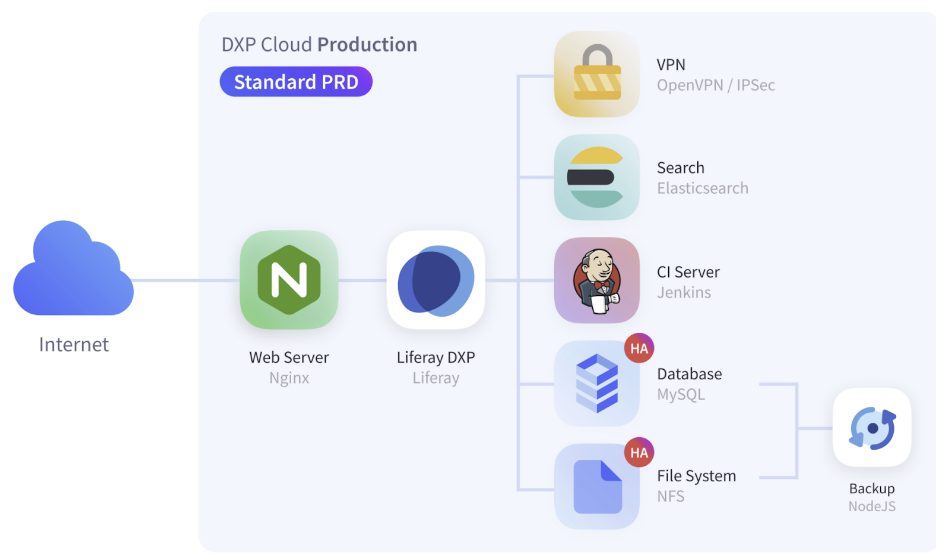
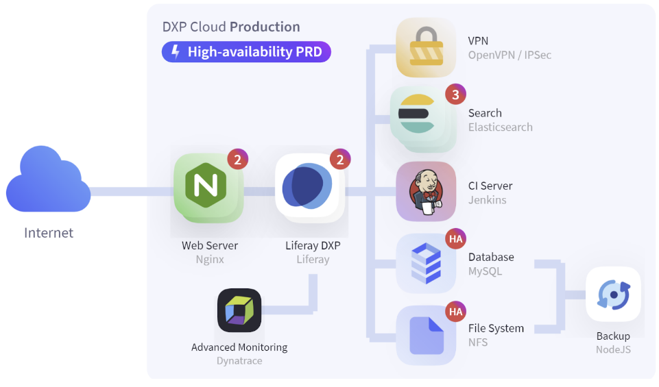
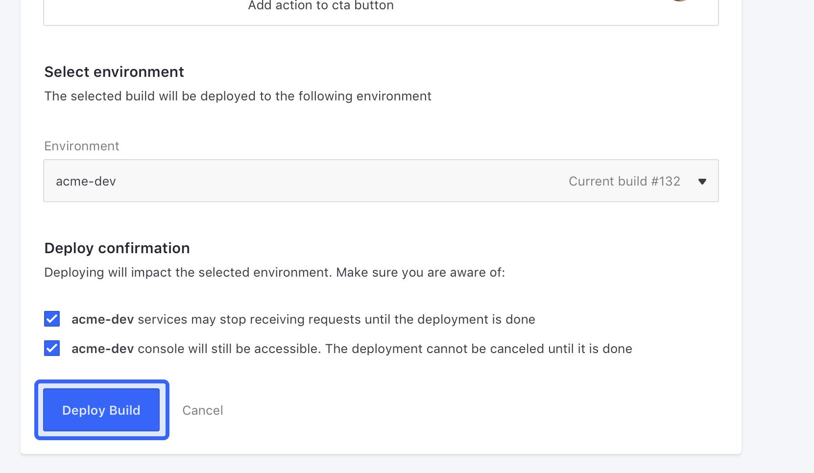

# Upgrading to a High Availability Subscription

In many cases, the standard subscription plan for Liferay DXP Cloud is sufficient to ensure quality performance for a live project. As your needs change, you may need to upgrade your subscription plan to increase the resources allocated to your environments.



When you upgrade to a High Availability subscription, you increase the amount of resources allocated to your environment, allowing you to use Dynatrace integration and increase the number of instances for your `liferay`, `webserver`, and `search` services:



In order to take advantage of this additional infrastructure, you must take the following steps.

## Communicate with Your Account Manager

The first step in upgrading your DXP Cloud subscription is to communicate with your Account Manager. Once you upgrade your account, the Liferay DXP Cloud team increases the resources available to your project for you to use.

Once the additional resources have been provisioned for you, you must update the configuration for your services. This requires configuration updates for the `liferay`, `webserver`, and `search` services.

## Liferay Service Configuration

First, configure the `liferay` service to increase the number of instances your environment uses. In your DXP Cloud [project repository](../getting-started/configuring-your-github-repository.md)'s `liferay/LCP.json` file, increment the value of the `scale` property by 1 (generally from `1` to `2` when upgrading to the High Availability subscription):

```
{
    "kind": "Deployment",
    "id": "liferay",
    "image": "liferaycloud/liferay-dxp:7.2-4.2.1",
    "memory": 8192,
    "cpu": 8,
    "scale": 2,
    ...
}
```

### Enable Dynatrace Integration

The High Availability subscription also includes an add-on that allows you to use Dynatrace integration with the `liferay` service. To take advantage of this feature in your production environment(s), you must take additional steps to configure the `liferay` service.

The Liferay Cloud team provides a `tenant` value to use for this configuration when you upgrade your subscription. Use this `tenant` value to complete the steps listed [here](../infrastructure-and-operations/security/managing-secure-environment-variables-with-secrets.md#integrating-dynatrace-with-production-environments).

## Web Server Service Configuration

Next, configure the `webserver` service to increase the number of instances your environment uses. Increase the `scale` property in your project repository's `webserver/LCP.json` file to match the number of instances used for your `liferay` service:

```
{
    "kind": "Deployment",
    "id": "webserver",
    "image": "liferaycloud/nginx:1.16.1-4.1.1",
    "memory": 512,
    "cpu": 2,
    "scale": 2,
    ...
}
```

## Search Service Configuration

Finally, update the `search` service to increase its number of instances it uses by increasing the `scale` property in your project repository's `search/LCP.json` file. Increment the value to the next odd number of instances to prevent issues with the service starting (generally from `1` to `3` when upgrading to the High Availability subscription):

```
{
    "kind": "StatefulSet",
    "id": "search",
    "image": "liferaycloud/elasticsearch:6.8.13-4.1.1",
    "memory": 8192,
    "cpu": 8,
    "scale": 3,
    "podManagementPolicy": "Parallel",
    ...
}
```

```{warning}
In order to ensure your `search` service's instances can connect to each other properly, increase the `scale` property to an odd number of nodes, and ensure that the `podManagementPolicy` property is set to `Parallel`.
```

## Deploy the Changes

Once you have configured all of your services, [deploy the new configurations](../build-and-deploy/overview-of-the-dxp-cloud-deployment-workflow.md#deploy) to your production and UAT environments. If you are unfamiliar with deploying changes to DXP Cloud, the following steps can be reviewed as an example.

### Create a Jenkins Build with Your Changes

Run Git commands to submit your changes using any terminal with Git installed.

1. Add the changed files to Git:

    ```bash
    git add .
    ```

1. Make a commit with your changes and a message:

    ```bash
    git commit -m "DXP Cloud High Availability subscription upgrade"
    ```

1. Push the changes to GitHub (or other ):

    ```bash
    git push origin master
    ```

Pushing the changes automatically creates a build. Wait for the build to complete before proceeding.

### Deploy the Build to Your Environments

Finally, use the [DXP Cloud console](https://console.liferay.cloud/login) to deploy the completed build to the applicable environments.

1. In the DXP Cloud console, go to the Builds page (using the link at the top of the page).

1. Find the build you created previously in the list, and from the Actions menu, click *Deploy build to*.

    

1. Select the environment to deploy the build to (e.g., `acme-uat`).

1. Read the information below and select the confirmation boxes to confirm the results of the deployment.

    

1. Click *Deploy Build*.

The build is deployed to the environment, and the services restart with the additional instances you configured.

## Conclusion

Congratulations! After completing these steps, your environments are fully upgraded to the High Availability model. These environments have more resources and functionality to meet the needs of your users.
