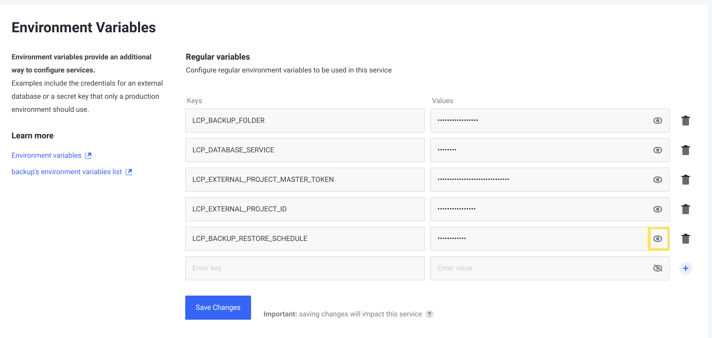
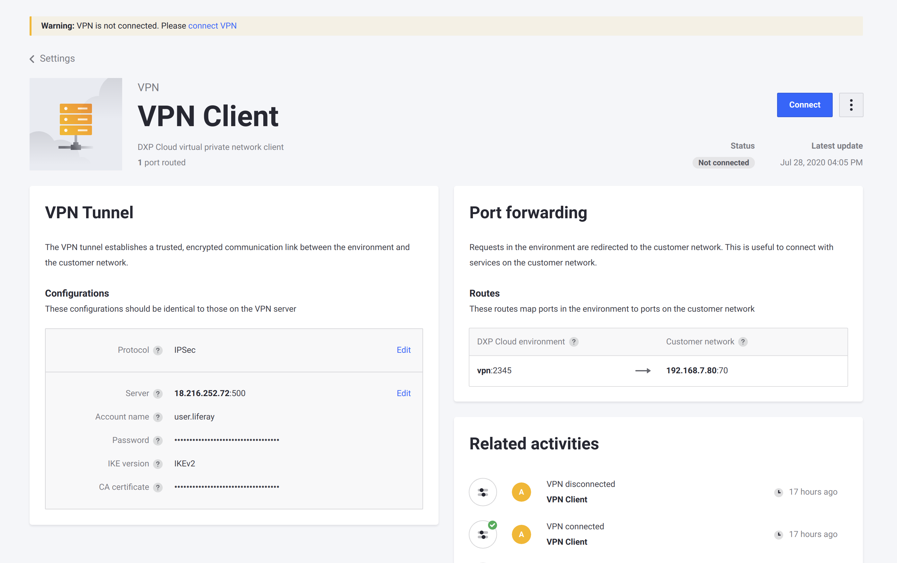

# Configuring Cross-Region Disaster Recovery

DXP Cloud provides two ways for customers to take advantage of the Disaster Recovery (DR) procedure in the case of major incidents: Automatic Disaster Recovery and Cross-Region Disaster Recovery. DXP Cloud's approaches to disaster recovery scenarios can be reviewed in greater detail in the [Disaster Recovery Overview](./disaster-recovery-overview.md).

Here you'll learn how to recover data manually during a cross-region disaster. These steps are required only when there is a compromise in all three zones in the same geographic region at the same time.

* [Initial Setup](#initial-setup)
* [During an Incident](#during-an-incident)
* [Post-incident Recovery](#post-incident-recovery)

## Initial Setup

Liferay offers a dedicated DXP Cloud environment to manage a cross region disaster. For this example, assume that a Production environment is stored in the *europe-west2* region and the region is compromised. To prevent downtime and data loss on the Production environment, shift the Disaster Recovery environment to outside the region of operation, such as *us-west1*. This fifth Disaster Recovery (shortened to DR) environment thus serves as a backup to store new user data generated during the incident.

DXP Cloud customers wishing to set up a Disaster Recovery environment must contact their sales representative to provision the DR environment. This new environment appears with the other available environments (e.g., `dev`, `infra`, `uat`, and `prd`).


DXP Cloud systems administrators must have full administrative rights on both the DR environment and the Production environment.

### Verify VPN Settings in the DR environment

If a VPN is enabled on the Production environment, verify that the DR environment's VPN has also been enabled.

To ensure the two environments are connected,

1. Click the DR environment's *Settings* tab in the left menu.

1. In the VPN section, enter this information:

    * **VPN Type**: OpenVPN
    * **Server Address**: The server address.
    * **Account Name**: The administrator's email address.
    * **Password**: The administrator's password.
    * **Certificate**: The certificate code.
    * **Forwarding IP**: The forwarding IP address.
    * **Forwarding Port**: The forwarding port number.
    * **Local Hostname**: The VPN's hostname.
    * **Local Port**: The local port number.

1. Click *Connect VPN*.

For more information on connecting to a VPN, see [VPN Connection](../infrastructure-and-operations/networking/connecting-a-vpn-server-to-dxp-cloud.md).

### Deploy the Latest Stable Build from Production to the DR Environment

Now you must deploy the latest stable build on Production to the DR environment. Follow the same steps outlined in [Overview of the DXP Cloud Deployment Workflow](../build-and-deploy/overview-of-the-dxp-cloud-deployment-workflow.md).

### Set Up Automated Backup Restores to Disaster Recovery

To finish setting up your Disaster Recovery environment, set up automated backup restores. This ensures that the latest backup is always ready in your DR environment for when an incident occurs.

First, retrieve your production environment's master token (this requires administrator privileges to access the `liferay` service shell):

1. In the DXP Cloud console, navigate to your production environment &rarr; the `liferay` service page.

1. Click on the *Shell* tab.

1. Run this command to get the environment's master token:

    ```bash
    env | grep LCP_PROJECT_MASTER_TOKEN
    ```

    The master token is the hexadecimal ID after the `=` in the result.

Once you have the production environment's master token, set these [environment variables](../reference/defining-environment-variables.md) in your DR environment:

  * **LCP_EXTERNAL_PROJECT_MASTER_TOKEN**: your production environment's master token

  * **LCP_EXTERNAL_PROJECT_ID**: the production environment's project ID (for example, `acme-prd`)

  * **LCP_BACKUP_RESTORE_SCHEDULE**: a [cron scheduling](https://crontab.guru/) value that defines the frequency of automated backups. See [Scheduling Automated Backups and Cleanups](../platform-services/backup-service/backup-service-overview.md#scheduling-automated-backups-and-cleanups) for more information.

Saving these variables in your DR environment enables automated restores.

## During an Incident

Continuing the example above, assume that the Production environment hosted in the *europe-west2* region is scheduled to be backed up hourly at 2:00 PM local time. In this scenario, the region is then compromised at 2:30 PM local time. Because no backups have been generated in the intervening half hour, it is necessary to restore a backup of the database and documents from the Production environment to the Disaster Recovery environment. The last stable environment is the version created at 2:00 PM.

During a cross-region incident, follow these steps:

1. [Disable the Database Restoration Schedule](#disable-the-database-restoration-schedule)
1. [Copy Latest Production Data to the DR Environment](#copy-latest-production-data-to-the-dr-environment)
1. [Verify the DR Environment's VPN Status and Reindex](#verify-the-dr-environment-s-vpn-status-and-reindex)
1. [Direct Custom Domain Traffic to the DR Environment](#direct-custom-domain-traffic-to-the-dr-environment)

### Disable the Database Restoration Schedule

Since the DR environment becomes the main environment accessible to users for the duration of the incident, your normal database restoration schedule may overwrite data after you switch production over to it.

If you are using the [`LCP_BACKUP_RESTORE_SCHEDULE` environment variable](../platform-services/backup-service/backup-service-overview.md#environment-variables-reference) to regularly restore data to your DR environment, temporarily disable the restoration schedule by removing the variable. This prevents data created during the incident from being overwritten by a scheduled restore.

Follow these steps to disable the restoration schedule while it is accessible:

1. On the DXP Cloud Console, navigate to your DR environment &rarr; Backup service page &rarr; Environment Variables.

1. Click the eye icon to reveal the value for your `LCP_BACKUP_RESTORE_SCHEDULE` variable:

    

1. Make a note of the value for `LCP_BACKUP_RESTORE_SCHEDULE` so that you can quickly replace it after the incident.

1. Remove the `LCP_BACKUP_RESTORE_SCHEDULE` environment variable and save changes.

### Copy Latest Production Data to the DR Environment

Next, restore a backup from your Production environment to ensure your DR environment has the most recent updates.

```important::
   If you were using the ``LCP_BACKUP_RESTORE_SCHEDULE`` environment variable to regularly restore to your DR environment, you may already have a more recent stable backup restored and ready (depending on your configured frequency). If you had a backup automatically restored more recently, skip manually restoring the backup.
```

Follow these steps to restore the latest stable backup of Production to the DR environment:

1. In the DR environment, click the *Backups* tab.
1. Click the tab corresponding to the Production environment.

    ```note::
       The Backup History lists the backups in two tabs: one for the DR environment and one for the Production environment.
    ```

1. Click *Actions* () for the latest stable backup in the Production environment; then select *Restore*.

    

### Verify the DR Environment's VPN Status and Reindex

Next, follow these steps to ensure your DR environment is ready for incoming traffic:

1. Verify that your VPN is connected to the DR environment by navigating to the _Settings_ &rarr; _VPN_ page for your DR environment.

    

    If the appropriate VPN is not connected, set up the connection. See [Connecting a VPN Server to DXP Cloud](../infrastructure-and-operations/networking/connecting-a-vpn-server-to-dxp-cloud.md) for more information.

1. Log onto your DXP instance (using the IP address, since the custom domain does not yet point to the DR environment).

1. Navigate to the *Global Menu* () &rarr; *Control Panel* &rarr; *Search*.

1. Click *Reindex all search indexes*.

Allow some time for the reindex to complete.

### Direct Custom Domain Traffic to the DR Environment

The web server service's custom domain in the DR environment must match the original Production environment's. You must also delete that configuration from the Production environment: 

1. In the DR environment, select *Services* in the left menu.
1. Click *webserver* in the list of Services.
1. Click the *Custom Domains* tab and configure the custom domain to match that of the Production environment.
1. Navigate to the same settings in the Production environment and remove the custom domain configuration.
1. Update the DNS records and add the custom domain to the DR environment. For more information, see [Custom Domains](../infrastructure-and-operations/networking/custom-domains.md).

This causes all traffic to go to the DR environment.


## Post-incident Recovery

Once the regional incident is over, you must shift back to the original region's Production environment (*europe-west2* in the example). Follow these steps:

1. [Put a Freeze on Data Creation](#put-a-freeze-on-data-creation)
1. [Create a Manual Backup of the DR Environment](#create-a-manual-backup-of-the-dr-environment)
1. [Restore the Manual Backup to Production](#restore-the-manual-backup-to-production)
1. [Verify VPN Status and Reindex](#verify-vpn-status-and-reindex)
1. [Restore Server Custom Traffic to Production](#restore-server-custom-traffic-to-production)
1. [Restore the Database Restoration Schedule](#restore-the-database-restoration-schedule)

### Put a Freeze on Data Creation

To prevent data loss from recent changes when you switch back to your normal production environment, you must freeze all content creation in the DR environment. When you are ready to make the switch back to your production environment, work with your database administrator to arrange a data freeze before you make a manual backup.

### Create a Manual Backup of the DR Environment

During the incident, the DR environment functions as the Production environment and therefore contains all new data generated during the disaster event. To preserve this data, you must back up the DR environment: 

1. In the DR environment, click *Backups* in the menu on the left.
1. Click *Backup Now*.


### Restore the Manual Backup to Production

Restore the data from your DR environment back to your normal production environment:

1. In the DR environment, click *Backups* in the menu on the left.
1. Click the tab corresponding to the DR environment.

    ```note::
       The Backup History lists the backups in two tabs: one for the DR environment and one for the Production environment.
    ```

1. For the most recent backup (the one you just created), click the *Actions* button () and select *Restore*.
1. Select the Production environment and click *Deploy Build*.


### Verify VPN Status and Reindex

Follow these steps to ensure your production environment is ready for incoming traffic:

1. Verify that your VPN is connected to the production environment by navigating to the _Settings_ &rarr; _VPN_ page for your production environment.

   If the appropriate VPN is not connected, set up the connection. See [Connecting a VPN Server to DXP Cloud](../infrastructure-and-operations/networking/connecting-a-vpn-server-to-dxp-cloud.md) for more information.

1. Log onto your DXP instance (using the IP address, since the custom domain still points to the DR environment).

1. Navigate to the *Global Menu* &rarr; *Control Panel* &rarr; *Search*.

1. Click *Reindex all search indexes*.

Allow some time for the reindex to complete.

### Restore Server Custom Traffic to Production

Because the webserver service redirected all traffic to the DR environment during the incident, these settings must be updated again so that all traffic is redirected back to the original Production environment.

1. Navigate to _Services_ on the left menu.
1. Click on _webserver_ in the list of Services.
1. Click the _Custom Domains_ tab.

   

1. Remove the custom domain from the DR environment.

    ```warning::
       Removing the custom domain creates downtime until your Production environment is receiving traffic again.
    ```

1. Update the DNS records and add the custom domain back to the Production environment. For more information, see [Custom Domains](../infrastructure-and-operations/networking/custom-domains.md).
1. Click _Update Custom Domain_.

Traffic should now be directed back to the original Production environment. If you do not use automatically scheduled database restores to your DR environment, the disaster recovery process is complete.

### Restore the Database Restoration Schedule

If you were using the `LCP_BACKUP_RESTORE_SCHEDULE` environment variable to regularly restore to your DR environment before the incident, restore this variable again to resume the restoration schedule:

1. On the DXP Cloud console, navigate to your DR environment &rarr; Backup service page &rarr; Environment Variables.

1. Add the `LCP_BACKUP_RESTORE_SCHEDULE` environment variable and restore the value that you noted previously [when you removed it](#disable-the-database-restoration-schedule).

1. Save the changes.

Your DXP Cloud environments can now resume their normal operations.
