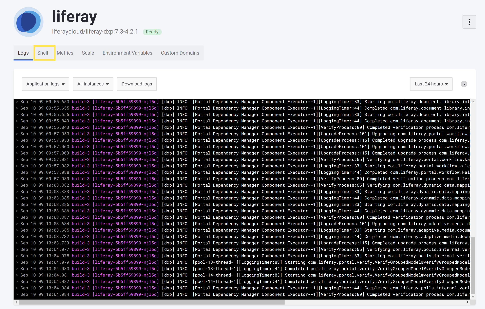
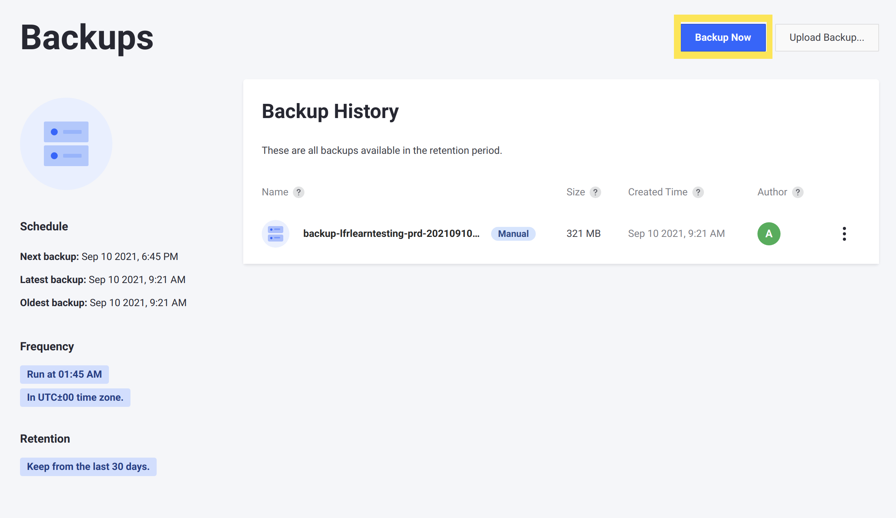
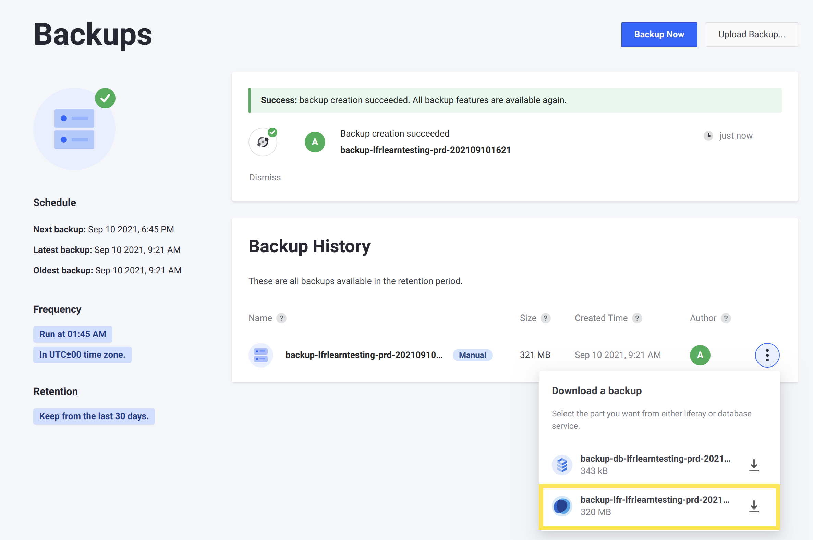

# Creating Thread and Heap Dumps

When you are experiencing issues with your `liferay` service's performance, you may need to take thread or heap dumps to help you or DXP Cloud Support optimize your instance or troubleshoot problems.

Follow these steps to generate thread or heap dumps for troubleshooting:

1. [Choose a script to generate the dumps](#choose-a-script-to-generate-the-dumps)

1. [Run the script from the Liferay service shell](#run-the-script-from-the-liferay-service-shell)

1. [Download the dumps via a backup](#download-the-dumps-via-a-backup)

1. [Delete the dumps when you are done](#delete-the-dumps-when-you-are-done)

The next section provides example scripts that you can run to generate thread or heap dumps for a DXP Cloud environment.

## Choose a Script to Generate the Dumps

Whether you are generating thread or heap dumps, you can run a script through the `liferay` service's [shell](shell-access.md) to make them available to download via backups.

### Thread Dump Creation Script

Thread dumps help you to understand what processes are taking place in your DXP Cloud environment. Having multiple sets of thread dumps gives a more useful view of whether problematic patterns may exist in your Liferay instance.

You can use this script to generate thread dumps for your Liferay instance in any DXP Cloud environment:

```
#!/bin/bash

TARGET_THREAD_DUMP_FOLDER=${TARGET_THREAD_DUMP_FOLDER:-/opt/liferay/data/thread_dumps}

mkdir -p "${TARGET_THREAD_DUMP_FOLDER}"

take_thread_dump() {
    mkdir -p "${TARGET_THREAD_DUMP_FOLDER}/${1}"

    local pid=$(jps | grep -v Jps | awk '{print $1}')

    echo "[DXP Cloud] jstack ${pid} > ${TARGET_THREAD_DUMP_FOLDER}/${1}/threaddump${2}.txt"

    jstack ${pid} > ${TARGET_THREAD_DUMP_FOLDER}/${1}/threaddump${2}.txt
}

take_thread_group() {
    local time=$(date +'%H%M%S')

    echo "[DXP Cloud] Taking thread dumps with timestamp ${time}"

    for num in 1 2 3 4 5 6
    do
        take_thread_dump $time $num
        sleep 10
    done
}

main() {
    for num in 1 2 3 4
    do
        take_thread_group
        sleep 60
    done

    echo "[DXP Cloud] Thread dumps generated"
}

echo "[DXP Cloud] Take thread dumps"
main
```

This script creates a new folder in your `liferay` service's `$LIFERAY_HOME/data/` folder (named `thread_dumps/` by default), and then it creates multiple timestamped subfolders that each contain a set of thread dumps. By default, it creates *four subfolders* with timestamps about 60 seconds apart, and fills each subfolder with *six thread dumps* about 10 seconds apart. Thread dumps are created with the [jstack utility](https://docs.oracle.com/javase/8/docs/technotes/guides/troubleshoot/tooldescr016.html).

You can make multiple edits to alter this behavior:

* You can change the name of the directory that thread dumps are saved to by changing `thread_dumps/` at the end of the path on the first line. However, *you must keep the folder inside the `data/` directory* for it to be accessible via backups.

* You can change the number of iterations in the `main` function's loop to change the number of sets created. You can make the same change in the `take_thread_group` function to change the number of thread dumps per set.

* You can change the period of the `sleep` command (in seconds) in the `main` function to change the frequency of each set being created. You can make the same change in the `take_thread_group` function to change the frequency of thread dumps within each set.

### Heap Dump Creation Script

Heap dumps help you to understand what data is consuming RAM in your Liferay instance. If you need to troubleshoot your instance's memory allocation, then you may need to take multiple heap dumps at different, key times to determine if there is an issue.

You can use this script to generate a heap dump for your Liferay instance in any DXP Cloud environment:

```
#!/bin/bash

TARGET_HEAP_DUMP_FOLDER=${TARGET_HEAP_DUMP_FOLDER:-/opt/liferay/data/heap_dumps}

mkdir -p "${TARGET_HEAP_DUMP_FOLDER}"

take_heap_dump() {
    mkdir -p "${TARGET_HEAP_DUMP_FOLDER}/${1}"

    echo "[DXP Cloud] Taking heap dump with timestamp ${1}"

    local pid=$(jps | grep -v Jps | awk '{print $1}')

    echo "[DXP Cloud] jmap -dump:format=b,file=heapdump.txt ${pid}"

    jmap -dump:format=b,file=heapdump.txt ${pid}

    mv heapdump.txt ${TARGET_HEAP_DUMP_FOLDER}/${1}/heapdump.txt
}

main() {
    local time=$(date +'%H%M%S')

    take_heap_dump $time

    echo "[DXP Cloud] Heap dump generated"
}

main
```

This script creates a new folder in your `liferay` service's `$LIFERAY_HOME/data/` folder (named `heap_dumps/` by default), and then it creates a timestamped subfolder that contains a single, new heap dump. The heap dump is created with the [jmap utility](https://docs.oracle.com/javase/7/docs/technotes/tools/share/jmap.html).

You can change the name of the directory that thread dumps are saved to by changing `heap_dumps/` at the end of the path on the first line. However, *you must keep the folder inside the `data/` folder* for it to be accessible via backups.

## Run the Script from the Liferay Service Shell

Once you have a script to use, you must deploy it and run it from the `liferay` service's shell in the DXP Cloud console.

### Save the Script to Your Project Repository

First, save your chosen script into a directory that you can deploy to your Liferay instance's `$LIFERAY_HOME` folder.

1. Create a new folder for manual scripts in your project repository's Liferay configurations, such as `liferay/configs/{ENV}/diagnostics/`. Creating the folder in the appropriate `liferay/configs/{ENV}/` directory ensures that the folder contents appear in your Liferay instance's `$LIFERAY_HOME` once it is deployed.

    ```bash
    cd liferay/configs/common/
    ```

    ```bash
    mkdir diagnostics/
    ```

1. Create a `generate_thread_dumps.sh` or `generate_heap_dump.sh` file in your project repository's Liferay configurations, in a new folder for manual scripts (such as `liferay/configs/{ENV}/diagnostics/`).

    ```bash
    touch my_script_name.sh
    ```

1. Save the [desired script's contents](#choose-a-script-to-generate-the-dumps) into the new file.

### Deploy and Run the Script

Once you have the script saved into a subfolder in `liferay/configs/{ENV}/`, you must deploy the script and run it from the shell on the DXP Cloud console.

1. Follow the steps outlined in [Overview of the DXP Cloud Deployment Workflow](../using-the-liferay-dxp-service/overview-of-the-dxp-cloud-deployment-workflow.md) to deploy the script to the appropriate environment.

1. In the DXP Cloud console, navigate to the `liferay` service page in the appropriate environment.

1. Click the *Shell* tab.

    

    The script you deployed to this environment is in the file system accessible through this shell.

1. In the shell, navigate to the folder you created and deployed the script to.

    ```bash
    cd diagnostics/
    ```

1. Ensure that you have permission to execute the script you deployed.

    ```bash
    chmod +x ./generate_thread_dumps.sh
    ```

1. Run the script.

    ```bash
    ./generate_thread_dumps.sh
    ```

1. Wait until the script completes to ensure that you have the appropriate number of thread dumps. A confirmation message appears when the script has finished creating thread or heap dumps.

    ```
    [DXP Cloud] Thread dumps generated
    ```

    ```{note}
    The heap dump script provided [in this section](#heap-dump-creation-script) only generates one heap dump. If you need multiple heap dumps to analyze memory usage at different times, then you must run the script again at those times.
    ```

When the script has finished running, the thread or heap dump(s) are saved into timestamped subfolders available within `$LIFERAY_HOME/data`. Next, you must download the dumps via a backup to retrieve them locally.

## Download the Dumps via a Backup

Obtain the thread or heap dump(s) by downloading them with a backup of your `data` volume. You must first create a backup after the dumps are generated.

1. Navigate to the *Backups* screen for the same environment, via the link on the left side of the screen.

1. On the Backups page, click *Backup Now*.

    

1. Once the backup is created, click the Actions menu for the new backup and click *Download*, and then choose the download link named `backup-lfr-<PROJECT_NAME>-<ENV>-<TIMESTAMP>.tgz` to download the `data` volume.

    

A download begins containing a backup of the `data` volume. The dumps are contained within the subfolder that the script specified (e.g., `thread_dumps/` or `heap_dumps/`).

## Delete the Dumps When You are Done

The thread and/or heap dumps that you generate may take up significant space in your Liferay service's `data` volume, especially if you run the scripts multiple times. Remember to delete the dumps from your environment when you do not need them anymore to avoid wasting memory in your `data` volume. Use the Liferay service shell in the DXP Cloud console to delete the dumps.

For example, run these commands from the DXP Cloud console to delete one set of thread dumps:

```bash
cd data/thread_dumps/
```

```bash
rm -r <TIMESTAMPED_FOLDER>/
```

The [scripts provided here](#choose-a-script-to-generate-the-dumps) save the thread and heap dumps into subfolders with a timestamp that you can use to determine when they were created. You can choose to delete only subfolders with timestamps that are no longer needed for your troubleshooting.

## Additional Information

* [Shell Access](./shell-access.md)
