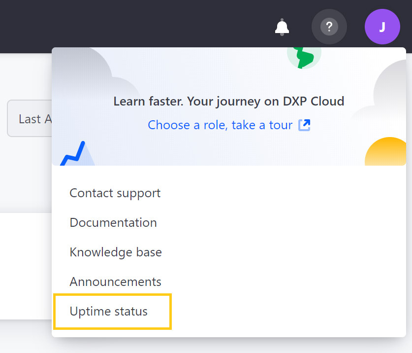
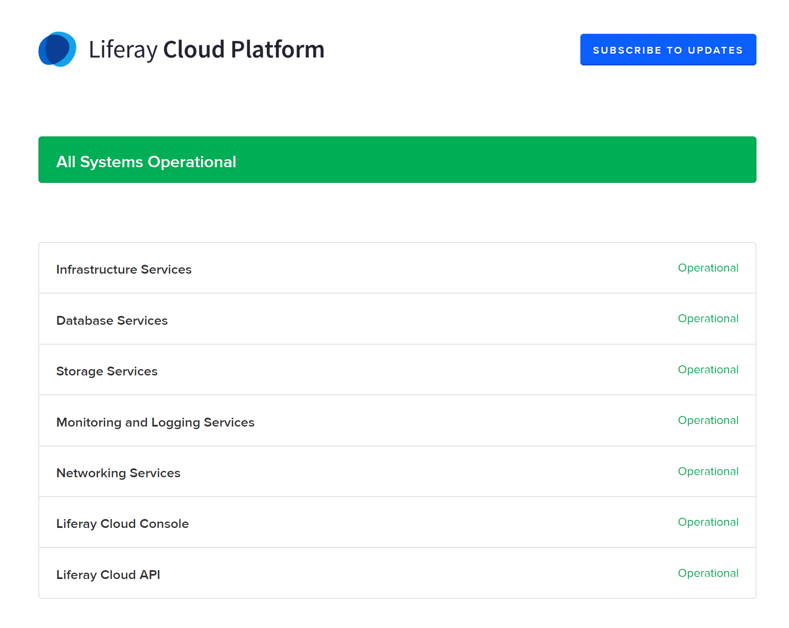
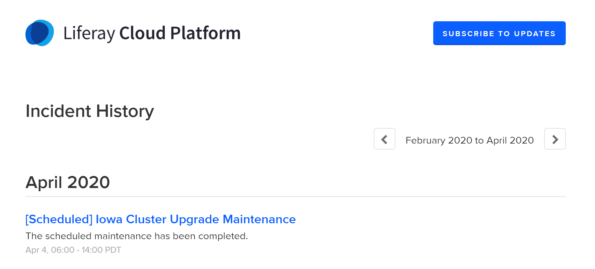
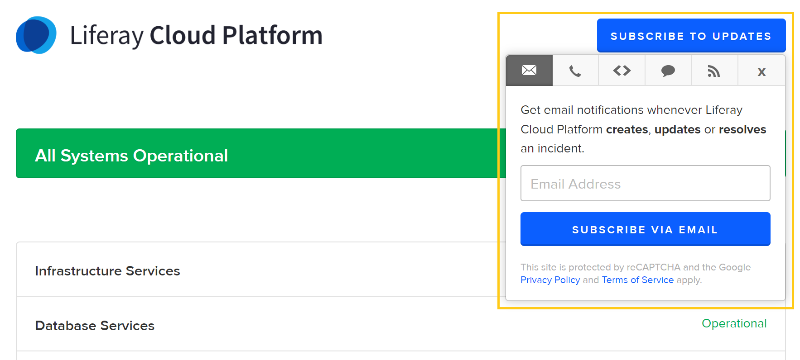

# Liferay Cloud Platform Status

The Liferay Cloud Platform is comprised of multiple systems. Users can view the status of Liferay Cloud Platform systems, incident history, and planned maintenance windows via the [Liferay Cloud Platform](https://status.liferay.cloud/) status page.

## Access the Status Page via the DXP Cloud Console

Users can access the Liferay Cloud Platform status page via the DXP Cloud console:

1. Click on the *Help* icon at the top right of the console page.

1. Click on *Uptime status*.

## View the Status of Cloud Platform Systems

The Liferay Cloud Platform status page lists the current status of the following systems:

* Infrastructure Services
* Database Services
* Storage Services
* Monitoring and Logging Services
* Networking Services
* Liferay Cloud Console
* Liferay Cloud API

## Subscribe to Updates

Users can *Subscribe to Updates* to receive real-time notifications of any platform status changes.

Click on *Subscribe to Updates*, and select the method of notification that is most convenient for you.

## Incident History and Planned Maintenance

Users can view past incidents and planned maintenance windows from the Liferay Cloud Platform status page.

Scroll down the Liferay Cloud Platform status page to see recent incidents.

Click *Incident History* at the bottom of the page to see extended records.

## Additional Information

* [DXP Cloud Support Overview](https://help.liferay.com/hc/articles/360030208451-DXP-Cloud-Support-Overview)
* [Troubleshooting Tools and Resources](./troubleshooting/troubleshooting-tools-and-resources.md)
